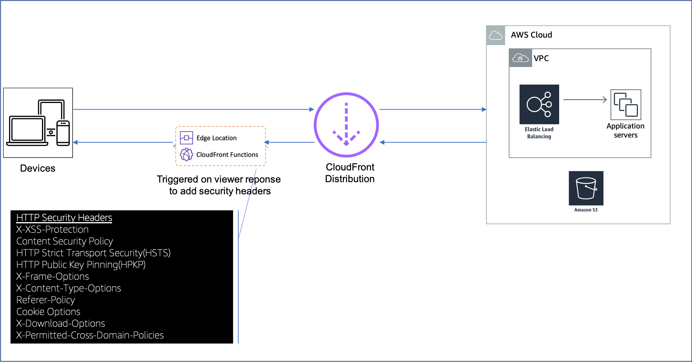

# Add Security Headers by CloudFront Function

The client-side security features are usually enabled and configured by HTTP response headers sent by a web server. However, a web server may not include all the desired security headers in responses sent to your clients. This CloudFront Function will add several response headers to enable web browsers security features.

You can use https://observatory.mozilla.org/ and scan the CloudFront distribution for security vulnerabilities.


## Description

The add-security-headers for CloudFront Function adds necessary headers to enforce all security features at web browsers.    

## Architecture Diagram


CloudFront Function - add-security-headers-cff is triggered on viewer response.

## Use Cases

To enable web browsers security features in all scenarios.

## Project Structure

This project contains source code and supporting files for a serverless application that you can deploy with the SAM CLI. It includes the following files and folders.

- add-security-headers.yaml - CloudFormation template that will create add-security-headers CloudFront Function.
- template.yaml - SAM(Serverless Application Model) template, can be deployed by executing command `sam deploy`


## Deployment

To deploy the stack, you can either use UI or AWS CLI

### UI
Go to [CloudFront Extensions Workshop](https://awslabs.github.io/aws-cloudfront-extensions/#cloudfront-function), find the CloudFront Function and click **Deploy** button.


### AWS CLI

```bash
aws cloudformation deploy --template-file template.yaml --stack-name add-security-headers-cff 
```


## Cleanup

To delete the sample application that you created, use the AWS CLI. Assuming you used your project name for the stack name, you can run the following:

```bash
aws cloudformation delete-stack --stack-name add-security-headers-cff
```


