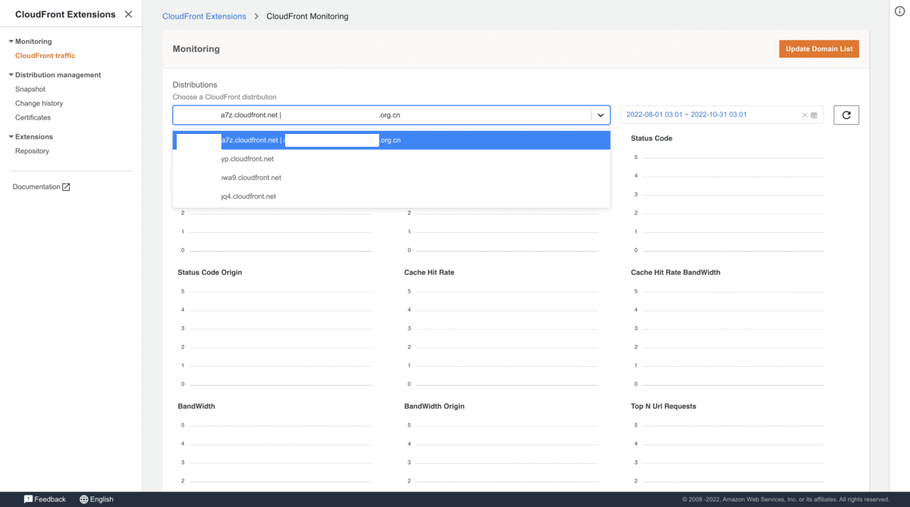
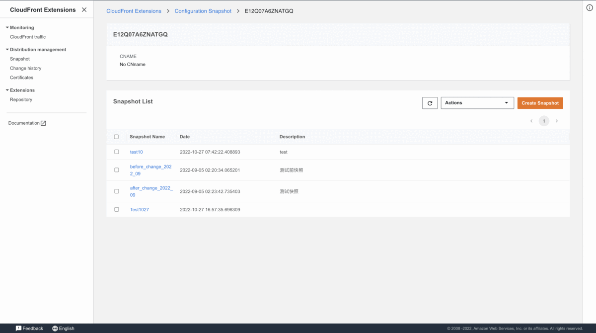
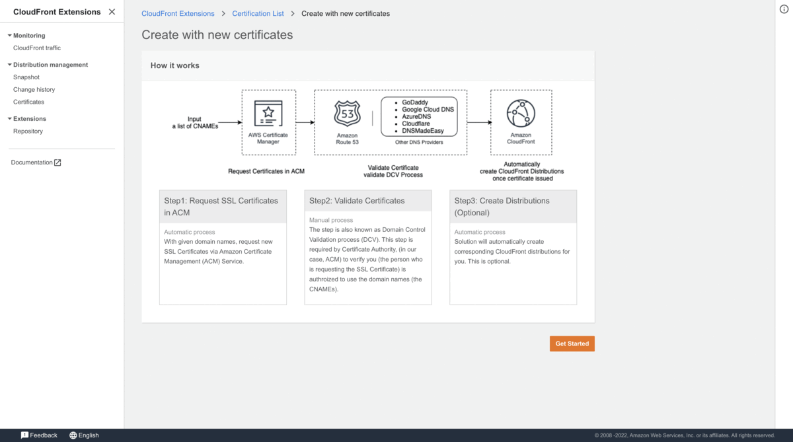
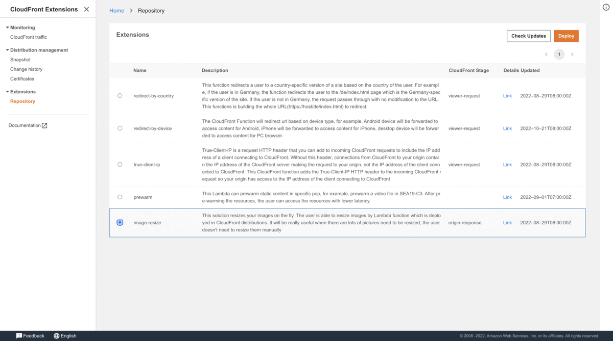

<h1 align="center">
  
   
  CloudFront Extensions
</h1>
<h4 align="center">Amazon CloudFront operation toolkit</h4>

  <h4>
    
    
    
    

  </h4>

CloudFront Extensions GitHub project offers an open source package consisting of a set of applications and solution templates that covers various user scenarios for using [Amazon CloudFront](https://aws.amazon.com/cloudfront/), [Lambda@Edge](https://aws.amazon.com/lambda/edge/) and CloudFront Functions. 

  <h4>
    <a href="https://www.amazonaws.cn/solutions/amazon-cloudfront-extensions/">
      Home Page
    </a>
     | 
    <a href="https://awslabs.github.io/aws-cloudfront-extensions/">
      Usage
    </a>
     | 
    <a href="https://awslabs.github.io/aws-cloudfront-extensions/en/monitoring/overview/">
      Monitoring
    </a>
     | 
    <a href="https://awslabs.github.io/aws-cloudfront-extensions/en/distribution-management/snapshot/overview/">
      Config Snapshot
    </a>
     | 
    <a href="https://awslabs.github.io/aws-cloudfront-extensions/en/distribution-management/ssl-certificates/overview/">
      SSL Certificates
    </a>
     | 
    <a href="https://awslabs.github.io/aws-cloudfront-extensions/en/extension-repository/overview/">
      Extensions Repo
    </a>
     | 
    <a href="https://awslabs.github.io/aws-cloudfront-extensions/workshop/">
      Workshop
    </a>
     | 
    <a href="https://aws.amazon.com/cn/blogs/china/quickly-build-custom-cdn-monitoring-through-amazon-cloudfront-real-time-log/">
      Blog
    </a>
  </h4>

## Feature

### Monitoring
The solution provides two kinds of monitoring: non-real time monitoring and real time monitoring. You can choose one of them to deploy. You can use the solution to view CloudFront traffic metrics via built-in dashboard or via API calls. It analysis CloudFront logs to get the metric data and you only need to modify MetricsCollector, MetricsHelper and MetricsManager to add new metrics.

### Config Snapshot
A Snapshot is a CloudFront Distribution configuration. By saving a complex CloudFront Distribution configuration to a Snapshot, the configuration (snapshot) can be reused to current or other CloudFront Distributions in your AWS account.

### SSL Certificates

You can use this solution to automatically create or import SSL Certificates and associate them to new CloudFront distributions. The solution provides two kinds of jobs: Create Certificates Job and Import Certificate Job. You can use them on web console or via API calls.

### Extensions Repository

The solution provides a set of ready-to-use extensions (Lambda@Edge functions, CloudFront functions, CloudFormation templates) that could be useful when you use CloudFront. You can deploy them from the solution web console. After deployment, you can directly use it without programming or customize it when needed.

## Deployment

**Time to deploy:** Approximately 15 minutes.

Follow the step-by-step instructions in [implementation guide](https://awslabs.github.io/aws-cloudfront-extensions/en/deployment/) to configure and deploy CloudFront Extensions into your account.

1. Make sure you have signed in AWS Console.
2. Click the following button to launch the CloudFormation Stack in your account.

   | Region        | Launch Button  |
   | ------------- | -------------  |
   | Global Region      |     |

## Architecture diagram

Deploying CloudFront Extensions solution with the default parameters builds the following environment in the AWS Cloud.

1. Amazon CloudFront distributes the solution frontend web UI assets hosted in Amazon S3 bucket.
2. Amazon Cognito user pool provides authentication for backend.
3. Amazon AppSync provides the backend GraphQL APIs.
4. Amazon API Gateway provides the backend RESTful APIs for SSL certificates and Monitoring features.
5. Amazon DynamoDB stores the solution related information as backend database.
6. Amazon Lambda interacts with other Amazon Services to process core logic of monitoring, SSL certificates and extensions repository, and obtains information updated in DynamoDB tables.
7. AWS Step Functions orchestrate workflows for creating ACM certificates, importing existed certificates and creating CloudFront distributions. 
8. Extensions are shown in Extensions repository. AWS CloudFormation and AWS Serverless Application Repository will be triggered if you want to deploy an extension into your AWS account.
9. AWS Lambda stores CloudFront configuration changes into S3 bucket, and you can view the difference between two CloudFront configuration versions and apply the configuration.
10. Amazon Athena queries CloudFront standard logs or real-time logs to get CloudFront metrics and output it by API Gateway. You can also view the metrics by monitoring dashboard.

## Contribution

See [CONTRIBUTING](./CONTRIBUTING.md) for more information.

## License

This project is licensed under the Apache-2.0 License.

