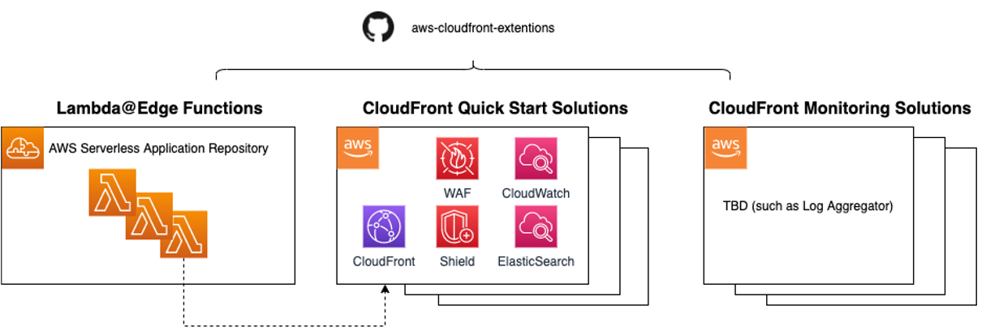

# AWS CloudFront Extensions

[中文]() | [English]()

“CloudFront Extensions” GitHub project offers an open source package consisting of a set of applications and solution templates that covers various user scenarios for using Lambda@Edge and Amazon CloudFront. 

Ultimately, we want to provide out-of-box experience from three dimensions:

**One stop to find Lambda@Edge scripts for various use cases**

This project offers production level Lambda@Edge scripts for common CloudFront use cases, such as Redirect, Header Rewriting, Authentication, Pre-warm etc. The solution aims to optimize the user experience of CloudFront configuration in global regions (where Lambda@Edge service is available), and help you to simplify global CloudFront configuration via Lambda function scripts. You can not only checkout Lambda@Edge scripts from this GitHub repo, but also can directly deploy them from Serverless Application Repository(SAR) into AWS Console without coding.

**One-Click to deploy commonly used CloudFront solutions**

This project offers common solutions for using CloudFront, for instance, CloudFront Security Solution with WAF & Shield. These solutions are provided in form of pre-baked CloudFormation template. With 1-click, you can have solution launched into your own AWS console. 

**Out-of-box experience when integrating with external monitoring system** 

This project also provides out-of-box monitoring solution to enhance the overall observability and simplify the integration of CloudFront and customers’ existing monitoring system.

See more:
Lambda@Edge: https://aws.amazon.com/lambda/edge/
Amazon CloudFront: https://aws.amazon.com/cloudfront/

To get started, please find the step-by-step workshop material here: https://awslabs.github.io/aws-cloudfront-extensions/

## Overview

Provision CloudFront Extensions with pre-configured deployment assets, click button to install Lambda@Edge from Serverless Application Repository.

## CloudFront Quick Start

|        **Name**    | **Description**      |
|------------------|--------------------|
| [WAF & Shield Deployment for CloudFront](templates/aws-cloudfront-waf/README.md) | Prepared templates to quickly launch distribution and pre-configured rules, such as AWS managed common rules, whitelist, blacklist, HTTP flood role, SQL injection, XSS, Bad bot, etc.   | 

## Lambda@Edge

|        **Catelog** | **Description**      |
|------------------|--------------------|
|  [*Authentication*](docs/LambdaEdge.md#authentication)  | Authenticating by Cognito or third-party native library, add security information into HTTP headers, etc. |
|   [*Validation*](docs/LambdaEdge.md#validation)  |  Validating specific parameters from HTTP request, such as check request token through MD5, etc.             |
|   [*URL Rewrite*](docs/LambdaEdge.md#url-rewrite) | All functions are related to rewrite URL in various ways.             |
|   [*URL Redirect*](docs/LambdaEdge.md#url-redirect) |  All functions are related to redirect URL in as many as possible way.              |
|   [*Override Request*](docs/LambdaEdge.md#override-request) | Access, modify and override HTTP request, or even change further behavior.            |
|   [*Override Response*](docs/LambdaEdge.md#override-response) | Generate, modify and override HTTP response for viewer request or origin request event.               |
|   [*Origin Selection*](docs/LambdaEdge.md#origin-selection) | Route to different origins based on information in the request, or even warm up from origin.               |
|   [*Personalize Content*](docs/LambdaEdge.md#personalize-content) | Personalize the content as per requirement, such as resize the pictures.              |
|   [*Security*](docs/LambdaEdge.md#security) | All functions are related secure perspective, such as anti-leeching, etc.           |

## Observability

|        *Name*    | *Description*      |
|------------------|--------------------|
| End-to-end monitoring | Centralized logs management solution and built-in dashboards on top of ElasticSearch, collecting file & real-time logs from CloudFront and related services.   | 

## Contribution

See [CONTRIBUTING](./CONTRIBUTING.md) for more information.

## License

This project is licensed under the Apache-2.0 License.
