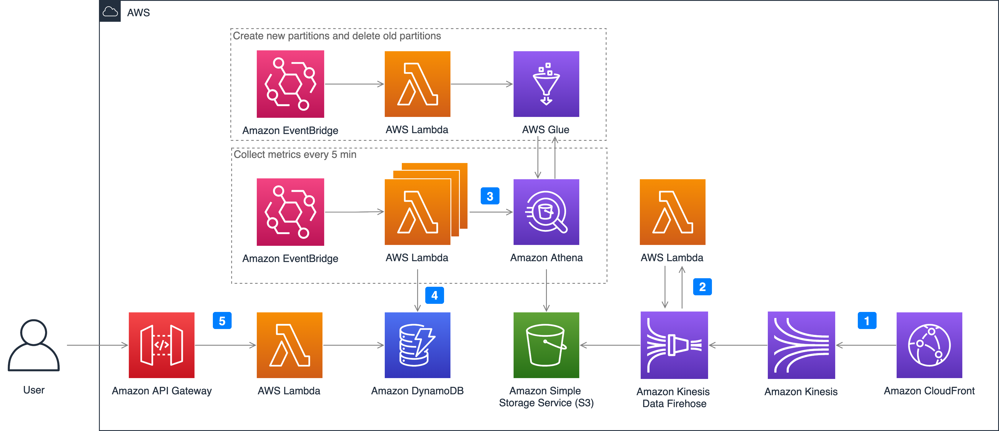

如果您在部署解决方案（CloudFormation堆栈）时选择**Real time monitoring**，将部署以下架构，并在您的帐户中自动创建相应的云资源。

1. **开启CloudFront实时日志**。开启的过程中需要配置对应的Kinesis Data Stream数据流。
2. **设置Kinesis Data Firehose快速完成数据传输**。CloudFront的实时日志会依次通过Kinesis Data Stream和Kinesis Data Firehose，最终存储到Amazon S3桶中。在此过程中，Kinesis Data Firehose会调用Amazon Lambda函数Log Transformer实现通过客户端IP找到ISP和国家代码，从而以国家代码和运营商为单位对下载速率指标进行分类，并配合Kinesis Data Firehose实现动态分区。也就是说，将实时日志通过分区键进行分区，并存储到Amazon S3桶中，如year=2021/month=12/day=10/hour=09。
3. **通过Athena查询S3中的实时日志**。为了让Amazon Athena通过数据分区加速数据查询，通过Amazon EventBridge每天会新建第二天的所有分区，并删除前一天的分区。Lambda函数MetricCollector用来分析实时日志和收集监控指标，每5分钟执行一次。
4. **将查询数据的结果保存在DynamoDB中方便后续获取**。通过Amazon Athena查询出相应的监控指标数据，例如通过带宽计算缓存命中率(CHR)、下载速率，最终将监控指标数据存储在DynamoDB表格中。

5. **最终用户接口使用API Gateway**
    用户接口通过API Gateway和Lambda函数MetricManager生成一个RESTful API，MetricManager会读取DynamoDB表格中的监控指标并返回相应结果。为了进一步加强安全管理限制API的访问，API Gateway中开启API key授权，访问接口的用户需在x-api-key标头中带有合法API key才能正常请求API。

## 创建实时配置
1. 打开CloudFront控制台，在**日志**设置标签下启用实时配置。
2. 点击**创建配置**按钮，采样率输入*100*并选择如下日志字段。

    !!! 请按照下图字段顺序进行选择
        

3. 在**端点**中选择cloudfront-real-time-log-data-stream数据流。
4. 在分配栏中，选择需要获取监控指标的CloudFront分配ID（即部署CloudFormation时填入域名的CloudFront分配）后，点击创建配置按钮。

## 监控指标 

支持如下监控指标:

- request: 从客户端到 CloudFront 的请求数量
- requestOrigin: 回源的请求数量
- statusCode: 从客户端到 CloudFront 的状态码
- statusCodeOrigin: 回源的状态码
- bandwidth: 从客户端到CloudFront的带宽
- bandwidthOrigin: 回源的带宽
- chr (cache hit ratio): 通过请求数量计算的缓存命中率
- chrBandWidth: 通过带宽计算的缓存命中率
- downloadSpeed: 从客户端到CloudFront的下载速率
- downloadSpeedOrigin: 回源的下载速率
- topNUrlRequests: 根据请求数量统计的top url
- topNUrlSize: 根据流量统计的top url
- downstreamTraffic: 响应流量

