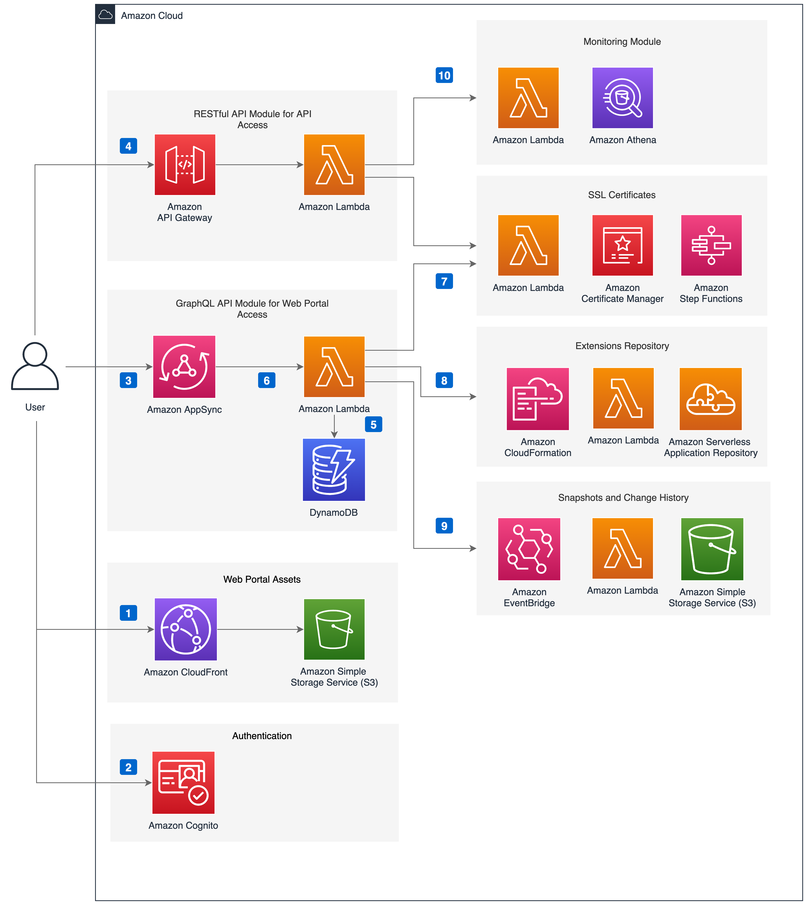
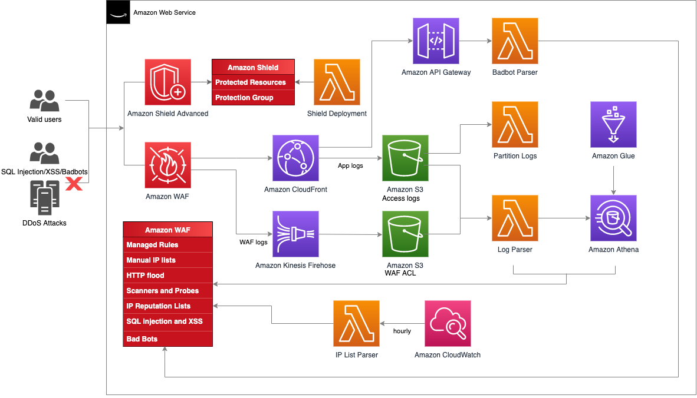
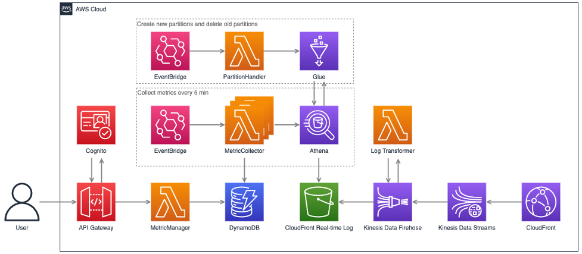

Deploying CloudFront Extensions solution with the default parameters builds the following environment in the Amazon Web Services Cloud.

*Figure 1: CloudFront Extensions architecture*

## Lambda@Edge & CloudFront Functions collection
 
The collection includes multiple Lambda@Edge which can be deployed via SAR (Serverless Application Repository) and CloudFront Functions which can be deployed by CloudFormation.

## CloudFront security automations with Amazon WAF and Amazon Shield

*Figure 2: CloudFront security automations with Amazon WAF and Amazon Shield architecture*

The CloudFormation template provides the following components and workflows:

- Shield Deployment Lambda function will automatically deploy a protection group and protected resource to protect against DDoS attack. 

- Log Parser Lambda function invokes Athena to query CloudFront access log and WAF log to find the request with times above the threshold, and add the IP into WAF to protect against DDoS attack.

- When the crawler triggers the trap URL, Badbot Parser Lambda function will add the IP into WAF to stop the crawler crawling the web site content.

- CloudWatch will invoke IP List Parser Lambda function at a fixed interval to update the malicious IP list from the third-party website.

- The automated deployed WAF rules will protect against SQL injection attack and XSS attack.

## CloudFront Real-time Log Monitoring API

*Figure 3: CloudFront Real-time Log Monitoring API architecture*

This solution deploys the Amazon CloudFormation template in your Amazon Web Services Cloud account and completes the following settings.

1. Enable CloudFront real-time logs

    You need to configure the corresponding Kinesis data stream.

2. Set up Kinesis Data Firehose to complete data transfer quickly
  
    This enables CloudFront's real-time logs to pass through Kinesis Data Stream and finally store them in S3 buckets through Kinesis Data Firehose. During this process, to monitor the download speed in each country and each ISP, Kinesis Data Firehose invokes the Amazon Lambda function Log Transformer to find the ISP and country code through the client IP, and cooperate with Kinesis Data Firehose to implement dynamic partitioning, that is, real-time logs are partitioned by partition key and stored in S3 bucket, such as year=2021/month=12/day=10.

3. Query real-time logs in S3 via Athena
  
    In order to allow Athena to speed up data query through data partitioning, Amazon EventBridge will create all partitions for the next day every day, and delete the partitions of the previous day. The Lambda function MetricCollector is used to analyze real-time logs and collect monitoring metrics. It will be executed every 5 minutes.

4. Save the results of query data in DynamoDB for subsequent retrieval
  
    Query the corresponding monitoring indicator data through Athena, such as calculating CHR (cache hit rate) and download rate through bandwidth, and finally store the monitoring indicator data in the DynamoDB table.

5. The end user interface uses API Gateway
  
    The user interface generates a RESTful API through API Gateway and the Lambda function MetricManager. MetricManager reads the monitoring indicators in the DynamoDB table and returns the corresponding results. In order to further strengthen security management and restrict API access, Cognito authorization is enabled in API Gateway, and users who access the API need to carry a Cognito token to request the API normally.

