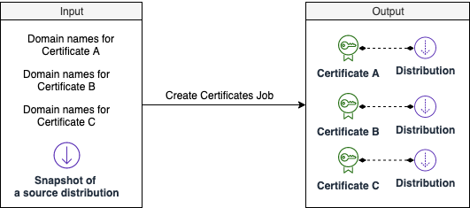

The solution will create one or multiple certificates in ACM and create the associated distributions in CloudFront. 

### How does it work

When you start a Create Certificates Job, the solution starts a workflow in AWS Step Functions that does the following:

1. Create certificates in ACM: The solution will automatically create all ACM based on input. After all SSL Certificates were created, the solution will automatically sent SNS message to the designated email address or HTTP endpoint (depending on subscription). After this step, the domain owners are expected to complete DNS validation process. For more information, see [DNS validation process with your DNS Provider](./dns-validation-process.md).

2. Check certificates status in ACM: The solution checks the progress of DNS validation status every 5 minutes. The DNS validation is a manual process, also known as Domain Control Validation. Domain owner needs to manually add a CNAME record for your domain name on the website of your DNS providers. ACM will check the DNS validation status every few minutes. Once done, ACM will issue certificates. 

3. Create new CloudFront distributions: Once all certificates were issued by ACM, the solution will automatically create CloudFront distributions. After all distributions were created, the solution will send an SNS message to the designated email address or HTTP endpoint. After this step, the domain owners are expected to add new CloudFront distribution to map to CNAME. For more information, see [Adding CloudFront record for CNAME with your DNS Provider](./add-record-for-cname.md).

### Schedule a job for creating new certificates

1. Log in to the web console.
2. In the left sidebar, under **Configuration**, select **SSL Certification**. 
3. Choose **Request New Certificate**.
4. In the page that opens, click **Get Started**.
5. Enter a group of domain name list for a certificate. Click **Add domain names for another certificate** if you want to create another certificate. 
6. Choose **Automatically create distributions**, and select a snapshot of a distribution that you want to copy the config from. 
7. Click **Add new tag** to add a Tag for the resource such as certificates, CloudFront Distributions that will be created.
8. Click **Start job**.
9. Verify the generated input parameters and if everything is fine then enter "Confirm" in input box and click "Apply" button.

### View create certificate job status

You can view job status on the web console or using API calls.

Once the create job started, you will be redirected to a page where you can view the status of the job. For create certificate job, there are three steps in AWS Step functions workflow. After all steps are completed, the job will finish with success. If one of the steps failed, the job will fail. 

* Step1 will be completed once all certificates were created in ACM. It usually takes less than a minute. 
* Step2 will be completed once ACM had issued all expected certificates. ACM only issues the certificates if all DNS validation were done.(This step will be blocking until user do the DCV validation on all the domain names on related name servers, please refer to [this link](https://docs.aws.amazon.com/acm/latest/userguide/dns-validation.html))
* Step3 will be completed once all expected distributions were created in CloudFront. 

After Step1, the domain owners are expected to complete DNS validation process. See more details in [DNS validation process with your DNS Provider](./dns-validation-process.md).

After Step3, the domain owners are expected to add new CloudFront distribution to map to CNAME. See more details in [Adding CloudFront record for CNAME with your DNS Provider](./add-record-for-cname.md).

If the job failed, refer to [Clean up resources](clean-up-resources.md) to clean up the created ACM and CloudFront distributions if needed.

