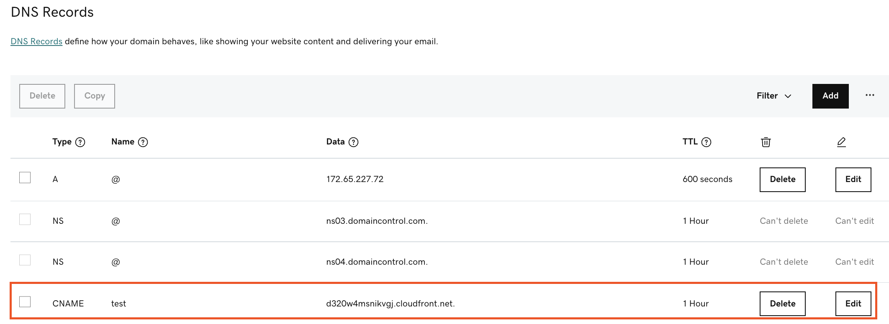

When you create certificates, you need to complete DNS validation process. This process requires you to add/update CNAME record in DNS provider, such as Route 53 and GoDaddy.

## Email
An email will be sent with information needed for DNS validation. The following is an example SNS notification in you email:

```
CNAME value need to add into DNS hostzone to finish DCV: [{'Name': '_1317a5f539939083b712d51b6b1676e5.web1.ssl-for-saas.demo.solutions.aws.a2z.org.cn.', 'Type': 'CNAME', 'Value': '_de026e5dc988d65312fe83616ef24249.hnyhpvdqhv.acm-validations.aws.'}]
```

If you do not know where the email was sent to, you can check it in CloudFormation stack that was deployed when you launch the solution. 

If you want to update the email, you need to update the email parameter in the CloudFormation stack. 

## Adding CNAMEs record for DCV validation in Route53

### Adding Through AWS Route53 Console

1. Sign in to the AWS Management Console and access the [Route 53 console](https://console.aws.amazon.com/route53/).
2. In the navigation pane, choose **Hosted zones**.
3. If you already have a hosted zone for your domain, skip to step 5. If not, create a hosted zone first.

    - To route internet traffic to your resources, such as Amazon S3 buckets or Amazon EC2 instances, see [Creating a public hosted zone](https://docs.aws.amazon.com/Route53/latest/DeveloperGuide/CreatingHostedZone.html).
    - To route traffic in your VPC, see [Creating a private hosted zone](https://docs.aws.amazon.com/Route53/latest/DeveloperGuide/hosted-zone-private-creating.html).

4. On the **Hosted zones** page, choose the name of the hosted zone that you want to create records in.
5. Choose **Create record**.
6. Enter the name and value in Create record form with type CNAME.


### Adding Through Provided Script

1. Prepare python environment based on your os: [install python](https://www.python.org/downloads/).
2. Find out the hosted zone ID from the aws console under Route53/YOUR_DOMAIN_NAME/Hosted zone details tab.
3. Copy the script below and save to file `route53Cert.py`. Open the file and update the data based on your received email, for example:

``` python
     
   import boto3
   
   route53 = boto3.client('route53')
   def add_cname_record(cnameName, cnameValue, hostedZoneId):
       response = route53.change_resource_record_sets(
           ChangeBatch={
               'Changes': [
                   {
                       'Action': 'CREATE',
                       'ResourceRecordSet': {
                           'Name': cnameName,
                           'ResourceRecords': [
                               {
                                   'Value': cnameValue,
                               },
                           ],
                           'SetIdentifier': 'SaaS For SSL',
                           'TTL': 300,
                           'Type': 'CNAME',
                           'Weight': 100,
                       },
                   }
               ],
               'Comment': 'add cname record for certificate',
           },
           HostedZoneId=hostedZoneId,
       )
   
   if __name__ == '__main__':
       # paste your data as the cnameList value
       cnameList = [{'Name': '_1317a5f539939083b712d51b6b1676e5.web1.ssl-for-saas.demo.solutions.aws.a2z.org.cn.', 'Type': 'CNAME', 'Value': '_de026e5dc988d65312fe83616ef24249.hnyhpvdqhv.acm-validations.aws.'}]
       for i, val in enumerate(cnameList):
            # change your host zone id
           add_cname_record(val['Name'], val['Value'], '<Your Hosted Zone ID>')
           
```

4. Install python dependencies, you can follow [this tutorial](https://boto3.amazonaws.com/v1/documentation/api/latest/guide/quickstart.html) to setup your environment.
5. Run your script by `python route53Cert.py`. it will be success add record to your domain if there is no error output.

## Adding CNAMEs record for DCV validation in GoDaddy

### Adding Through GoDaddy Console

1. Log in to [GoDaddy](https://www.godaddy.com/). 
2. In the **Domains** menu,* select **All Domains**.
3. Choose the domain that needs to update CNAME record.
4. Add a new CNAME record, enter the **Name** with the CNAME and the **Data** with the corresponding CloudFront distribution. You should be able to retrieve both values in the SNS message sent by solution.




### Adding Through Provided Script

1. Prepare python environment based on your os: [install python](https://www.python.org/downloads/).
2. Find out goDaddy api Key and Secret from the [goDaddy Console](https://developer.godaddy.com/keys).
3. Copy the script below and save to file `goDaddyCert.py`. Open the file and update the data based on your received email, for example:


``` python

   #!/usr/bin/env python
   from godaddypy import Client, Account
   
   # remember to set your api key and secret
   userAccount = Account(api_key='your_api_key', api_secret='your_api_secret')
   userClient = Client(userAccount)
   
   # E.g.: to update your_record.yourdomain.com set domain and record to:
   domain = 'your_domain'
   
   def add_cname_record(cnameName, cnameValue, domain):
       updateResult = userClient.add_record(domain=domain, record={'data': cnameValue, 'name':cnameName,'ttl':3600, 'type':'CNAME'})
       print(str(updateResult))
   
   
   if __name__ == '__main__':
      # paste your data as the cnameList value
       cnameList = [{'Name': '_1317a5f539939083b712d51b6b1676e5.web1.ssl-for-saas.demo.solutions.aws.a2z.org.cn.', 'Type': 'CNAME', 'Value': '_de026e5dc988d65312fe83616ef24249.hnyhpvdqhv.acm-validations.aws.'}]
       for i, val in enumerate(cnameList):
           add_cname_record(val['Name'], val['Value'], domain)
           
```

4. Install python dependencies by following [this tutorial](https://pypi.org/project/GoDaddyPy/).
5. Run the script with 'python goDaddyCert.py'. If not error message displayed, then your script has been successfully executed.


