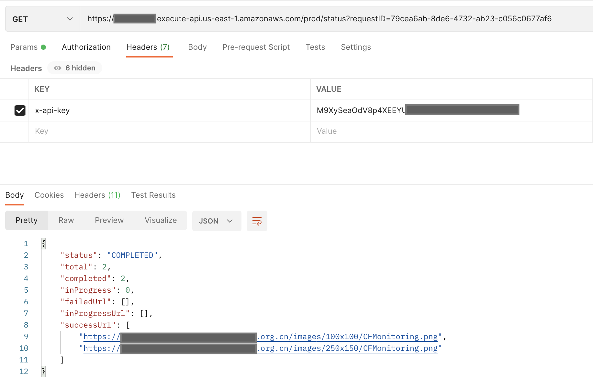

## What is Pre-warming?
Pre-warming is also known as Pre-caching or Pre-fetching. It speeds up content delivery by warming the CloudFront cache. This is very useful when delivering large files. Pre-warming helps offload origin’s traffic, as the same requests will hit the CloudFront cache, origin server receives less requests and consequently it's less likely that the origin server will fall over or become slow. 

### How does it work?
The solution deploys a CloudFormation template, that will install the below architecture in your AWS account. All the cloud resources will be automatically created. After deployment, you will get two REST APIs, one for triggering pre-warm action, the other one for getting pre-warm status.

The CloudFormation template provides the following components and workflows:

1. Scheduler Lambda function inserts initial pre-warm status into the DynamoDB table and invokes cache invalidator.
2. Cache invalidator Lambda function invalidates CloudFront caches for all the URLs and sends messages with requestId, PoP and URLs, and so on into SQS.
3. CloudWatch alarm monitors the messages in the queue and notifies the auto scaling group to scale out when messages are sent into the queue.
4. Auto scaling group contains EC2 spot instances. Each instance sends requests to the edge locations and updates the prewarm status into DynamoDB table after consuming the messages from the SQS queue.
5. StatusFetcher function gets the prewarm status from the DynamoDB table.

### Deployment on the web console (Recommended)

The steps to deploy the extensions from the web console are similar. For more information, refer to the section [True Client IP](true-client-ip.md).

### Deployment via CloudFormation
 
**Time to deploy**: Approximately 10 minutes

#### Deployment overview

Use the following steps to deploy this solution on AWS.

- Launch the CloudFormation template into your AWS account.
- Review the template parameters, and adjust them if necessary.

#### Deployment steps

1. Sign in to the AWS Management Console and select the button to launch the CloudFormation template. You can also [download the template](https://aws-gcr-solutions.s3.amazonaws.com/Aws-cloudfront-extensions/latest/custom-domain/PrewarmStack.template.json) as a starting point for your own implementation.

      

2. The template launches in the US East (N. Virginia) Region by default. To launch the solution in a different AWS Region, use the Region selector in the console navigation bar.

3. Under Parameters, review the parameters for the template, and modify them as necessary.

      | Parameter | Default value | Description |
      |-----------|---------------|---------|
      | ShowSuccessUrls | false | Show success url list in Prewarm status API (true or false). |
      | InstanceType | c6a.large | EC2 spot instance type to send pre-warm requests. |
      | ThreadNumber | 6 | Thread number to run in parallel in EC2. |
  

4. Choose **Next**.
5. On the **Configure stack options** page, you can specify tags (key-value pairs) for resources in your stack and set additional options, and then choose **Next**.
6. On the **Review** page, review and confirm the settings. Check the boxes acknowledging that the template will create AWS Identity and Access Management (IAM) resources and any additional capabilities required.
7. Choose **Create** to deploy the stack. 

You can view the status of the stack in the CloudFormation Console in the Status column. You should receive a CREATE_COMPLETE status in approximately 10 minutes.

To see details for the stack resources, choose the **Outputs** tab. 

## How to use Pre-warming

Before pre-warming, you need to set Viewer protocol policy as **HTTP and HTTPS** in your CloudFront distribution's cache behavior.

### Pre-warm by Postman

1. After deployment, choose the **Outputs** tab of CloudFormation stack, and you can see the following information:
    

    - **PrewarmAPIkey**: API key arn。You can find the API key in API Gateway console. This key is used for authentication when requesting to pre-warm API, as the value of x-api-key.
    - **PrewarmApiEndpoint**: Pre-warm API's URL is followd by the prewarm keyword. Eg. if PrewarmApiEndpoint is **https://123456789.execute-api.us-east-1.amazonaws.com/prod/**, then pre-warm API will be **https://123456789.execute-api.us-east-1.amazonaws.com/prod/prewarm**
    - **PrewarmStatusApiEndpoint**: Pre-warm status API's URL is followed by the status keyword. Eg. If PrewarmStatusApiEndpoint is **https://test.execute-api.us-east-1.amazonaws.com/prod/**, then pre-warm status API will be **https://test.execute-api.us-east-1.amazonaws.com/prod/status**
2. Open a tool that can send HTTP requests, such as Postman.
3. Send pre-warm request (refer to [API references](../api-reference-guide/extension-repository.md#pre-warming) for more details), and add a key value pair in the header: key is **x-api-key**, value is your API key.

    
    

4. The pre-warming API will return a requestID. Now you have successfully triggered the pre-warming, you can obtain the pre-warm status by PrewarmStatus API.
5. Send pre-warm status request, add the requestId in the URL querystring, and add x-api-key in the header. The pre-warm status can be seen in the response.(Please check if there is a value named "Accept-Encoding" in default headers，and its value is "gzip, deflate, br"，if there isn't ，please add it.)
    

### Pre-warm by Curl

#### Pre-warm

Script content:

**prewarmlist.json**

      {
            "url_list": [
                  "https://www.example.com/index.html",
                  "https://www.example.com/images/demo.png"
            ],
            "target_type":"pop",
            "cf_domain": "d1234567890r.cloudfront.net",
            "region": ["ATL56-C1", "DFW55-C3"],
            "protocol": "http|https"
      }

**Note:**
    parameter "protocol" is optional, if not specified the default protocol is http.

**prewarm.sh**

      prewarmuri="https://123456789.execute-api.us-east-1.amazonaws.com/prod/prewarm"
      curl --header 'x-api-key: KEY12345678900Tg9P' -XPOST -d @prewarmlist.json $prewarmuri

Execute the script:

      sh prewarm.sh

Example of the script output:

      {"requestID": "e1efca9a-8d92-4058-a1e9-002fd423f6e5"}

### Prewarm status 

Script content:

**prewarmstatus.sh**

      #!/bin/bash
      statusurl="https://3e23456789h.execute-api.us-east-1.amazonaws.com/prod/status?requestID=e1efca9a-8d92-4058-a1e9-002fd423f6e5“
      curl  --header 'x-api-key: KEY123456789Tg9P' $statusurl

Execute the script:

      sh prewarmstatus.sh

Example of the script output:

      {
            "status": "COMPLETED",
            "total": 2,
            "completed": 2,
            "inProgress": 0,
            "failedUrl": [],
            "inProgressUrl": []
      }

## Troubleshooting

The pre-warm solution will automatically start the EC2 Spot instance and execute the script on EC2 to pre-warm resources. The location of the pre-warm script is /etc/agent/agent.py, these EC2 instances will be deleted automatically after the pre-warming is completed. You can login to the EC2 instance and view the specific execution log in /var/log/user-data.log for debugging.

