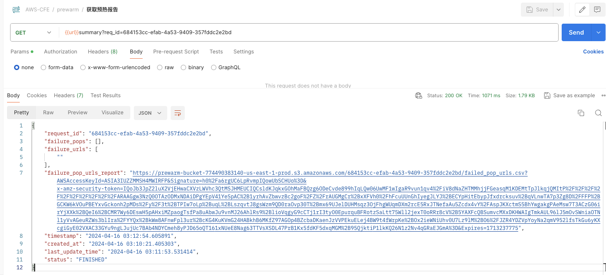

## What is Pre-warming?
Pre-warming is also known as Pre-caching or Pre-fetching. It speeds up content delivery by warming the CloudFront cache. This is very useful when delivering large files. Pre-warming helps offload origin’s traffic, as the same requests will hit the CloudFront cache, origin server receives less requests and consequently it's less likely that the origin server will fall over or become slow. 

### How does it work?
The solution deploys a CloudFormation template, that will install the below architecture in your AWS account. All the cloud resources will be automatically created. After deployment, you will get two REST APIs, one for triggering pre-warm action, the other one for getting pre-warm status.

The CloudFormation template provides the following components and workflows:

1. API Handler Lambda receives requests from API Gateway, deduplicates URLs, writes them to a CSV file named with a request ID, uploads the file to S3, creates an Eventbridge timer according to the incoming shutdown event, starts EC2 instances within the ASG as per the specified parameters, and stores the request body in the Request table in DynamoDB.

2. The Request table in DynamoDB has a DynamoDB stream enabled. The stream of the Request table triggers the Get Size Lambda and Task Lambda.

3. Get Size Lambda downloads the CSV file named with the request ID from S3, iterates through the URL list, executes curl commands to determine the size of each file, summarizes the file sizes, and stores the total size in the total_size field of the Request table in bytes. It also writes back problematic URLs and successful URLs to S3.

4. The Task Lambda receives all POP points and CloudFront domain information from the DynamoDB stream, downloads the CSV file named with the request ID from S3 to obtain the URL list, iterates through the POPs to obtain IP lists using dig, stores them in the Request-Pop table in DynamoDB, iterates through the URLs, and sends tasks to the prewarm_task queue based on the matching of each URL with POP points. 

5. EC2 instances in the ASG retrieve tasks from the prewarm_task queue, execute curl commands to download files, and store download results in the Request-Task table, including file sizes and success of downloads. The EC2 instances use a standard Amazon Linux 2023 AMI, which downloads agent code from S3 and conducts pre-warming during startup.

6. The Request-Task table has a DynamoDB stream enabled, which triggers the Aggregation Lambda. The Aggregation Lambda batch processes download tasks, aggregates file sizes, and updates the downloaded_size field of the Request table, obtaining the cumulative download size.

7. The timer triggers the Shutdown Lambda at the scheduled time. The Shutdown Lambda terminates all EC2 instances in the ASG, terminating ongoing pre-warming. It also deletes all messages in the prewarm_task queue.

### Deployment on the web console (Recommended)

The steps to deploy the extensions from the web console are similar. For more information, refer to the section [True Client IP](true-client-ip.md).

### Deployment via CloudFormation
 
**Time to deploy**: Approximately 10 minutes

#### Deployment overview

Use the following steps to deploy this solution on AWS.

- Launch the CloudFormation template into your AWS account.
- Review the template parameters, and adjust them if necessary.

#### Deployment steps

1. Log in to the Amazon Web Services Management Console and select the button to launch the template. You can also choose to [download the template directly](https://aws-gcr-solutions.s3.amazonaws.com/Aws-cloudfront-extensions/v2.0.0_331/custom-domain/CFEPrewarmStack.template.json) / [download the template - use existing VPC template](https://aws-gcr-solutions.s3.amazonaws.com/Aws-cloudfront-extensions/v2.0.0_331/custom-domain/CFEPrewarmStackUseExistVPC.template.json) for deployment.

      
      

2. The template launches in the US East (N. Virginia) Region by default. To launch the solution in a different AWS Region, use the Region selector in the console navigation bar.

3. In the Parameters section, review the template parameters and modify as necessary.
4. For the default template parameters when choosing direct deployment, they are as follows:

      | Parameter             | Default Value | Description                           |
      |-----------------------|---------------|---------------------------------------|
      | envName | prod      | The environment for deployment.                         |
5. For the parameters when choosing to deploy with an existing VPC template, they are as follows:

      | Parameter             | Default Value  | Description                     |
      |-----------------------|----------------|---------------------------------|
      | envName | prod | The environment for deployment.             |
      |     vpc         | None, required | The VPC where you want to deploy.    |
      |     subnet       | None, required | The public subnet in the VPC you want to deploy.       |
      |     sg          | None, required | The security group you want to use.        |
      |     key         | None, required | The keypair for security.            |
      |     vpce           | None, optional | The endpoint for private API when needed to deploy as private. |
6. Select **Next**.
7. On the Configure stack options page, you can specify tags (key-value pairs) for the resources in the stack and set other options, then select **Next**.
8. On the Review page, review and confirm the settings. Ensure that you select the checkbox to acknowledge that the template will create IAM resources. Select **Next**.
9. Choose **Create stack** to deploy the stack.

You can view the status of the stack in the **Status** column in the Amazon CloudFormation console. Under normal circumstances, the status will change to **CREATE_COMPLETE** within approximately 15 minutes.

You can also select the **Outputs** tab to view detailed information about the stack resources.

## How to use Pre-warming

Before pre-warming, you need to set Viewer protocol policy as **HTTP and HTTPS** in your CloudFront distribution's cache behavior.

### Pre-warm by Postman

1. After the solution is deployed, open the *Outputs* tab of the CloudFormation stack to find the following information:
    

    - **prewarmapikeyoutput**: API key ARN. You can find this API key in the API Gateway console under API keys, click on the show button to get the key. This API key is required for authentication when making requests to the pre-warm API, as the value for x-api-key.
    - **prewarmapiEndpoint**: The URL of the pre-warm API, which is the base URL followed by the prewarm keyword.
    ***For example***: If PrewarmApiEndpoint is **https://123456789.execute-api.us-east-1.amazonaws.com/prod/**, then the pre-warm API is invoked via POST method at **https://123456789.execute-api.us-east-1.amazonaws.com/prod/prewarm**
    ***For example***: If PrewarmStatusApiEndpoint is **https://test.execute-api.us-east-1.amazonaws.com/prod/**, then the pre-warm status API is invoked via GET method at **https://test.execute-api.us-east-1.amazonaws.com/prod/prewarm**
2. Open a tool capable of sending HTTP requests, such as Postman.
3. Send a pre-warm request following the pre-warm API format (see [API Reference Guide](../api-reference-guide/extension-repository.md#pre-warming)) and add a key-value pair to the header: key as **x-api-key**, value as the API key.

    
    

4. The pre-warm API will return a request ID, indicating that you have successfully triggered the pre-warm. Next, you can use the pre-warm progress API to get the pre-warm status.
5. Send a request following the format of the pre-warm progress API and add the request ID to the URL parameters. Add the x-api-key in the header, and in the response, you will see the latest pre-warm status. (Make sure to check if the Accept-Encoding is present in the request header with the value "gzip, deflate, br". If not, ensure to add it)
    
6. You can dynamically adjust the overall pre-warm progress by changing the number of pre-warm instances after starting pre-warming.
   
7. After changing the number of pre-warm instances, you can check the current number of instances in the system.
   
8. After pre-warming is complete, you can view the pre-warming report.
   

### Triggering Pre-warming via Curl

#### Trigger Pre-warming

Script Contents

**prewarmlist.json**

    {
        "url_list": [
          "https://www.example.com/index.html",
          "https://www.example.com/css/bootstrap-icons.css"
        ],
        "cf_domain": "www.example.com",
        "target_type":"pop",
        "countries": [
        ],
        "regions": [
        ],
        "pops": [
            "ATL56-C1",
            "SIN2-C1",
            "DFW55-C3"
        ],
        "timeout": 5,
        "header": [
        ],
        "instance_count": 1,
        "need_invalidate": false
    }

!!! Note
    The field "target_type" is optional. If not specified, it defaults to pop. You can also choose country and region. If a value from pop, country, or region is chosen, the corresponding pops, countries, or regions below need to be filled in with the corresponding values for pre-warming. If not filled, the system will select pre-warming nodes by default. The need_invalidate field is optional, indicating whether to clear the CloudFront cache. By default, it is not enabled.

**prewarm.sh**

      prewarmuri="https://123456789.execute-api.us-east-1.amazonaws.com/prod/prewarm"
      curl --header 'x-api-key: KEY12345678900Tg9P' -XPOST -d @prewarmlist.json $prewarmuri

Execute the Script

      sh prewarm.sh

Execution Result Example

    {
        "status": "Success",
        "error_message": "",
        "error_urls": [],
        "request_id": "e059b77b-e427-4489-a50b-4d8c652f114c",
        "timestamp": "2024-04-16 03:12:21.046535",
        "timeout_at": "2024-04-16 03:17:21.046535"
    }

#### Getting Pre-warm Progress

Script Contents

**prewarmstatus.sh**

      #!/bin/bash
      statusurl="https://123456789.execute-api.us-east-1.amazonaws.com/prod/prewarm?req_id=e1efca9a-8d92-4058-a1e9-002fd423f6e5“
      curl  --header 'x-api-key: KEY123456789Tg9P' $statusurl

Execute the Script

      sh prewarmstatus.sh

Execution Result Example

    {
        "request_id": "684153cc-efab-4a53-9409-357fddc2e2bd",
        "download_size": 137368,
        "total_size": 206052,
        "percentage_complete": 66,
        "available_task_count": 0,
        "in_progress_task_count": 0,
        "download_count": 6,
        "total_count": 6,
        "created_at": "2024-04-16 03:10:21.405303",
        "last_update_time": "2024-04-16 03:11:53.531414",
        "timestamp": "2024-04-16 03:15:09.499889",
        "status": "FINISHED"
    }

### Managing Instances

#### Modifying Instance Count

Script Contents

**instance.json**

    {
        "req_id": "684153cc-efab-4a53-9409-357fddc2e2bd",
        "DesiredCapacity": 1
        // "force_stop": false
    }

!!! Note
    The field "force_stop" is optional. If not specified, it defaults to false, indicating whether to forcibly shut down pre-warm machines.

**instance.sh**

      instanceuri="https://123456789.execute-api.us-east-1.amazonaws.com/prod/instances"
      curl --header 'x-api-key: KEY12345678900Tg9P' -XPOST -d @instance.json $instanceuri

Execute the Script

      sh instance.sh

Execution Result Example

    {
        "status": "success",
        "timestamp": "2024-04-16 03:54:40.366685",
        "message": "Auto Scaling Group prewarm_asg_prod updated to Desired Capacity: 1"
    }

#### Getting Instance Count

Script Contents

**prewarminstance.sh**

      #!/bin/bash
      instancesurl="https://123456789.execute-api.us-east-1.amazonaws.com/prod/instances“
      curl  --header 'x-api-key: KEY123456789Tg9P' $instancesurl

Execute the Script

      sh prewarminstance.sh

Execution Result Example

    {
        "status": "success",
        "timestamp": "2024-04-16 03:56:39.210951",
        "message": "query success",
        "desiredcapacity": 1
    }

#### Getting Pre-warm Report

Script Contents

**prewarmreport.sh**

      #!/bin/bash
      reporturl="https://123456789.execute-api.us-east-1.amazonaws.com/prod/summary?req_id=684153cc-efab-4a53-9409-357fddc2e2bd“
      curl  --header 'x-api-key: KEY123456789Tg9P' $reporturl

Execute the Script

      sh prewarmreport.sh

Execution Result Example

    {
        "request_id": "684153cc-efab-4a53-9409-357fddc2e2bd",
        "failure_pops": [],
        "failure_urls": [
            ""
        ],
        "failure_pop_urls_report": "http://reporturl",
        "timestamp": "2024-04-16 03:12:54.605891",
        "created_at": "2024-04-16 03:10:21.405303",
        "last_update_time": "2024-04-16 03:11:53.531414",
        "status": "FINISHED"
    }

## Troubleshooting

The pre-warming solution automatically starts EC2 Spot instances and executes scripts for pre-warming on EC2. The pre-warming script is located at /home/ec2-user/agent/agent.py. After pre-warming is completed, these EC2 instances are automatically deleted.

