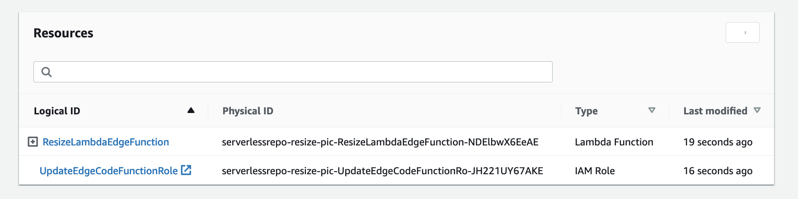
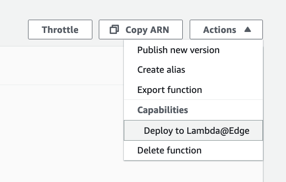
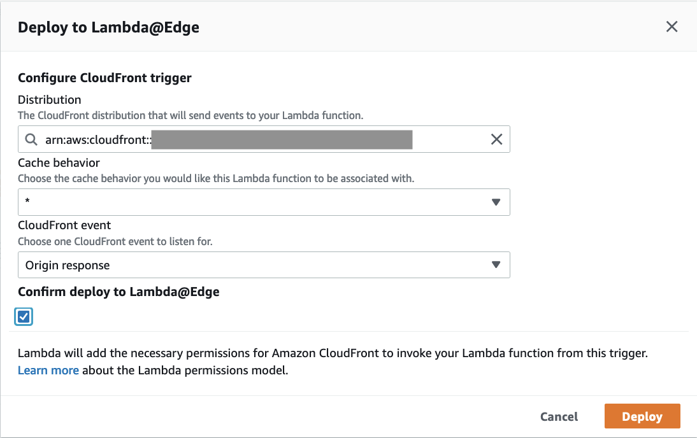

## What is Resize Image?
This solution resizes your images on the fly. The user is able to resize images by Lambda function which is deployed in CloudFront distributions. It will be really useful when there are lots of pictures need to be resized, the user doesn't need to resize them manually.

## How does it work?


1. User specifies the dimension (width and height) in the url, e.g. https://www.example.com/images/200x300/demo.png

2. If the image in specific dimension is existed in S3 bucket, then do nothing and return it.
   
3. If the object is not existed in S3 bucket, a 404 Not Found response will be returned to CloudFront edge location, Lambda@Edge will fetch the source image (e.g. images/demo.png) from S3 bucket into buffer, resize it and store the resized image into relative folder(e.g. images/200x300) in S3 bucket
  (Note: If you see a 403 instead of 404 error, you will need to add s3:ListBucket into the bucket policy)
    Here's an example:
    ```
        {
            "Sid": "1",
            "Effect": "Allow",
            "Principal": {
                "AWS": "arn:aws:iam::cloudfront:user/CloudFront Origin Access Identity Example"
            },
            "Action": "s3:ListBucket",
            "Resource": "arn:aws:s3:::example-bucket"
        }
    ```

   
4. After the image is resized and stored, update the status code to 200 and return the resized image.
   
5. The image is cached in CloudFront edge location, so next time when you invoke the same url with same dimension, it will return the image from CloudFront cache, and will not access origin.

## Usage

To user this CloudFront extension

1. Login your AWS account and go to [S3 console](https://s3.console.aws.amazon.com/s3/home).

2. Create an S3 bucket, and a folder with any name(e.g. images), put your image(e.g. demo.png) in the folder.
   


3. Go to [CloudFront console](https://us-east-1.console.aws.amazon.com/cloudfront/), Click Create distribution button.

4. In Create distribution page, for Origin domain, choose the S3 bucket created in step 2; For S3 bucket access, choose 'Yes use OAI' and click 'Create new OAI' button to create a new OAI. for bucket policy, choose 'Yes, update the bucket policy'. Keep other options with default value and click Create button.

5. Keep waiting until CloudFront distribution is created.

6. Go to [S3 console](https://s3.console.aws.amazon.com/s3/home). Choose the S3 bucket created in step 2.

7. In permission tab, update Action and Resource values in the bucket policy. (Update Action to s3:ListBucket, update Resource to S3 bucket ARN created in step 2).

```
{
    "Version": "2008-10-17",
    "Id": "PolicyForCloudFrontPrivateContent",
    "Statement": [
        {
            "Sid": "1",
            "Effect": "Allow",
            "Principal": {
                "AWS": "arn:aws:iam::cloudfront:user/CloudFront Origin Access Identity E2NHBYQWR0YVVH"
            },
            "Action": "s3:ListBucket",
            "Resource": "arn:aws:s3:::input-your-bucket-name"
        }
    ]
}
```


8. Deploy [CloudFront Extensions Console](../deployment.md). In extensions repository, find **image-resize**.

9. Click Deploy button.

      Here're the details of each parameter:

      | Parameter | Description |
      |  ----  | ----  | 
      | FitType | The way to fit the image. Valid values are </p><b>cover</b>(Preserving aspect ratio, ensure the image covers both provided dimensions by cropping to fit); </p><b>contain</b>(Preserving aspect ratio, contain within both provided dimensions using letterboxing where necessary); </p><b>fill</b>(Ignore the aspect ratio of the input and stretch to both provided dimensions); </p><b>inside</b>(Preserving aspect ratio, resize the image to be as large as possible while ensuring its dimensions are less than or equal to both those specified); </p><b>outside</b> (Preserving aspect ratio, resize the image to be as small as possible while ensuring its dimensions are greater than or equal to both those specified) |
      | S3BucketName | S3 bucket name which contains the images, for example, resize-image-demo |

10. Keep waiting until the function is deployed, it will show the deployed resources.
  
11. Click ResizeLambdaEdgeFunction in the resources table.
12. Click Deploy to Lambda@Edge button.
  

13. Choose the CloudFront distribution, for CloudFront event, choose Origin response and click Deploy button.
  

14. Keep waiting until the Lambda@Edge deployment is completed.

15. To use resize image feature, type in url(e.g. https://CloudFrontUrl/images/200x300/demo.png) in your browser, it will automatically create an images/200x300 folder in S3 bucket and generate a 200x300 demo.png in it.

      In this example, the source image is located in images/demo.png, the automatically generated images are stored in relative folders which are named by dimensions.

      


## CloudFront Stage
Origin response

## Deployment on the web console (Recommended)

The steps to deploy the extensions from the web console are similar. For more information, refer to the section [True Client IP](true-client-ip.md).


  


