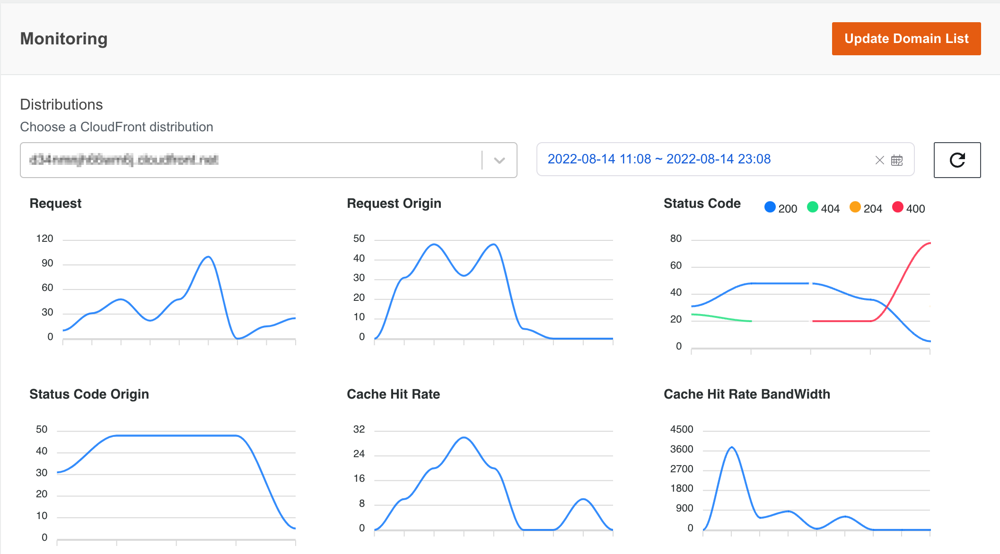

Metrics dashboard is customizable time range for Non-real time or Real time monitoring that you can use to track CloudFront traffic graphical metrics in a single dashboard. The dashboard uses CloudFront standard log or realtime log to get the metrics. The solution provides a metric API if you only need to get the metric data via RESTful API and don't need the dashboard.

With the Metrics dashboard, you can do the following:

- **View graphic metrics**

    The CloudFront monitoring dashboard displays multiple metrics in each graphical chart for your reference. Each chart is mapped to one metric in CloudFront Monitoring API.
    
    !!! Note "Note"
        The graphic metrics type in the dashboard are the same as the CloudFront Monitoring API acquisition type when deploying the solution.

    The metrics description is as follows:

    |**CloudFront Monitoring API Type**|**Description**|**Window Time**|
    |----------------------|----------------------|--------------------|
    |[Real time traffic metrics](real-time-monitoring.md#metrics)        | Realtime log for CloudFront distribution with 5-min delay |5 minutes|
    |[Non-real time traffic metrics](non-real-time-monitoring.md#metrics)| Non-Realtime log for CloudFront distribution with 1-hour delay |5 minutes|

    Metrics definition:

    |**Metric**|**Description**| **Sample SQL to get metric in Athena** |
    |----------------------|----------------------|--------------------|
    | Requests | The number of requests from the client to CloudFront | SELECT count(timestamp), cast(avg("time-taken") as decimal(38,3)), "cs-host", "c-country" FROM "db"."cf_log" WHERE year = 2023 AND month = 1 AND day = 4 AND hour = 6 AND timestamp <= 1672813380.0 AND timestamp > 1672813320.0 group by "cs-host", "c-country";|
    | Origin requests | The number of requests back to the origin | SELECT count(timestamp), cast(avg("time-taken") as decimal(38,3)), "cs-host", "c-country" FROM "db"."cf_log" WHERE year = 2023 AND month = 1 AND day = 4 AND hour = 6 AND timestamp <= 1672813620.0 AND timestamp > 1672813560.0 AND ("x-edge-detailed-result-type" = 'Miss' OR ("x-edge-detailed-result-type" like '%Origin%' AND "x-edge-detailed-result-type" <> 'OriginShieldHit')) group by "cs-host", "c-country"; |
    | Requests latency | The latency of the requests from the client to CloudFront | SELECT count(timestamp), cast(avg("time-taken") as decimal(38,3)), "cs-host", "c-country" FROM "db"."cf_log" WHERE year = 2023 AND month = 1 AND day = 4 AND hour = 6 AND timestamp <= 1672813380.0 AND timestamp > 1672813320.0 group by "cs-host", "c-country"; |
    | Origin requests latency | The latency of the requests back to the origin | SELECT count(timestamp), cast(avg("time-taken") as decimal(38,3)), "cs-host", "c-country" FROM "db"."cf_log" WHERE year = 2023 AND month = 1 AND day = 4 AND hour = 6 AND timestamp <= 1672813620.0 AND timestamp > 1672813560.0 AND ("x-edge-detailed-result-type" = 'Miss' OR ("x-edge-detailed-result-type" like '%Origin%' AND "x-edge-detailed-result-type" <> 'OriginShieldHit')) group by "cs-host", "c-country"; |
    | Requests 3xx/4xx/5xx error rate | The percentage of 3xx/4xx/5xx status code from the client to CloudFront | SELECT "sc-status", count(timestamp), cast(avg("time-taken") as decimal(38,3)), "cs-host", "c-country" FROM "db"."cf_log" WHERE year = 2023 AND month = 1 AND day = 4 AND hour = 6 AND timestamp <= 1672815240.0 AND timestamp > 1672815180.0 GROUP BY "sc-status", "cs-host", "c-country"; |
    | Origin requests 3xx/4xx/5xx error rate | The percentage of 3xx/4xx/5xx status code back to the origin | SELECT "sc-status", count(timestamp), cast(avg("time-taken") as decimal(38,3)), "cs-host", "c-country" FROM "db"."cf_log" WHERE year = 2023 AND month = 1 AND day = 4 AND hour = 6 AND timestamp <= 1672815360.0 AND timestamp > 1672815300.0 AND ("x-edge-detailed-result-type" = 'Miss' OR ("x-edge-detailed-result-type" like '%Origin%' AND "x-edge-detailed-result-type" <> 'OriginShieldHit')) group by "sc-status", "cs-host", "c-country"; |
    | Requests 3xx/4xx/5xx error latency | The latency of 3xx/4xx/5xx status code from the client to CloudFront | SELECT "sc-status", count(timestamp), cast(avg("time-taken") as decimal(38,3)), "cs-host", "c-country" FROM "db"."cf_log" WHERE year = 2023 AND month = 1 AND day = 4 AND hour = 6 AND timestamp <= 1672815240.0 AND timestamp > 1672815180.0 GROUP BY "sc-status", "cs-host", "c-country"; |
    | Origin requests 3xx/4xx/5xx error latency | The latency of 3xx/4xx/5xx status code back to the origin | SELECT "sc-status", count(timestamp), cast(avg("time-taken") as decimal(38,3)), "cs-host", "c-country" FROM "db"."cf_log" WHERE year = 2023 AND month = 1 AND day = 4 AND hour = 6 AND timestamp <= 1672815360.0 AND timestamp > 1672815300.0 AND ("x-edge-detailed-result-type" = 'Miss' OR ("x-edge-detailed-result-type" like '%Origin%' AND "x-edge-detailed-result-type" <> 'OriginShieldHit')) group by "sc-status", "cs-host", "c-country"; |
    | Requests latency (300-1000+ms) rate | The percentage of requests whose latency are larger than 1 second | SELECT cast((sum(case when "time-taken" >= 1.0 then 1 else 0 end) * 100.0 / count(*)) as decimal(38,2)) as ratio, count(timestamp), "cs-host", "c-country" FROM "db"."cf_log" WHERE year = 2023 AND month = 1 AND day = 4 AND hour = 7 AND timestamp <= 1672815720.0 AND timestamp > 1672815660.0 group by "cs-host", "c-country"; |
    | Top 10 URLs with most requests | Top 10 urls calculated by the number of requests | SELECT b.* from (SELECT "cs-host", "cs-uri-stem", cnt, row_number() over (partition by "cs-host", "cs-uri-stem" order by cnt desc) rank from (select "cs-host", "cs-uri-stem", count(1) as cnt from "db"."cf_log" where year = 2023 AND month = 1 AND day = 3 AND timestamp <= 1672790399.0 AND timestamp > 1672704000.0 group by "cs-host", "cs-uri-stem") a) b where b.rank <= 100 order by "cs-host", "cnt" desc; |
    | Bandwidth | The bandwidth from the client to CloudFront | SELECT sum("sc-bytes")/(60*1)*8, "cs-host", "c-country" FROM "db"."cf_log" WHERE year = 2023 AND month = 1 AND day = 4 AND hour = 6 AND timestamp <= 1672813620.0 AND timestamp > 1672813560.0 group by "cs-host", "c-country"; |
    | Origin bandwidth | The bandwidth back to origin | SELECT sum("sc-bytes")/(60*1)*8, "cs-host", "c-country" FROM "db"."cf_log" WHERE year = 2023 AND month = 1 AND day = 4 AND hour = 7 AND timestamp <= 1672815900.0 AND timestamp > 1672815840.0 AND ("x-edge-detailed-result-type" = 'Miss' OR ("x-edge-detailed-result-type" like '%Origin%' AND "x-edge-detailed-result-type" <> 'OriginShieldHit')) group by "cs-host", "c-country"; |
    | Data transfer | The down stream traffic in response to the request | 	SELECT sum("sc-bytes"), "cs-host", "c-country" FROM "db"."cf_log" WHERE year = 2023 AND month = 1 AND day = 4 AND hour = 7 AND timestamp <= 1672816260.0 AND timestamp > 1672816200.0 group by "cs-host", "c-country"; |
    | Top 10 URLs with most traffic | Top 10 url calculated by traffic | SELECT b.* from (SELECT "cs-host", "cs-uri-stem", sc_size, row_number() over (partition by "cs-host", "cs-uri-stem" order by sc_size desc) rank from (select "cs-host", "cs-uri-stem", sum("sc-bytes") as sc_size from "db"."cf_log" where year = 2023 AND month = 1 AND day = 3 AND timestamp <= 1672790399.0 AND timestamp > 1672704000.0 group by "cs-host", "cs-uri-stem") a) b where b.rank <= 100 order by "cs-host", "sc_size" desc; |
    | Cache hit rate (calculated using requests) | Cache hit rate calculated by the number of requests | SELECT cast((sum(case when "x-edge-result-type" like '%Hit' then 1 else 0 end) * 100.0 / count(1)) as decimal(38,2)) as ratio, count(timestamp), "cs-host", "c-country" FROM "db"."cf_log" WHERE year = 2023 AND month = 1 AND day = 4 AND hour = 7 AND timestamp <= 1672816680.0 AND timestamp > 1672816620.0 AND "x-edge-response-result-type" <> 'LimitExceeded' AND "x-edge-response-result-type" <> 'CapacityExceeded' group by "cs-host", "c-country"; |
    | Cache hit rate (calculated using bandwidth) | Cache hit ratio calculated by bandwidth | SELECT cast((sum(case when "x-edge-result-type" like '%Hit' then "sc-bytes" else 0 end)*100.0/(60*5)*8) / (sum("sc-bytes")/(60*5)*8 ) as decimal(38,2)) as ratio, count(timestamp), "cs-host", "c-country" FROM "db"."cf_log" WHERE year = 2023 AND month = 1 AND day = 4 AND hour = 6 AND timestamp <= 1672813320.0 AND timestamp > 1672813260.0 AND "x-edge-response-result-type" <> 'LimitExceeded' AND "x-edge-response-result-type" <> 'CapacityExceeded' group by "cs-host", "c-country"; |
    | Cache result | The request count for different x-edge-result-type | SELECT "x-edge-result-type", count(timestamp), cast(avg("time-taken") as decimal(38,3)), "cs-host", "c-country" FROM "db"."cf_log" WHERE year = 2023 AND month = 1 AND day = 4 AND hour = 7 AND timestamp <= 1672816980.0 AND timestamp > 1672816920.0 group by "x-edge-result-type", "cs-host", "c-country"; |
    | Cache result latency | The latency of the request for different x-edge-result-type | SELECT "x-edge-result-type", count(timestamp), cast(avg("time-taken") as decimal(38,3)), "cs-host", "c-country" FROM "db"."cf_log" WHERE year = 2023 AND month = 1 AND day = 4 AND hour = 7 AND timestamp <= 1672816980.0 AND timestamp > 1672816920.0 group by "x-edge-result-type", "cs-host", "c-country"; |

    You can navigate to the CloudFront monitoring dashboard from the left sidebar of the Web Console under Monitoring, and click distribution (you can find it by CNAMEs) that you want to view in the distribution list and specify a time period in the time picker. The traffic metrics will be show in the graphical charts in the dashboard.

    

- **Setup monitoring domain list**

    The monitoring domain list includes all tracked CloudFront distributions. This list can be configured in the CloudFormation template parameter during deployment, see [Deploy the solution](../deployment.md#cloudfront-extensions-console). Once the CloudFormation stack deployed, you can set up/update the domain list in the Metrics dashboard web console.

    !!! Note "Note"
        If you use 'ALL' to monitoring all domains in your AWS account in the deployment parameter, the update domain list function will override this setting if you change the selection in the dashboard.

    1. Log in to the web console.
    2. In the left sidebar, under monitoring, select CloudFront.
    3. Click 'Update Domain List' to open the  configuration window.
    4. In the pop-up window, select existing CloudFront distributions that you want to add the monitoring list.
    5. Choose Apply.

    When the domain list changed, the distributions list in the dashboard will be updated accordingly, and the tracked metrics will be displayed in the charts in about 5 minutes.
