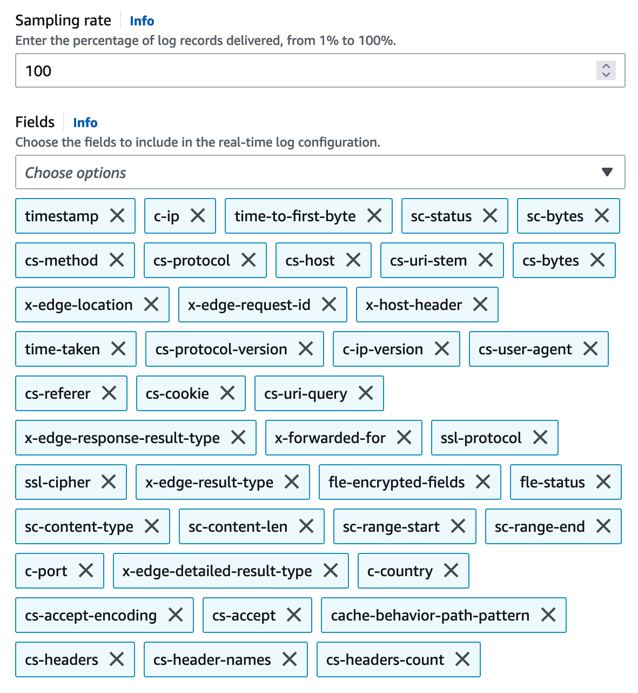

If you selected **Real time monitoring** when deploying the solution (CloudFormation stack), the following architecture will be installed, and the corresponding cloud resources will be automatically created in your account. 

1. Enable CloudFront real-time logs. You need to configure the corresponding data stream in Kinesis Data Stream.
2. Set up Kinesis Data Firehose to complete data transfer quickly. This enables CloudFront's real-time logs to pass through Kinesis Data Stream and finally store them in S3 buckets through Kinesis Data Firehose. During this process, to monitor the download speed in each country and each ISP, Kinesis Data Firehose invokes the Amazon Lambda function Log Transformer to find the ISP and country code through the client IP, and cooperate with Kinesis Data Firehose to implement dynamic partitioning, that is, real-time logs are partitioned by partition key and stored in S3 bucket, such as year=2021/month=12/day=10/hour=09.
3. Query real-time logs in S3 via Athena. In order to allow Athena to speed up data query through data partitioning, Amazon EventBridge will create all partitions for the next day every day, and delete the partitions of the previous day. The Lambda function MetricCollector is used to analyze real-time logs and collect monitoring metrics. It will be executed every 5 minutes.
4. Save the query results in DynamoDB. Query the corresponding monitoring indicator data through Athena, such as calculating CHR (cache hit rate) and download rate through bandwidth, and finally store the monitoring indicator data in the DynamoDB table.
5. Call APIs via API Gateway. When users send API request to API Gateway, a Lambda function called MetricManager will be triggered. The function reads the monitoring indicators and returns the corresponding results from the DynamoDB table. In order to strengthen security management and restrict API accesses, API key is enabled in API Gateway by default. Users are required to pass an x-api-key when calling the APIs.

## Active monitoring
1. Open the CloudFront console to enable the Real-time configurations under **Logs** setting tab
2. Click `Create configuration` button to open configuration settings, input 100 in the *Sampling rate* field and *all* fields

    !!! Note "PLEASE choose the fields by the default order"
        

3. Choose the cloudfront-real-time-log-data-stream in the `Endpoint` field
4. In Distributions select the dictribution and in the `Cache behaviors` select **Default(*)**.

## Metrics

The following metrics are provided:

- request: the number of requests from the client to CloudFront
- requestOrigin: the number of requests back to the origin
- statusCode: the status code from the client to CloudFront
- statusCodeOrigin: the status code of the back-to-origin
- bandwidth: the bandwidth from the client to CloudFront
- bandwidthOrigin: bandwidth back to origin
- chr: cache hit rate calculated by the number of requests
- chrBandWith: cache hit ratio calculated by bandwidth
- downloadSpeed: download speed from client to CloudFront
- downloadSpeedOrigin: the download speed of the back-to-origin
- topNUrlRequests: top url calculated by the number of requests
- topNUrlSize: top url calculated by traffic
- downstreamTraffic: down stream traffic in response to the request

