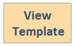

To automate deployment, this solution uses the following AWS CloudFormation templates, which you can download before deployment:

### CloudFront Extensions Console
 
**CloudFrontExtnConsoleStack.template.json**: Use this template to launch the solution and all associated components. The default configuration deploys monitoring dashboard, distribution management and extension repository, but you can customize the template to meet your specific needs.
