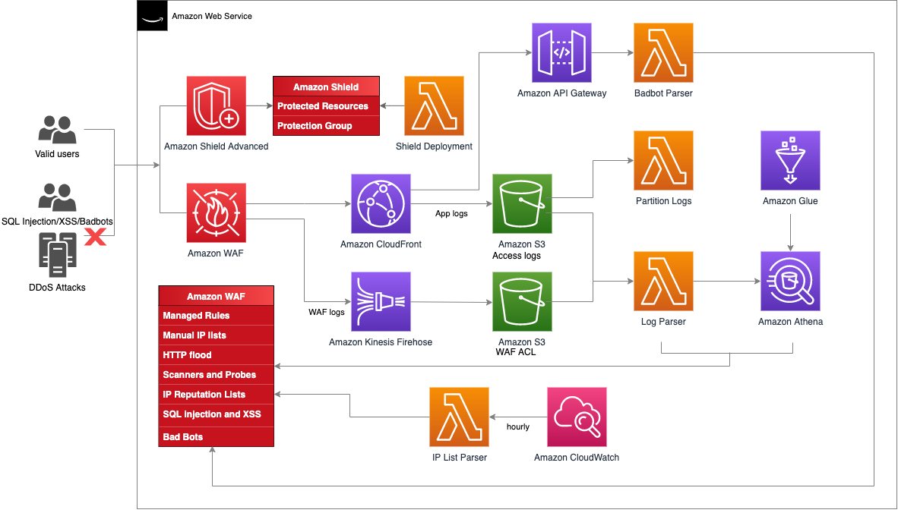
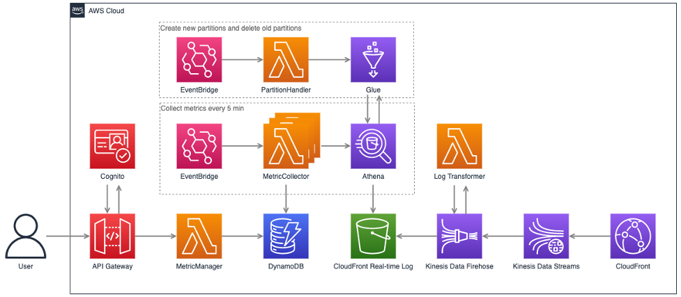

使用默认参数部署解决方案后，在亚马逊云科技中构建的环境如下图所示。

      
图1：方案架构

### Lambda@Edge & CloudFront Functions合集
 
本模块包含多个可通过SAR (Serverless Application Repository)部署的Lambda@Edge函数和通过CloudFormation部署的CloudFront Functions。

### 基于Amazon WAF与Amazon Shield的CloudFront安全自动化

图2：基于Amazon WAF与Amazon Shield的CloudFront安全自动化架构

本模块通过CloudFormation模版会自动部署一系列亚马逊云科技服务，其中包含Amazon WAF、Amazon Shield Advanced、Amazon Lambda、Amazon Athena、Amazon API Gateway等。

- Shield Deployment Lambda函数：自动部署Shield Advanced安全组和被保护资源，从而防御DDoS攻击。
- Log Parser Lambda函数：调用Athena对CloudFront标准日志和WAF日志进行查询，找到指定时间内超过阈值的IP，将其更新到WAF中，从而防御DDoS攻击。
- Badbot Parser Lambda函数：当有爬虫点击陷阱链接时，将其IP更新到WAF中，从而阻止爬虫继续爬取网站内容。
- IP List Parser Lambda函数：CloudWatch会定时调用此函数从第三方网站更新有风险的IP列表。
- 自动部署的WAF规则会对SQL注入攻击和跨站脚本攻击进行防御。

### CloudFront实时日志监控API

图3：CloudFront实时日志监控API架构

本模块主要完成以下操作：

1. 开启CloudFront实时日志
  
    开启的过程中需要配置对应的Kinesis Data Stream数据流。

2. 设置Kinesis Data Firehose快速完成数据传输
  
    CloudFront的实时日志会依次通过Kinesis Data Stream和Kinesis Data Firehose，最终存储到Amazon S3桶中。在此过程中，Kinesis Data Firehose会调用Amazon Lambda函数Log Transformer实现通过客户端IP找到ISP和国家代码，从而以国家代码和运营商为单位对下载速率指标进行分类，并配合Kinesis Data Firehose实现动态分区。也就是说，将实时日志通过分区键进行分区，并存储到Amazon S3桶中，如year=2021/month=12/day=10。

3. 通过Athena查询S3中的实时日志
  
    为了让Amazon Athena通过数据分区加速数据查询，通过Amazon EventBridge每天会新建第二天的所有分区，并删除前一天的分区。Lambda函数MetricCollector用来分析实时日志和收集监控指标，每5分钟执行一次。

4. 将查询数据的结果保存在DynamoDB中方便后续获取
  
    通过Amazon Athena查询出相应的监控指标数据，例如通过带宽计算缓存命中率(CHR)、下载速率，最终将监控指标数据存储在DynamoDB表格中。

5. 最终用户接口使用API Gateway
  
    用户接口通过API Gateway和Lambda函数MetricManager生成一个RESTful API，MetricManager会读取DynamoDB表格中的监控指标并返回相应结果。为了进一步加强安全管理限制API的访问，API Gateway中开启Cognito授权，访问接口的用户需携带Cognito令牌才能正常请求API。

