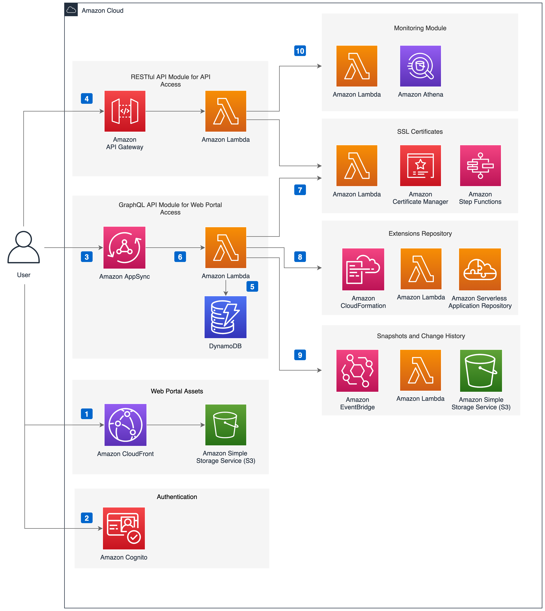

使用默认参数部署此解决方案会在AWS云中构建以下环境。

Figure 1: CloudFront Extensions架构图

1. Amazon CloudFront分发托管在Amazon S3桶中的解决方案web控制台。
2. Amazon Cognito用户池为后端提供身份验证。
3. Amazon AppSync提供了后端GraphQL API。
4. Amazon API Gateway为SSL证书和监控功能提供了Restful API。
5. Amazon DynamoDB作为后端数据库存储了解决方案相关信息。
6. AWS Lambda与其他Amazon服务交互以实现监控、SSL证书和扩展存储库的核心逻辑，并获得在DynamoDB表中更新的信息。
7. AWS Step Functions管理创建ACM证书、导入现有证书和创建CloudFront分配的工作流。
8. CloudFront扩展显示在扩展存储库中。如果您想将扩展部署到您的AWS帐户中，它将自动触发AWS CloudFormation用于部署。
9. AWS Lambda将CloudFront配置的更改存储到S3存储桶中，您可以查看两个CloudFront配置版本之间的差异并应用配置。
10. Amazon Athena查询CloudFront标准日志或实时日志以获得CloudFront指标，并通过API Gateway输出。您还可以通过监控仪表板查看指标。

