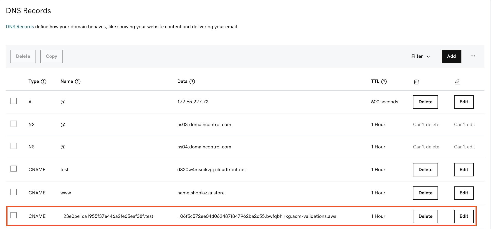

您可以在DNS提供商中添加CNAME的CloudFront记录。

## 添加CName以指向Route53中的CloudFront分发

创建CloudFront分配后，域名所有者需要手动或使用API将CloudFront分配添加为网站的CNAME，这样当有人访问网站时，DNS提供商将重定向到CloudFront分配。请参阅[AWS官方文档](https://docs.aws.amazon.com/Route53/latest/DeveloperGuide/routing-to-cloudfront-distribution.html)。

## 添加CName以指向GoDaddy中的CloudFront分配

1. 登录[GoDaddy](https://www.godaddy.com/)。
2. 在**Domains* menu**，选择**All Domains**。
3. 选择需要更新CNAME记录的域名。
4. 添加新的CNAME记录，输入带有CNAME的**Name**，以及带有相应CloudFront分配的**Data**。您可以在本解决方案发送的SNS消息邮件中找到这两个值。

