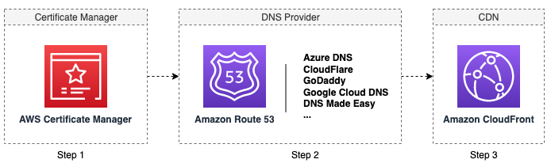

本解决方案将在ACM中创建一个或多个证书，并创建相关CloudFront分配。

### 它是如何工作的

启动创建证书作业时，本解决方案将在AWS Step Functions中启动工作流，该工作流执行以下操作：

1. 在ACM中创建证书：本解决方案将根据输入自动创建所有ACM证书。创建SSL证书后，本解决方案将向指定的电子邮件地址发送SNS消息。之后，域名所有者需要完成DNS验证过程。有关更多信息，请参阅[DNS验证](./dns-validation-process.md)。

2. 检查ACM中的证书状态：本解决方案每5分钟检查一次DNS验证状态。DNS验证是一个手动过程，也称为域控制验证（Domain Control Validation）。域名所有者需要在DNS提供商的网站上手动添加域名的CNAME记录。ACM将每隔几分钟检查一次DNS验证状态。完成后，ACM将颁发证书。

3. 创建新的CloudFront分配：当所有证书都由ACM颁发后，本解决方案将自动创建CloudFront分配。创建所有CloudFront分配后，本解决方案将向指定的电子邮件地址发送SNS消息。之后，域名所有者需要添加新的CloudFront分配以映射到CNAME。有关更多信息，请参阅[向DNS提供商添加CNAME的CloudFront记录](./add-record-for-cname.md)。

### 创建新证书

1. 登录到web控制台。
2. 在左侧栏的**分配管理**下，选择**SSL证书**。
3. 选择**请求新证书**。
4. 在打开的页面中，单击**开始**。
5. 为证书输入一组域名列表。如果要创建其他证书，请单击**为其他证书添加域名**。
6. 选择**自动创建分发**，然后选择要从中复制配置的CloudFront分配的快照。
7. 单击**添加新标记**，为将要创建的证书、云端分发版等资源添加标记。
8. 单击**开始作业**。
9. 验证生成的输入参数，如果一切正常，则在输入框中输入“Confirm”，然后单击“应用”按钮。

### 查看作业状态

您可以在web控制台或使用API查看作业状态。

创建作业启动后，您将被重定向到一个页面，在该页面上可以查看作业的状态。对于创建证书作业，AWS Step Functions工作流中会依次执行三个步骤。完成所有步骤后，作业将成功完成。如果其中一个步骤失败，作业将失败。

* 步骤1将创建所有ACM证书后完成。通常不到一分钟。

* 步骤2将在ACM发布所有预期证书后完成。ACM仅在完成所有DNS验证后才颁发证书。（此步骤将被阻塞，直到用户对相关DNS服务器上的所有域名进行DCV验证，请参阅[此链接](https://docs.aws.amazon.com/acm/latest/userguide/dns-validation.html))

* 步骤3在创建了所有CloudFront分配后完成。

在步骤1之后，域名所有者需要完成DNS验证过程。有关更多详细信息，请参阅[DNS验证](./dns-validation-process.md)。

在步骤3之后，域名所有者需要添加新的CloudFront分配以映射到CNAME。有关更多详细信息，请参阅[在DNS提供商中为CNAME添加CloudFront记录](./add-record-for-cname.md)。

如果作业失败，请参阅[清理资源](clean-up-resources.md)，清理创建的ACM和CloudFront分配。

