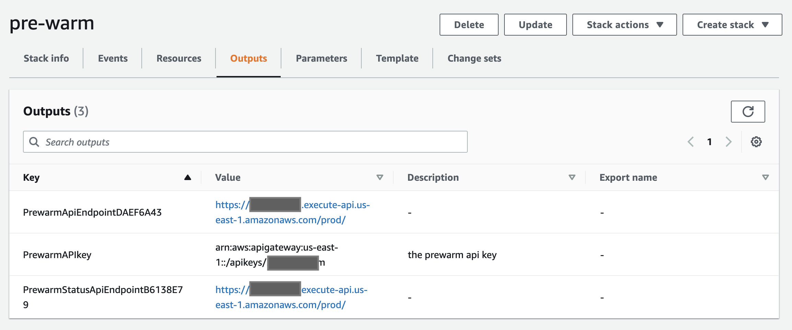
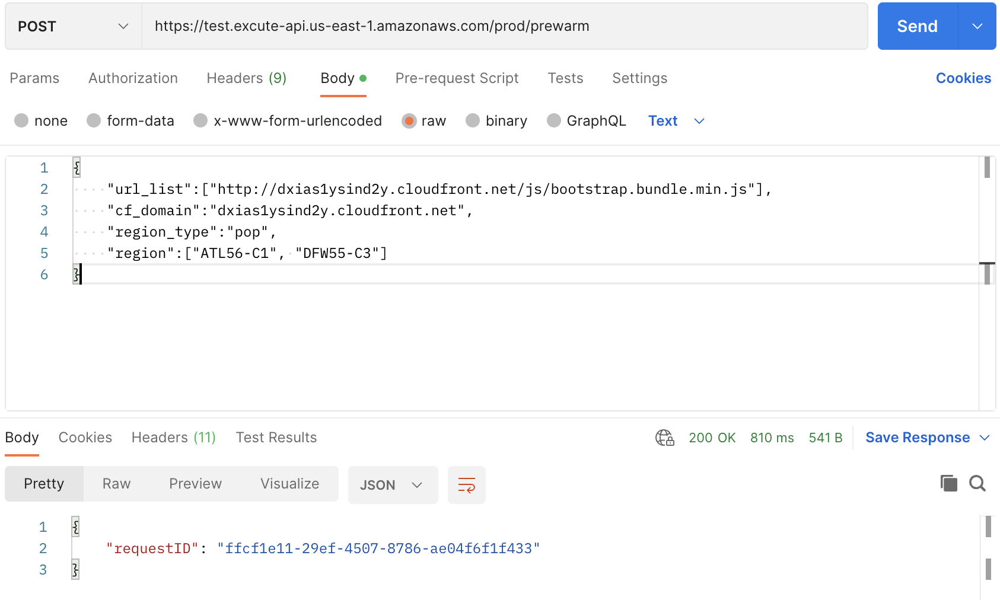

## 什么是预热?
预热通过提前向CloudFront发送请求来加速内容交付。这在传递大文件时非常有用。预热有助于降低源站服务器的负载，因为相同的请求将命中CloudFront缓存，源站服务器接收的请求较少，因此，降低了源站服务器出问题的机率。

## 预热是如何工作的?
该解决方案部署了一个CloudFormation模板，将在您的AWS帐户中安装以下架构。所有云资源都将自动创建。部署后，您将获得两个REST API，一个用于触发预热操作，另一个用于获取预热状态。

CloudFormation模板提供以下组件和工作流：

1. Scheduler Lambda函数将初始预热状态、将其插入DynamoDB表。
2. Cache invalidator Lambda函数会删除所有URL的CloudFront缓存，并将requestId、PoP和URL等的消息发送到SQS中。
3. CloudWatch alarm监视队列中的消息，并在消息发送到队列中时通知自动伸缩组扩容。
4. 自动伸缩组包含了EC2 Spot实例。每个实例会向CloudFront边缘位置发送请求，并在消费完SQS队列中的消息后将预热状态更新到DynamoDB表中。
5. StatusFetcher Lambda函数从DynamoDB表获取预热状态。

## 通过Web控制台部署（推荐）

从Web控制台中部署扩展的步骤类似。有关更多信息，请参阅[True Client IP](true-client-ip.md).

## 通过CloudFormation部署
 
部署时间：约10分钟

### 部署概述

使用以下步骤在Amazon Web Service上部署此解决方案。

- 在您的Amazon Web Service帐户中启动CloudFormation模板。
- 查看模板参数，并在必要时进行调整。

### 部署步骤

1. 登录到Amazon Web Services管理控制台，选择按钮以启动模板。您还可以选择直接[下载模板](https://aws-gcr-solutions.s3.amazonaws.com/Aws-cloudfront-extensions/latest/custom-domain/PrewarmStack.template.json)进行部署。

      

2. 默认情况下，该模板将在您登录控制台后默认的区域启动，即美国东部（弗吉尼亚北部）区域。若需在指定的区域中启动该解决方案，请在控制台导航栏中的区域下拉列表中选择。

3. 在参数部分，查看模板的参数，并根据需要进行修改。

      | 参数             | 默认值 | 说明  |
      |-----------|---------------|---------|
      | ShowSuccessUrls | false | 在预热状态API中显示成功url列表（true or false）。 |
      | InstanceType | c6a.large | 发送预热请求的EC2 spot实例类型。 |
      | ThreadNumber | 6 | EC2中并行执行的线程数。 |
  

4. 选择**下一步**。
5. 在**配置堆栈选项**页面上，您可以为堆栈中的资源指定标签（键值对）并设置其他选项，然后选择**下一步**。
6. 在**审核**页面，查看并确认设置。确保选中确认模板将创建Amazon Identity and Access Management（IAM）资源的复选框。选择**下一步**。
7. 选择**创建堆栈**以部署堆栈。

您可以在Amazon CloudFormation控制台的**状态**列中查看堆栈的状态。正常情况下，大约15分钟内可以看到状态为**CREATE_COMPLETE**。

您还可以选择**输出**标签页查看堆栈资源的详细信息。

## 使用说明

在预热前，请在被预热的CloudFront分配的缓存行为中，将Viewer protocol policy设置为**HTTP and HTTPS**.

### 通过Postman触发预热

1. 当本方案部署完成后，打开CloudFormation堆栈的*输出*标签页，可以看到如下信息：
    

    - **PrewarmAPIkey**: API密钥arn。您可在API Gateway控制台的API密钥界面中找到此API key，点击显示按钮，获取密钥。请求预热API时需要使用此密钥进行鉴权，作为x-api-key的值。
    - **PrewarmApiEndpoint**: 预热API的URL即为在此后面加上prewarm关键字。例如：若PrewarmApiEndpoint是**https://123456789.execute-api.us-east-1.amazonaws.com/prod/**，则预热API为 **https://123456789.execute-api.us-east-1.amazonaws.com/prod/prewarm**
    - **PrewarmStatusApiEndpoint**: 获取预热状态API的URL即为在此后面加上status关键字。例如：若PrewarmStatusApiEndpoint是**https://test.execute-api.us-east-1.amazonaws.com/prod/**，则获取预热状态API为 **https://urs06q9rid.execute-api.us-east-1.amazonaws.com/prod/status**
2. 打开可以发送HTTP请求的工具，例如Postman。
3. 按照预热API格式发送预热请求（更多信息请见[API参考指南](../api-reference-guide/extension-repository.md#pre-warming)），并在header中新建键值对：key为**x-api-key**，value为API key。

    
    

4. 预热API会返回requestID，至此您成功触发了预热，下面可以通过PrewarmStatus API获取预热状态。
5. 按照获取预热状态API的格式发送请求，并在url参数中带上requestId，在header中添加x-api-key，在响应中可看到最新的预热状态。(请注意检查是否请求header中默认带有Accept-Encoding，并且值为"gzip, deflate, br"，如果没有注意添加下)
    

### 通过Curl触发预热

#### 触发预热

脚本内容

**prewarmlist.json**

      {
            "url_list": [
                  "https://www.example.com/index.html",
                  "https://www.example.com/images/demo.png"
            ],
            "target_type":"pop",
            "cf_domain": "d1234567890r.cloudfront.net",
            "region": ["ATL56-C1", "DFW55-C3"]
      }

**prewarm.sh**

      prewarmuri="https://123456789.execute-api.us-east-1.amazonaws.com/prod/prewarm"
      curl --header 'x-api-key: KEY12345678900Tg9P' -XPOST -d @prewarmlist.json $prewarmuri

执行脚本

      sh prewarm.sh

执行结果示例

      {"requestID": "e1efca9a-8d92-4058-a1e9-002fd423f6e5"}

### 获取预热状态

脚本内容

**prewarmstatus.sh**

      #!/bin/bash
      statusurl="https://3e23456789h.execute-api.us-east-1.amazonaws.com/prod/status?requestID=e1efca9a-8d92-4058-a1e9-002fd423f6e5“
      curl  --header 'x-api-key: KEY123456789Tg9P' $statusurl

执行脚本

      sh prewarmstatus.sh

执行结果示例

      {
            "status": "COMPLETED",
            "total": 2,
            "completed": 2,
            "inProgress": 0,
            "failedUrl": [],
            "inProgressUrl": []
      }

## 问题调试

预热方案会自动启动EC2 Spot实例，并在EC2上执行脚本进行预热，预热脚本的位置为/etc/agent/agent.py，当预热执行完毕后会自动删除这些EC2实例。您可以登录到EC2机器上在/var/log/user-data.log中查看具体执行日志进行调试。

