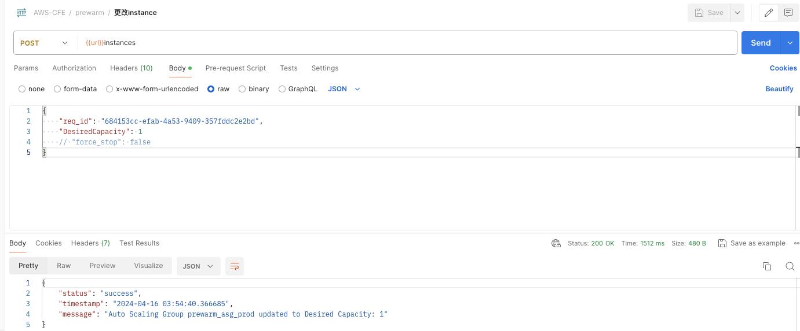

# 什么是预热?
预热通过提前向CloudFront发送请求来加速内容交付。这在传递大文件时非常有用。预热有助于降低源站服务器的负载，因为相同的请求将命中CloudFront缓存，源站服务器接收的请求较少，因此，降低了源站服务器出问题的机率。

## 预热是如何工作的?
该解决方案部署了一个CloudFormation模板，将在您的AWS帐户中安装以下架构。所有云资源都将自动创建。部署后，您将获得两个REST API，一个用于触发预热操作，另一个用于获取预热状态。

CloudFormation模板提供以下组件和工作流：

1. API Handler Lambda用来接收来自API Gateway的请求；对URL去重，写入一个csv文件，以request id命名上传到S3上；并按照传入的shutdown事件创建一个Eventbridge定时器；并按照参数要求启动ASG里面的EC2机器；把请求体存入DynamoDB的Request表中。
2. DynamoDB的Request表开启了DynamoDB stream，Request表的stream会触发Get Size Lambda和Task Lambda。
3. Get Size Lambda 会从S3中下载以request id命名的csv文件，轮询URL列表，执行curl命令，得到每个文件的大小并汇总文件大小，存入Request表中的total_size字段，单位是byte, 并把出问题的URL和成功的URL写回S3。
4. Task Lambda会从DynamoDB stream中得到所有pop点和Cloudfront domain的信息，从S3中下载以request id 命名的csv文件，得到URL列表。轮询pop通过dig得到每个pop的IP列表，存入Request-Pop表中，然后轮训URL，根据参数确定是否需要删除cloudfront的缓存，并把每个URL和pop点匹配作为一个任务，发送到prewarm_task这个queue中去。 
5. AutoScalingGroup(ASG)中的EC2机器会从prewarm_task这个queue中取得任务，执行curl命令进行文件下载，并且把下载结果存入Request-Task表中，包括文件的大小和下载的成功与否。其中EC2机器使用的是标准的Amazon Linux 2023的AMI，在启动的时候会去S3上下载agent代码并进行预热。
6. Request-Task表开启了DynamoDB stream，这个stream会触发Aggregation Lambda，Aggregation Lambda会批量统计下载任务的文件大小，汇总之后更新Request表中的downloaded_size字段，得到累计下载大小。
7. 定时器在预定的时间触发Shutdown Lambda，Shutdown Lambda 会直接停掉（terminate）掉ASG中的所有EC2机器，终端正在进行的预热。同时也会删掉prewarm_task这个queue里面所有的message，不管有没有完成。

## 部署预热功能
 
### 部署概述

部署时间：约10分钟

使用以下步骤在Amazon Web Service上部署此解决方案。

- 在您的Amazon Web Service帐户中启动CloudFormation模板。
- 查看模板参数，并在必要时进行调整。

### 部署步骤

1. 登录到Amazon Web Services管理控制台，直接点击以下按钮以启动模板。

      - 部署在新VPC： （[模板下载地址](https://aws-gcr-solutions.s3.amazonaws.com/Aws-cloudfront-extensions/v2.0.0_332/custom-domain/CFEPrewarmStack.template.json)）

      - 部署在现有VPC： （[模版下载地址](https://aws-gcr-solutions.s3.amazonaws.com/Aws-cloudfront-extensions/v2.0.0_332/custom-domain/CFEPrewarmStackUseExistVPC.template.json)） 

2. 默认情况下，该模板将在您登录控制台后默认的区域启动，即美国东部（弗吉尼亚北部）区域。若需在指定的区域中启动该解决方案，请在控制台导航栏中的区域下拉列表中选择。

3. 在参数部分，查看模板的参数，并根据需要进行修改。 
4. 对于选择直接部署的默认模版参数如下：

      | 参数      | 默认值       | 说明                                 |
      |---------|-----------|------------------------------------|
      | envName | prod      | 选择的部署预热环境。                         |
5. 对于选择使用现有vpc模版部署的参数如下：

      | 参数      | 默认值  | 说明                      |
      |---------|------|-------------------------|
      | envName | prod | 选择的部署预热环境。              |
      | vpc     | 无，必填 | 选择需要部署在的vpc             |
      | subnet  | 无，必填 | 选择需要部署所在vpc的公有子网        |
      | sg      | 无，必填 | 选择需要使用的安全组              |
      | key     | 无，必填 | 选择安全密钥keypair           |
      | vpce    | 无，选填 | 选择当需要部署为私有API时的endpoint |
      
6. 选择**下一步**。 
7. 在**配置堆栈选项**页面上，您可以为堆栈中的资源指定标签（键值对）并设置其他选项，然后选择**下一步**。 
8. 在**审核**页面，查看并确认设置。确保选中确认模板将创建Amazon Identity and Access Management（IAM）资源的复选框。选择**下一步**。 
9. 选择**创建堆栈**以部署堆栈。
10. 您可以在Amazon CloudFormation控制台的**状态**列中查看堆栈的状态。正常情况下，大约15分钟内可以看到状态为**CREATE_COMPLETE**。
11. 当本方案部署完成后，打开CloudFormation堆栈的 **输出** 标签页，可以看到如下信息：
    
    

- **prewarmapikeyoutput**: API密钥arn。您可在API Gateway控制台的API密钥界面中找到此API key，点击显示按钮，获取密钥。请求预热API时需要使用此密钥进行鉴权，作为x-api-key的值。
- **prewarmapiEndpoint**: 预热API的URL即为在此后面加上prewarm关键字。

    ***例如***：若PrewarmApiEndpoint是https://123456789.execute-api.us-east-1.amazonaws.com/prod/，则预热API为POST方式调用 https://123456789.execute-api.us-east-1.amazonaws.com/prod/prewarm
    
    ***例如***：若PrewarmStatusApiEndpoint是https://test.execute-api.us-east-1.amazonaws.com/prod/，则获取预热进度API为GET方式调用 https://test.execute-api.us-east-1.amazonaws.com/prod/prewarm
    

## 使用预热功能

在预热前，请在被预热的CloudFront分配的缓存行为中，将Viewer protocol policy设置为**HTTP and HTTPS**. 更多信息请见[API参考指南](../api-reference-guide/extension-repository.md#pre-warming)。

### 触发预热

#### 方式一：通过Postman

1. 打开可以发送HTTP请求的工具，例如Postman。
2. 按照预热API格式发送预热请求，并在header中新建键值对：key为**x-api-key**，value为API key。
   
    

    

3. 预热API会返回requestID，至此您成功触发了预热，下面可以通过查询预热进度 API获取预热状态。

4. 按照获取预热状态API的格式发送请求，并在url参数中带上requestId，在header中添加x-api-key，在响应中可看到最新的预热状态。(请注意检查是否请求header中默认带有Accept-Encoding，并且值为"gzip, deflate, br"，如果没有注意添加下)
    
5. 可以在预热过程中变更预热的instance数量，以便动态调整整体预热进展
   
6. 变更预热的instance数量后可以查看系统当前的instance数量
    
7. 预热结束后可以查看预热结果报告
   
    

#### 方式二：通过Curl

**触发预热**

1. 准备预热脚本内容

**prewarmlist.json**

    {
        "url_list": [
          "https://www.example.com/index.html",
          "https://www.example.com/css/bootstrap-icons.css"
        ],
        "cf_domain": "www.example.com",
        "target_type":"pop",
        "countries": [
        ],
        "regions": [
        ],
        "pops": [
            "ATL56-C1",
            "SIN2-C1",
            "DFW55-C3"
        ],
        "timeout": 5,
        "header": [
        ],
        "instance_count": 1,
        "need_invalidate": false
    }

!!! Note "注意"
    字段 "target_type" 是可选字段，如果不指定，默认是pop 也可以选择country和region 如果选择了某个值pop country region中的某一个 下面对应的pops countries regions需要填写对应需要预热的值，不填系统默认选择可预热节点预热. need_invalidate字段可选，表示是否开启清除cloudfront的缓存 默认不开启

**prewarm.sh**

      prewarmuri="https://123456789.execute-api.us-east-1.amazonaws.com/prod/prewarm"
      curl --header 'x-api-key: KEY12345678900Tg9P' -XPOST -d @prewarmlist.json $prewarmuri

2. 执行脚本

      sh prewarm.sh

执行结果示例

    {
        "status": "Success",
        "error_message": "",
        "error_urls": [],
        "request_id": "e059b77b-e427-4489-a50b-4d8c652f114c",
        "timestamp": "2024-04-16 03:12:21.046535",
        "timeout_at": "2024-04-16 03:17:21.046535"
    }

**获取预热进度**

1. 准备脚本内容

**prewarmstatus.sh**

      #!/bin/bash
      statusurl="https://123456789.execute-api.us-east-1.amazonaws.com/prod/prewarm?req_id=e1efca9a-8d92-4058-a1e9-002fd423f6e5“
      curl  --header 'x-api-key: KEY123456789Tg9P' $statusurl

2. 执行脚本

      sh prewarmstatus.sh
      
执行结果示例

    {
        "request_id": "684153cc-efab-4a53-9409-357fddc2e2bd",
        "download_size": 137368,
        "total_size": 206052,
        "percentage_complete": 66,
        "available_task_count": 0,
        "in_progress_task_count": 0,
        "download_count": 6,
        "total_count": 6,
        "created_at": "2024-04-16 03:10:21.405303",
        "last_update_time": "2024-04-16 03:11:53.531414",
        "timestamp": "2024-04-16 03:15:09.499889",
        "status": "FINISHED"
    }

### 修改instance数量

1. 准备脚本内容

instance.json

    {
        "req_id": "684153cc-efab-4a53-9409-357fddc2e2bd",
        "DesiredCapacity": 1
        // "force_stop": false
    }

!!! Note "注意"
    字段 "force_stop" 是可选字段，如果不指定，默认是false 表示是否强制关停预热的机器

instance.sh

      instanceuri="https://123456789.execute-api.us-east-1.amazonaws.com/prod/instances"
      curl --header 'x-api-key: KEY12345678900Tg9P' -XPOST -d @instance.json $instanceuri

2. 执行脚本

      sh instance.sh

执行结果示例

    {
        "status": "success",
        "timestamp": "2024-04-16 03:54:40.366685",
        "message": "Auto Scaling Group prewarm_asg_prod updated to Desired Capacity: 1"
    }

### 获取instance数量

1. 脚本内容

prewarminstance.sh

      #!/bin/bash
      instancesurl="https://123456789.execute-api.us-east-1.amazonaws.com/prod/instances“
      curl  --header 'x-api-key: KEY123456789Tg9P' $instancesurl

2. 执行脚本

      sh prewarminstance.sh

执行结果示例

    {
        "status": "success",
        "timestamp": "2024-04-16 03:56:39.210951",
        "message": "query success",
        "desiredcapacity": 1
    }

### 获取预热报告

1. 脚本内容

prewarmreport.sh

      #!/bin/bash
      reporturl="https://123456789.execute-api.us-east-1.amazonaws.com/prod/summary?req_id=684153cc-efab-4a53-9409-357fddc2e2bd“
      curl  --header 'x-api-key: KEY123456789Tg9P' $reporturl

2. 执行脚本
   
      sh prewarmreport.sh

执行结果示例

    {
        "request_id": "684153cc-efab-4a53-9409-357fddc2e2bd",
        "failure_pops": [],
        "failure_urls": [
            ""
        ],
        "failure_pop_urls_report": "http://reporturl",
        "timestamp": "2024-04-16 03:12:54.605891",
        "created_at": "2024-04-16 03:10:21.405303",
        "last_update_time": "2024-04-16 03:11:53.531414",
        "status": "FINISHED"
    }

## 问题调试

预热方案会自动启动EC2 Spot实例，并在EC2上执行脚本进行预热，预热脚本的位置为/home/ec2-user/agent/agent.py，当预热执行完毕后会自动删除这些EC2实例。

