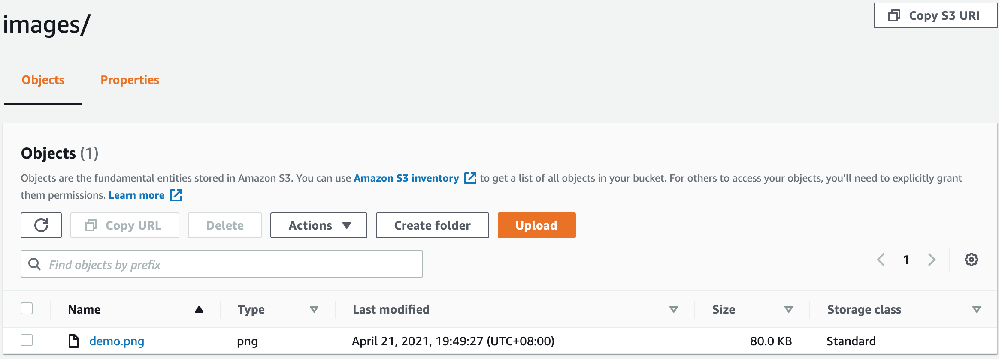
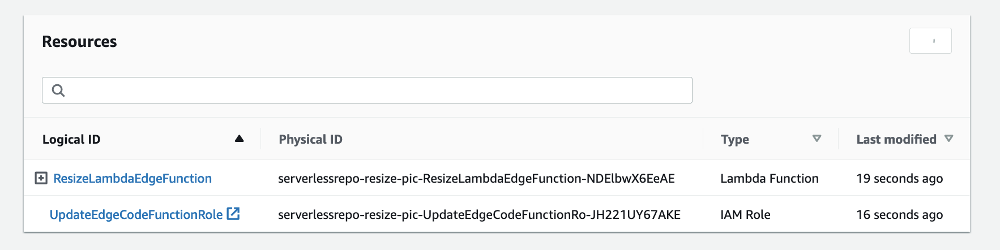
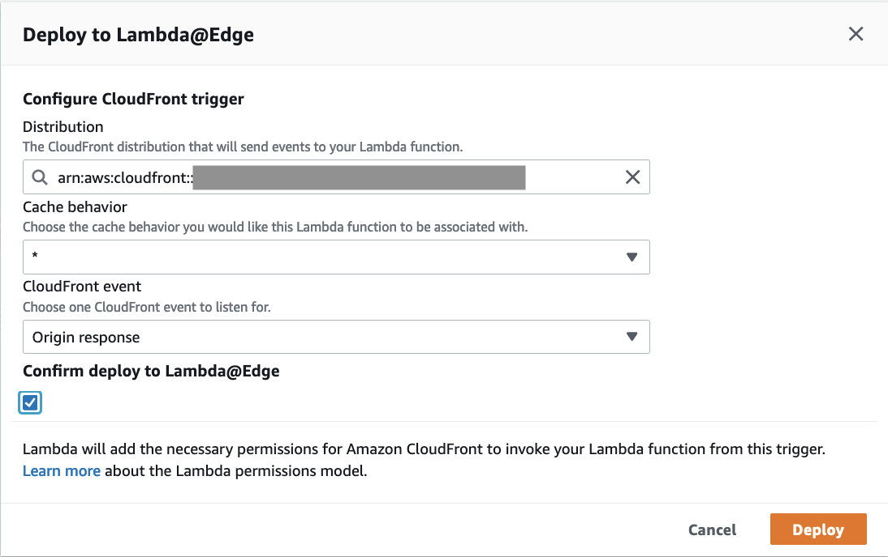

## 什么是图片缩放?

本方案可在CloudFront边缘节点上对您的图片进行缩放。当您有大量图片需要转换成各种尺寸的图片，如缩略图、适配手机的图片、适配PC浏览器的图等，可通过此功能减少操作成本。

## 图片缩放是如何工作的?


1. 用户在URL中指定需要缩放的尺寸，例如：https://www.example.com/images/200x300/demo.png，即表示将demo.png转换为200x300的图片。

2. 如果此尺寸的图片已在S3桶中存在，则直接返回它。
   
3. 如果此尺寸的图片不在S3桶中，Lambda会收到404 Not Found响应，Lambda会获取S3桶中的原始图片（例如：images/demo.png），按照URL中指定的尺寸对其进行缩放，并把缩放后的图片存储到S3桶的相应文件夹中（例如：images/200x300）。
  注意：若没有返回404 Not Found，而是返回403，您需要在S3桶中添加s3:ListBucket权限，例如：
  ```
        {
            "Sid": "1",
            "Effect": "Allow",
            "Principal": {
                "AWS": "arn:aws:iam::cloudfront:user/CloudFront Origin Access Identity Example"
            },
            "Action": "s3:ListBucket",
            "Resource": "arn:aws:s3:::example-bucket"
        }
  ```
   
4. 当图片缩放并存储到S3桶后，Lambda会返回200状态码，并将缩放后的图片的返回。
   
5. 缩放后的图片会缓存在CloudFront中，当用户下次请求同样尺寸的图片时，会优先从缓存中获取图片，从而减少响应时间。


## 使用说明

请执行如下步骤

1. 登录您的AWS账号，并进入[S3控制台](https://s3.console.aws.amazon.com/s3/home)。

2. 创建一个S3桶，并在桶中创建一个文件夹，例如名称为images的文件夹，将您的原始图片上传到此文件夹中。   
        
   

3. 进入[CloudFront控制台](https://us-east-1.console.aws.amazon.com/cloudfront/)，点击创建分配按钮。

4. 在创建分配页面，源域：选择在第2步中创建的S3桶；S3存储桶访问：选择'是的，使用 OAI' 并点击 '创建新的OAI' 按钮创建一个OAI。存储桶策略：选择 '是，更新存储桶策略'。其他用默认选项，点击创建分配按钮。
  

5. 等待直到CloudFront分配创建完成。

6. 进入[S3控制台](https://s3.console.aws.amazon.com/s3/home)。选择第二步创建的S3桶。

7. 在权限标签页中，更新存储桶策略中的Action和Resource值。(更新Action为s3:ListBucket，更新Resource为S3桶的ARN，具体参考如下示例)。

       ```
       {
           "Version": "2008-10-17",
           "Id": "PolicyForCloudFrontPrivateContent",
           "Statement": [
               {
                   "Sid": "1",
                   "Effect": "Allow",
                   "Principal": {
                       "AWS": "arn:aws:iam::cloudfront:user/CloudFront Origin Access Identity E2NHBYQWR0YVVH"
                   },
                   "Action": "s3:ListBucket",
                   "Resource": "arn:aws:s3:::input-your-bucket-name"
               }
           ]
       }
       ```

8. 部署[CloudFront Extensions控制台](../deployment.md)。在扩展存储库中，选择**image-resize**。

9. 点击部署按钮。

      下表是参数具体定义：

      | 参数 | 描述 |
      |  ----  | ----  | 
      | FitType | 图片缩放方式，有效值为</p><b>cover</b>：保留纵横比，通过裁剪以确保图像覆盖提供的两个尺寸。</p><b>contain</b>：保留纵横比，在必要时使用“letterboxing”。</p><b>fill</b>：忽略输入的纵横比并拉伸到两个提供的尺寸。</p><b>inside</b>：保持纵横比，将图像调整为尽可能大，同时确保其尺寸小于或等于指定的尺寸。</p><b>outside</b>：保留纵横比，将图像调整为尽可能小，同时确保其尺寸大于或等于指定的尺寸。 |
      | S3BucketName | 包含图片的S3桶名称，例如：resize-image-demo |

10. 等待直到部署完成，您将会看到如下资源。
  
11. 点击表格中的ResizeLambdaEdgeFunction。
12. 点击'部署到Lambda@Edge'按钮。
  

13. 选择之前创建的CloudFront分配。CloudFront事件选择源响应，点击部署按钮。
  

14. 等待直到Lambda@Edge部署完成。

15. 要使用图片缩放功能，在您的浏览器中输入URL(例如：https://CloudFrontUrl/images/200x300/demo.png)，它将会自动生成一个200x300的demo.png图片，并将其保存到S3桶的images/200x300文件夹.

      在本示例中，原始图片为images文件夹中的demo.png，自动生成的图片会被保存在images文件夹中的相应尺寸的文件夹中

      


## CloudFront阶段
源响应阶段

## 通过Web控制台部署（推荐）

从Web控制台中部署扩展的步骤类似。有关更多信息，请参阅[True Client IP](true-client-ip.md).


