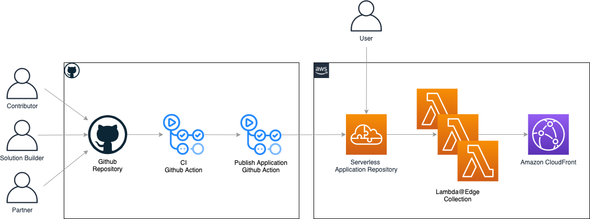

# Lambda@Edge Collection Roadmap

## Description
This solution is a collection of various Lambda@Edge extensions for using CloudFront.
Users are able to find the Lambda application in SAR(Serverless Application Repository) and deploy it with one-click. The solution covers common use scenarios, for example, authentication with Amazon Cognito on a CloudFront distribution, access relative content according to the device type.

It is an open-source project in GitHub, anyone is welcomed to contribute new Lambda@Edge features.

## Architecture

## Authentication
|    **Name**   | **Description**    | **Version**    |**Release**    | **Deployment Type** |
|------------------|--------------------|----------------|----------------|----------------|
| [Authentication by Cognito](../edge/nodejs/authentication-with-cognito) | Integrate with Cognito to provide authentication service. | v1.0.0 | Done | SAR |
| Authentication by native library | Integrate the native library, in this case using C library and include file, which's acting authentication function. | - | Todo | - |
| [Adding security header](../edge/nodejs/add-security-headers) | Add security header into response after successful authentication, this function will add 'strict-transport-security' to force browser using HTTPS. | v1.0.1 | Done | SAR, [CDK](https://github.com/awslabs/aws-cloudfront-extensions/tree/main/edge/nodejs/add-security-headers) |
| [OAuth2 Authentication](https://github.com/pahud/cdk-cloudfront-plus/issues/17) | Authentication with OAuth2. | v1.0.0 | Done | CDK |
| [Authentication with AliYun](../edge/nodejs/authentication-with-aliyun-cdn-typeA) | This solution provided by Goclouds Data is designed to achieve ALIYUN CDN authentication. | v1.0.0 | Done | SAR |

## Validation
|    **Name**   | **Description**    | **Version**    |**Release**    |
|------------------|--------------------|----------------|----------------|
| Validating token | Validate token from HTTP header by MD5 in order to prevent violent access. | - | Todo |

## URL Rewrite
|    **Name**   | **Description**    | **Version**    |**Release**    | **Deployment Type** |
|------------------|--------------------|----------------|----------------|----------------|
| Rewrite URL by cookie | Rewrite URL by cookie information when a viewer requests the address. | - | Todo | - |
| Rewrite URL by USER-AGENT |  Rewrite URL by USER-AGENT from HTTP header when a viewer requests the address. | - | Todo | - |
| [Default Directory Index for Amazon S3 Origin](https://github.com/pahud/cdk-cloudfront-plus/issues/9) |  re-write the request so that CloudFront requests a default index object (index.html in this case) for any request URI that ends in ‘/’. [Use case](https://aws.amazon.com/tw/blogs/compute/implementing-default-directory-indexes-in-amazon-s3-backed-amazon-cloudfront-origins-using-lambdaedge/) | v1.0.0 | Done | CDK |

## URL Redirect
|    **Name**   | **Description**    | **Version**    |**Release**    | **Deployment Type** |
|------------------|--------------------|----------------|----------------|----------------|
| [Redirect URL by device](../edge/nodejs/serving-based-on-device) | Redirect to the different version of an object based on the type of device that the user is using. | v1.0.3 | Done | SAR |
| Redirect URL by USER-AGENT | Generate a HTTP redirect response with specific URL regarding to USER-AGENT in the header. | - | Todo | - |
| [Redirect URL by Geolocation](https://github.com/pahud/cdk-cloudfront-plus/issues/11) | Forward request to the nearest PoP as per geolocation. It will return the location to client for 302 forwarding. | v1.0.0 | Done | CDK |

## Override Request
|    **Name**   | **Description**    | **Version**    |**Release**    | **Deployment Type** |
|------------------|--------------------|----------------|----------------|----------------|
| [Standardize query string](../edge/nodejs/normalize-query-string) | Standardize the query string before CloudFront forwards requests to your origin, so that improve the cache hit ratio. | v1.0.0 | Done | SAR, [CDK](https://github.com/pahud/cdk-cloudfront-plus/pull/64) |
| [Convert query string](https://github.com/pahud/cdk-cloudfront-plus/issues/23) | Convert the query string to key & value pairs and add into header. | v1.0.0 | Done | CDK |
| Format key & value | Format key & value pairs from POST request into specific form. | - | Todo | - |
| [Serverless load balancer](../edge/python/serverless-load-balancer) | The serverless load balance solution will load balance for your origin via Lambda@Edge which is deployed on CloudFront origin request. | v1.0.0 | Done | SAR |

## Override Response
|    **Name**   | **Description**    | **Version**    |**Release**    |
|------------------|--------------------|----------------|----------------|
| [Modify response status code](../edge/nodejs/modify-response-status-code)  | Modify response status code to specific code, such as 200 to 206, based on configured parameter. | v1.0.0 | Done |
| [Modify response header](../edge/nodejs/modify-response-header) | Modify response header as per configuration. | v1.0.0 | Done |
| Modify error response to 302 response | Modify error response to 302 response as per configuration. | - | Todo |
| Response status code 200 with zero sized body  | Special feature to support heartbeat function, any request will return HTTP 200 with zero sized body. | - | Todo |
| Generate static content  | Return generated static content based on configured parameter. | - | Todo |

## Origin Selection
|    **Name**   | **Description**    | **Version**    |**Release**    | **Deployment Type** |
|------------------|--------------------|----------------|----------------|----------------|
| [Access origin by geolocation](https://github.com/pahud/cdk-cloudfront-plus/issues/41) | Forward request to the nearest PoP as per geolocation. It will access the location from Edge location. | v1.0.0 | Done | CDK |
| Access origin by customized service| Access origin by calling customized service to get real origin address. | - | Todo | - |
| [Access origin by weight rate](../edge/nodejs/access-origin-by-weight-rate) | Forward request to multiple origin regarding to pre-configured weight for each origin. | v1.0.3 | Done | SAR |
| [Failover to alternative origin](../edge/nodejs/multiple-origin-IP-retry) | Failover to alternative IP from pre-configured list, return from success IP otherwise retry until last one. | v1.0.0 | Done | SAR, [CDK](https://github.com/awslabs/aws-cloudfront-extensions/tree/main/edge/nodejs/multiple-origin-IP-retry) |
| Access origin by MD5 checksum | To prevent accessing the origin site multiple times for the same video file, perform MD5 checksum for the video file and determine when return to the origin. | - | Todo | - |
| [Support 302 from origin](../edge/nodejs/http302-from-origin) | Process 302 response from origin, then access the redirected URL and return the response. | v1.0.0 | Done | SAR, [CDK](https://github.com/pahud/cdk-cloudfront-plus/issues/12) |

## Personalize Content
|    **Name**   | **Description**    | **Version**    |**Release**    | **Deployment Type** |
|------------------|--------------------|----------------|----------------|----------------|
| Pre-warm cache from specified origin | Load objects from configuration list into specific PoP in order to accelerate access. | - | Todo | - |
| [Resize picture](../edge/nodejs/resize-picture) | Resize pictures on the fly according to dimensions passed by the query parameter. | v1.0.0 | Done | SAR |
| Change the picture format | Change picture format. | - | Todo | - |
| Dynamic reloading content from primary origin | Dynamic reloading content from primary origin as per defined policy, such as certain hot data regarding to metrics. | - | Todo | - |
| [Custom Error Page](https://github.com/pahud/cdk-cloudfront-plus/pull/46) | Define a custom error page with a specific status code from the origin response. [Use case](https://aws.amazon.com/blogs/networking-and-content-delivery/customize-403-error-pages-from-amazon-cloudfront-origin-with-lambdaedge/) | v1.0.0 | Done | CDK |

## Security
|    **Name**   | **Description**    | **Version**    |**Release**    | **Deployment Type** |
|------------------|--------------------|----------------|----------------|----------------|
| [Anti-hotlinking](../edge/nodejs/anti-hotlinking) | Protect against hotlinking, users need to specify a referer allow list which supports wild card, the request is rejected if the referer is not in the allow list. | v1.2.5 | Done | SAR, [CDK](https://github.com/awslabs/aws-cloudfront-extensions/tree/main/edge/nodejs/anti-hotlinking) |
| Anti-theft-chain | Customers can verify access requests with anti-theft chains either through non-symmetric key encryption. | - | Todo | - |

## Logging 
|    **Name**   | **Description**    | **Version**    |**Release**    | **Deployment Type** |
|------------------|--------------------|----------------|----------------|----------------|
| [Global Data Ingestion](https://github.com/pahud/cdk-cloudfront-plus/issues/14) | Pipeline custom log to backend data ingestion service like Amazon Kinesis Firehose. [Use case](https://aws.amazon.com/tw/blogs/networking-and-content-delivery/global-data-ingestion-with-amazon-cloudfront-and-lambdaedge/) | v1.0.0 | Done | CDK |

