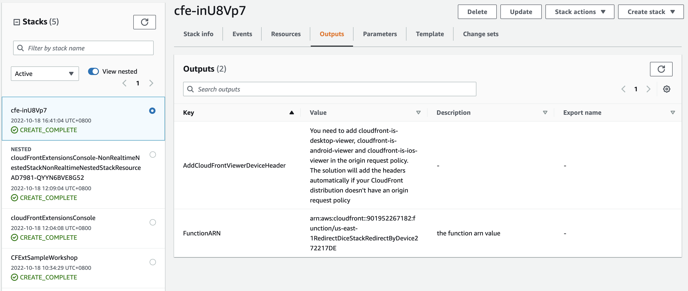

1. Go to [CloudFormation console](https://console.aws.amazon.com/CloudFormation).
2. Select the stacks deployed in the workshop, and select **Delete**
   

!!! Note "Note"
      
      If a stack is failed to delete, try again and retain all the resources (select the check box of each resource),  then delete the retained resources manually.

