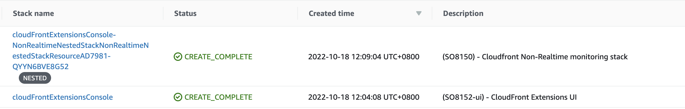
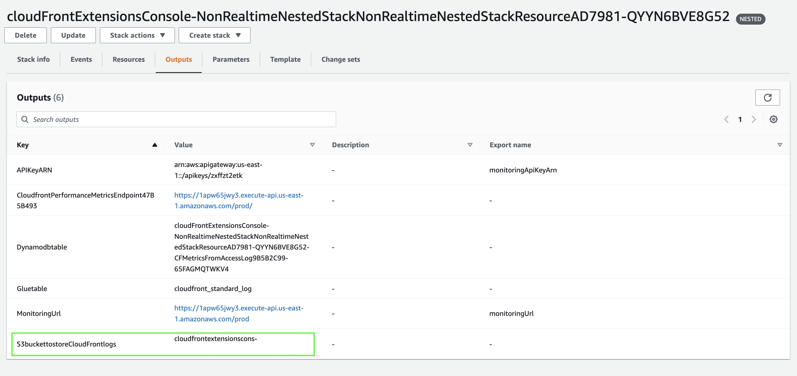
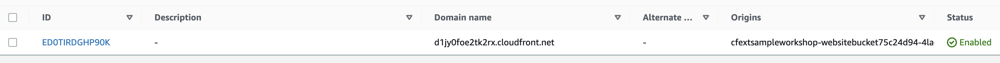
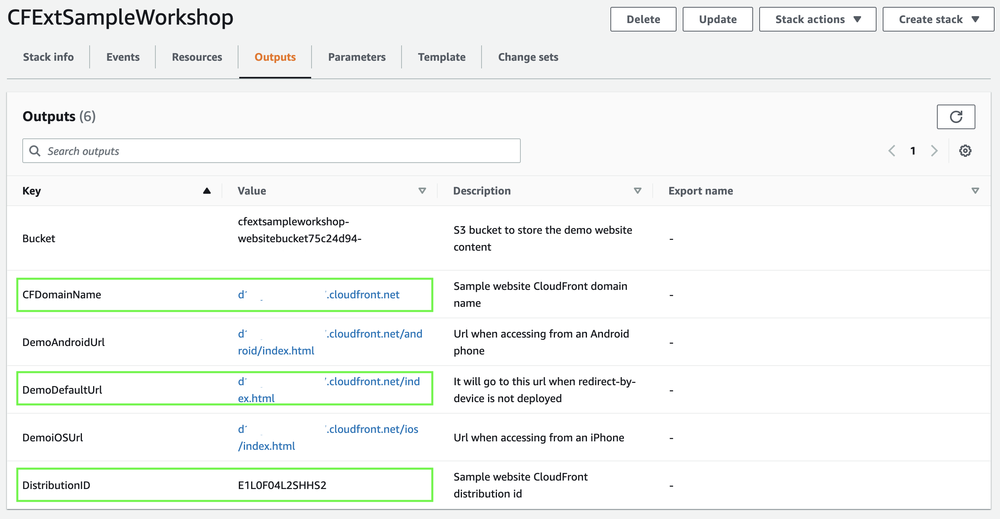
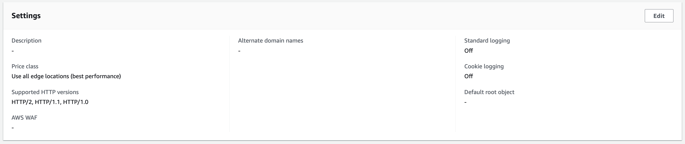
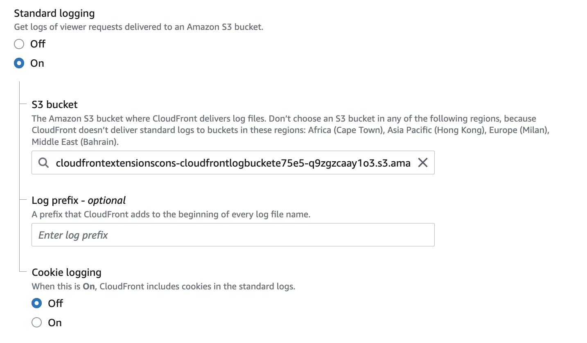
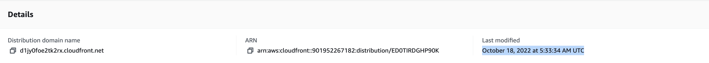

In this section, we will enable CloudFront standard log and monitor CloudFront metrics on CloudFront Extensions console.

After deployment, you will see two CloudFormation stacks.

Setup monitoring by following steps:

1. Choose the **Outputs** tab of the nested stack (the stack whose name contains **NonRealtimeNestedStack**).
2. You will find the S3 bucket in **S3buckettostoreCloudFrontlogs**. Copy the S3 bucket name.
   
3. Go to [CloudFront console](https://us-east-1.console.aws.amazon.com/cloudfront/v3/home?region=us-east-1#/distributions), choose the distribution created in **CFExtSampleWorkshop** stack (you can find the distribution id in the Outputs tab).
  
  
  

4. In **General** tab, under **Settings**, click **Edit** button.
  

5. Under **Standard logging**, choose **On** and set the S3 bucket to the bucket that you created in the nested stack.
  

6. Choose **Save changes**.
7. Wait until the distribution **Last modified** field changed from deploying to a specific date time.
  

