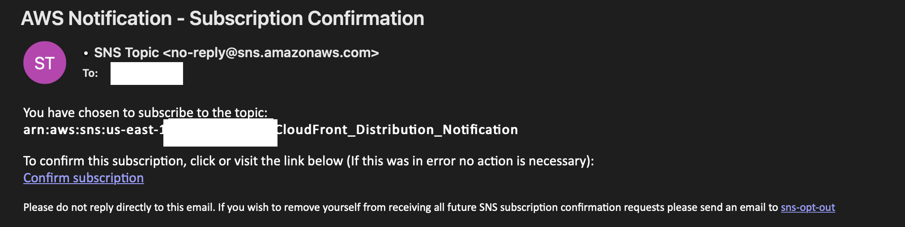
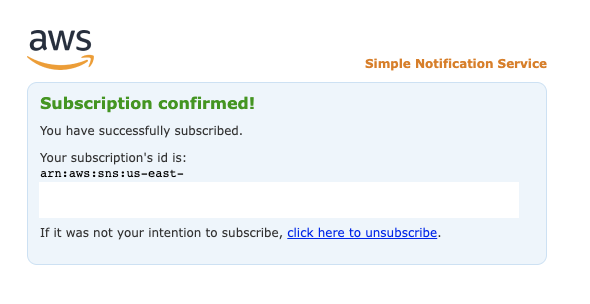

You can use CloudFront Extensions to automatically create or import SSL Certificates and associate them to new CloudFront distributions. 
Before that, you need to setup SSL notification.

After deployment, you will receive an email with the title **AWS Notification - Subscription Confirmation**

Setup SSL notification by following steps:

1. Click **Confirm subscription** link in the email.
2. It will go to a web page which indicates the subscription is confirmed.
   

