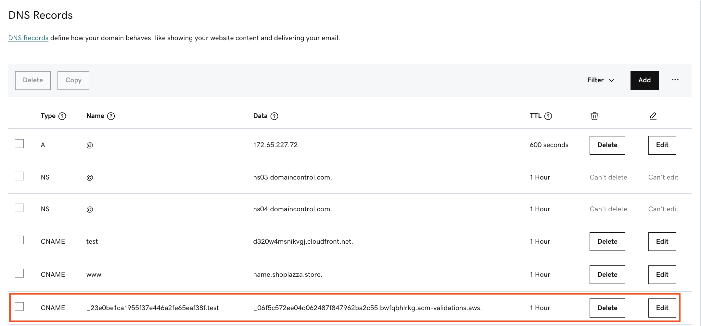

You can add the CloudFront record for CNAME with your DNS Provider.

## Add CName to point to CloudFront distribution in Route53

Once CloudFront distribution was created, the domain owner need to manually or use api to add the CloudFront distribution as a CNAME for the website domain, so that when someone access the website, the DNS provider will redirect the access to CloudFront distribution. Please refer to this [AWS official documentation](https://docs.aws.amazon.com/Route53/latest/DeveloperGuide/routing-to-cloudfront-distribution.html).

## Add CName to point to CloudFront distribution in GoDaddy
1. Log in to [GoDaddy](https://www.godaddy.com/). 
2. In the **Domains* menu**, select **All Domains**.
3. Choose the domain that needs to update CNAME record.
4. Add a new CNAME record, enter the **Name** with the CNAME and the **Data** with the corresponding CloudFront distribution. You should be able to retrieve both values in the SNS message sent by solution.

