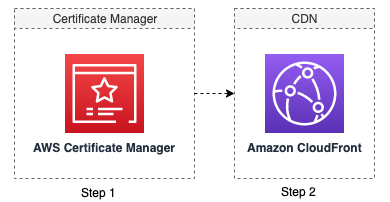

The solution will automatically import one or multiple your existing issued certificates in ACM and create associated distributions in CloudFront. 

### How does it work

When you starts an Import Certificate Job, the solution starts a workflow in AWS Step Functions that does the following:

1. Import certificates in ACM: The solution will automatically import certificate records in ACM.
2. Create new CloudFront distributions: The solution will automatically create CloudFront distributions. After all distributions were created, the solution will send a SNS message to the designated email address or HTTP endpoint. 

### Schedule a job for importing existing certificates

!!! Important "Important"

    Currently, the solution only supports importing one certificate in a job.

1. Log in to the web console.
2. In the left sidebar, under **Configuration**, select **SSL Certification**. 
3. Choose **Import Existing Certificates**.
4. Choose **Import One Certificate**.
5. Enter Certificate name, Certificate body, Certificate Private Body, and Certificate chain.
6. (Optional) Choose *Automatically create distributions*, select a snapshot of a distribution that you want copy the config from. 
7. (Optional): Turn on switch if you’d like the solution to aggregate certificate. for example, if you have domain list *.example.com, 1xxx.example.com (http://1.example.com/), 2xxx.example.com. The certificate will only contain *.example.com (http://example.com/). [Suggest to remove, it is difficult for users to understand the logic behind. ]
8. Click **Add new tag** to add a Tag for the resource (certificate, CloudFront Distributions) that will be created.
9. Click **Start job**.

## View import certificate job status

Once the import job started, you will be redirected to a page where you can view the status of the job. For import certificate job, there are two steps in AWS Step Function workflow. After all steps are completed, the job will finished with success. If one of the steps failed, the job will fail. 

* Step1 will be completed once all certificates were created in ACM. It usually takes less than a minute.
* Step2 will be completed once all expected distributions were created in CloudFront.

After Step2, the domain owners are expected to add new CloudFront distribution to map to CNAME. For more information, see [Adding CloudFront record for CNAME with your DNS Provider](./add-record-for-cname.md).

If the job failed, refer to [Clean up resources](clean-up-resources.md) to clean up the created ACM and CloudFront distributions if needed.

