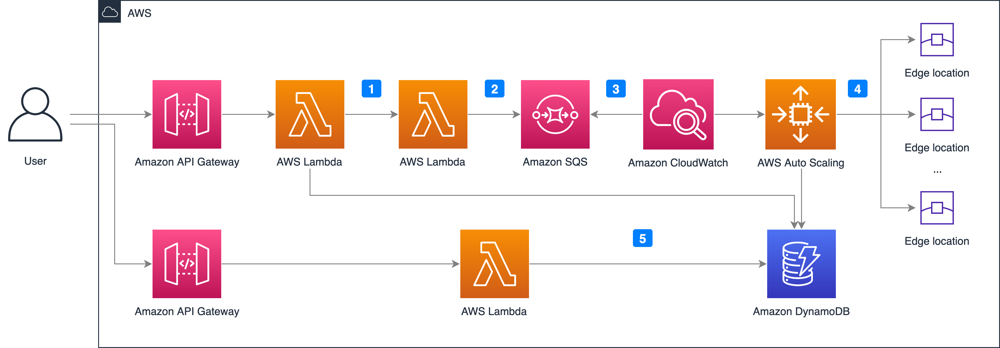

## What is Pre-warming?
Pre-warming is also known as Pre-caching or Pre-fetching. It speeds up content delivery by warming the CloudFront cache. This is very useful when delivering large files. Pre-warming helps offload origin’s traffic, as the same requests will hit the CloudFront cache, origin server receives less requests and consequently it's less likely that the origin server will fall over or become slow. 

### How does it work?
The solution deploys a CloudFormation template, that will install the below architecture in your AWS account. All the cloud resources will be automatically created. After deployed, you will get two REST APIs, one for triggering pre-warm action, the other one for getting pre-warm status.

The CloudFormation template provides the following components and workflows:

1. Scheduler Lambda function inserts initial pre-warm status into the DynamoDB table and invokes cache invalidator.
2. Cache invalidator Lambda function invalidates CloudFront caches for all the URLs and sends messages with requestId, POP and URLs, and so on into SQS.
3. CloudWatch alarm monitors the messages in the queue and notifies the auto scaling group to scale out when messages are sent into the queue.
4. Auto scaling group contains EC2 spot instances. Each instance sends requests to the edge locations and updates the prewarm status into DynamoDB table after consuming the messages from the SQS queue.
5. StatusFetcher function gets the prewarm status from the DynamoDB table.

### Deployment on the web console (Recommended)

The steps to deploy the extensions from the web console are similar. For more information, refer to the section [True Client IP](true-client-ip.md).

### Deployment via CloudFormation

For more information, refer to the section [Deployment](../deployment.md).

