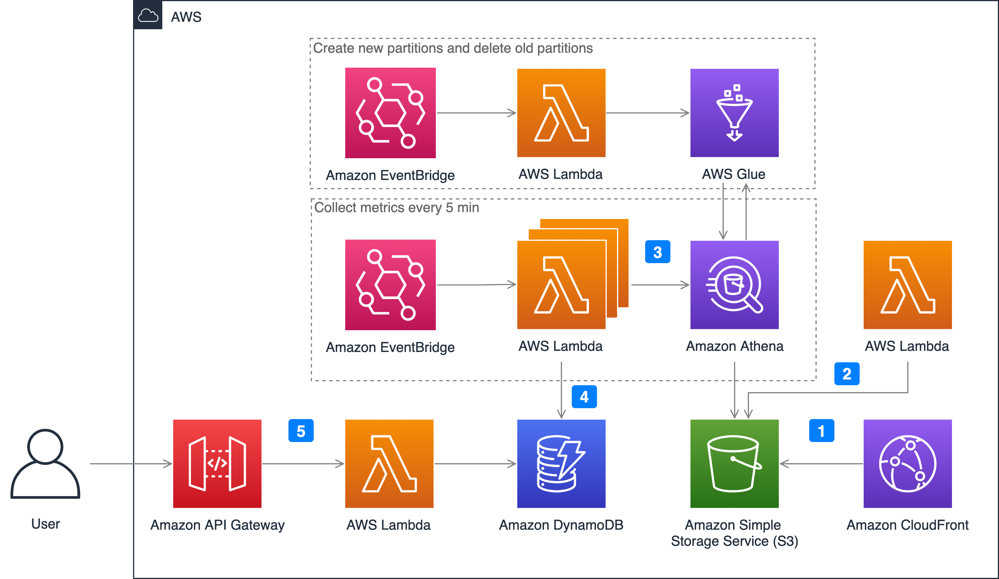

If you selected **Non-real time monitoring** when deploying the solution, the following architecture will be installed automatically to create the cloud resources in your account.

1. Enable CloudFront standard logs. You need to specify a S3 bucket to store CloudFront standard logs.
2. Remove unused fields in CloudFront standard logs and partition logs in S3 bucket. CloudFront standard logs contains more than 30 fields, and less than 10 fields are needed for getting CloudFront metrics. AWS Lambda function will read the logs in the S3 bucket and remove the unused fields to reduce the size of the log file. It can improve Athena query speed and save costs as well. AWS Lambda function will also move the logs into the folder for partition, such as year=2022/month=07/day=10/hour=09/.
3. Query real-time logs in S3 via Athena. In order to allow Athena to speed up data query through data partitioning, Amazon EventBridge will create all partitions for the next day every day, and delete the partitions of the previous day. The Lambda function MetricCollector is used to analyze real-time logs and collect monitoring metrics. It will be executed every 5 minutes.
4. Save the query results in DynamoDB. Query the corresponding monitoring indicator data through Athena, such as calculating CHR (cache hit rate) and download rate through bandwidth, and finally store the monitoring indicator data in the DynamoDB table.
5. Call APIs via API Gateway. When users send API request to API Gateway, a Lambda function called MetricManager will be triggered. The function reads the monitoring indicators and returns the corresponding results from the DynamoDB table. In order to strengthen security management and restrict API accesses, API key is enabled in API Gateway by default. Users are required to pass an x-api-key when calling the APIs.

## Metrics

The following metrics are provided:

- request: the number of requests from the client to CloudFront
- requestOrigin: the number of requests back to the origin
- statusCode: the status code from the client to CloudFront
- statusCodeOrigin: the status code of the back-to-origin
- bandwidth: the bandwidth from the client to CloudFront
- bandwidthOrigin: bandwidth back to origin
- chr: cache hit rate calculated by the number of requests
- chrBandWith: cache hit ratio calculated by bandwidth
- topNUrlRequests: top url calculated by the number of requests
- topNUrlSize: top url calculated by traffic
- downstreamTraffic: down stream traffic in response to the request

