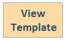

To automate deployment, this solution uses the following AWS CloudFormation templates, which you can download before deployment:

### CloudFront security automations with AWS WAF and AWS Shield
 
**AwsCloudfrontWafStack.template**: Use this template to launch the solution and all associated components. The default configuration deploys Amazon API Gateway, AWS Lambda, Amazon S3, Amazon Athena, Amazon CloudWatch, AWS WAF and AWS Shield Advanced, but you can customize the template to meet your specific needs.

### Monitoring solution
 
**CloudFrontMonitoringStack.template**: Use this template to launch the solution and all associated components. The default configuration deploys Amazon API Gateway, AWS Lambda, Amazon S3, Amazon Athena, Amazon Cognito and Amazon DynamoDB, but you can customize the template to meet your specific needs.

