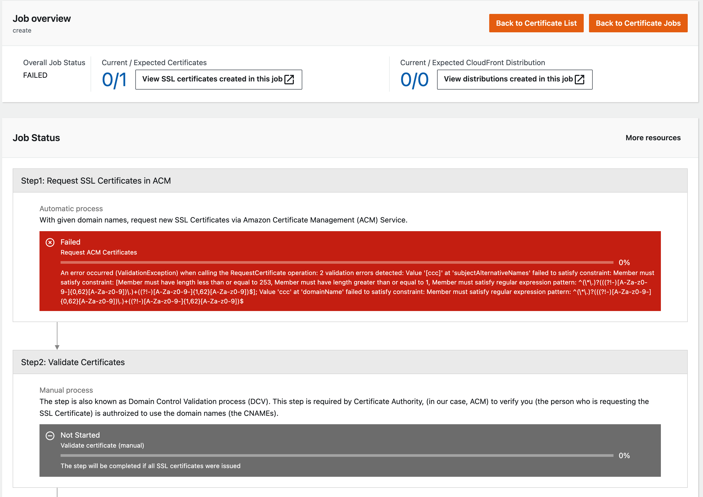

# Troubleshooting Errors

The following help you to fix errors or problems that you might encounter when using CloudFront Extensions.

## SSL Certificates

### Failed to request ACM certificate
When you "request new certificates" from Web UI or [api](api-reference-guide/ssl-certificates/import-create-ssl.md), you may find job failed, following is an example screenshot:

The detailed error message will show up in the Step section in red color. You can see in this case the error is caused by domain name is not valid which caused backend request ACM certificate fail.
