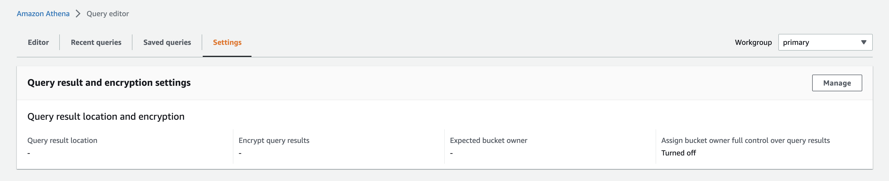
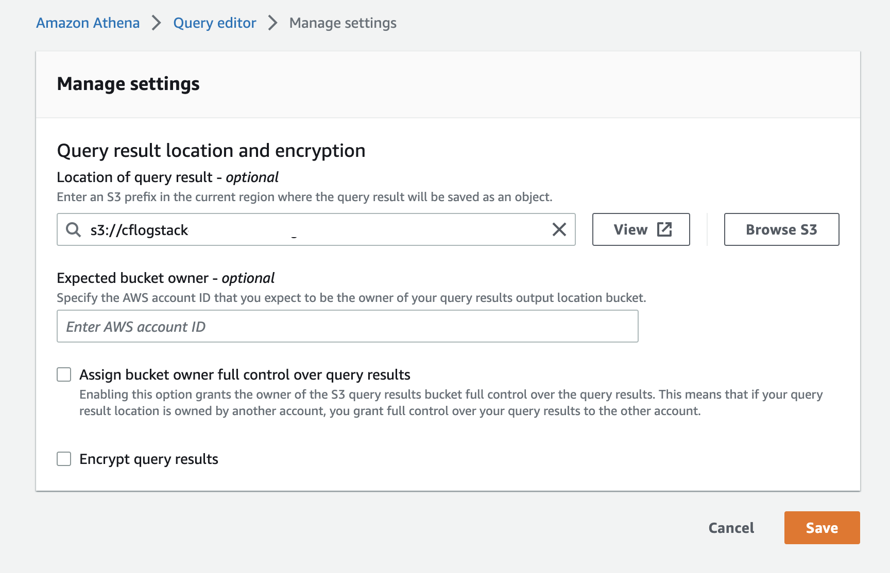

!!! Note "Note"
      
      The solution uses Athena to query CloudFront logs, **if this is the first time you use Athena in the region**, you are required to specify the location for query results in Athena, or else you can skip this section.

Before you can run a query, a query result bucket location in Amazon S3 must be specified.

To specify a client-side setting query result location using the Athena console

1. Open [Athena console](https://us-east-1.console.aws.amazon.com/athena/home?region=us-east-1#/query-editor/settings).

2. From the navigation bar, choose **Settings**.
3. From the navigation bar, choose **Manage**.
   

4. In the **Location of query result** box, choose **Browse S3**, choose any S3 bucket that you would like to store the query result, and then click **Choose**.
   

5. Choose **Save**.

