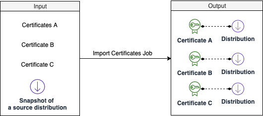

本解决方案将自动在ACM中导入一个或多个现有颁发的证书，并创建相关的CloudFront分配。 

### 它是如何工作的

启动导入证书作业时，解决方案将在AWS Step Functions中启动工作流，该工作流执行以下操作：

1. 在ACM中导入证书：解决方案将自动导入ACM中的证书记录。
2. 创建新的CloudFront分配：解决方案将自动创建CloudFront分配。创建所有CloudFront分配后，解决方案将向指定的电子邮件地址发送SNS消息。

### 导入现有证书的作业

!!! Important "注意"

    目前，本解决方案仅支持在Web UI上导入一个证书。但用户可以使用API导入多个证书。请参阅API文档。

1. 登录到web控制台。
2. 在左侧栏的**配置**下，选择**SSL证书**。
3. 选择**导入现有证书**。
4. 选择**导入一个证书**。
5. 输入证书名称、证书主体、证书私有主体和证书链。
6. 单击**添加新标记**为将要创建的资源（证书、CloudFront分配）添加标记。
7. 单击**开始作业**。
8. 验证生成的输入参数，如果一切正常，则在输入框中输入“Confirm”，然后单击“应用”按钮。

## 查看导入证书作业的状态

导入作业启动后，您将被重定向到可以查看作业状态的页面。对于导入证书作业，AWS Step Functions会执行两个步骤。完成所有步骤后，工作将成功完成。如果其中一个步骤失败，作业将失败。

* 步骤1将创建所有ACM证书后完成。通常不到一分钟。
* 步骤2在创建了所有CloudFront分配后完成。

在步骤2之后，域名所有者需要添加新的CloudFront分配以映射到CNAME。有关更多信息，请参阅[在DNS提供商中为CNAME添加CloudFront记录](./add-record-for-cname.md)。

如果作业失败，请参阅[清理资源](clean-up-resources.md)，清理创建的ACM和CloudFront分配。
