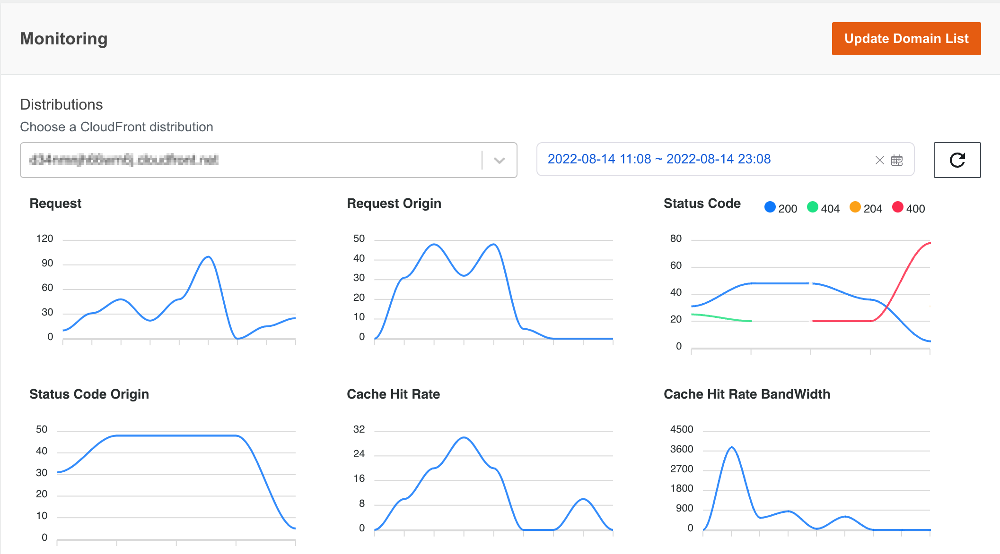

## 指标仪表板

指标仪表板以图表的方式展现指定时间内CloudFront的相关指标。仪表板通过分析CloudFront标准日志或实时日志用于生成指标。如果您只需要通过Restful API获取CloudFront性能数据，而不需要仪表板，本解决方案也提供了一个指标API供您调用。

使用指标仪表板，您可以执行以下操作：

- **查看图形化指标**

    CloudFront监控仪表板显示了多个监控指标。每个图表都与CloudFront监控API中的指标一一对应。
    
    !!! Note "说明"
        仪表板中的指标类型与部署解决方案后的CloudFront监控API获取类型相同。

    请参见下面列表中的指标描述

    |**CloudFront监控API类型**|**描述**|**指标采集时间间隔**|
    |----------------------|----------------------|--------------------|
    |[实时流量指标](real-time-monitoring.md#metrics)        | 通过分析CloudFront实时日志，延迟5分钟 |5分钟|
    |[非实时流量指标](non-real-time-monitoring.md#metrics)| 通过分析CloudFront标准日志，延迟1小时 |5分钟|

    您可以从Web控制台左侧栏导航找到CloudFront监控仪表板，然后选择要在图表中查看的CloudFront分配（您可以通过CNAMEs找到），并在时间选择器中指定一个监控时间段。最后，流量指标将显示在仪表板的图表中。

    

- **配置待监控域名**

    CloudFront分配列表包括所有需要监控的CloudFront分配，此列表可在部署本解决方案的时，在CloudFormation参数中配置，详情请参阅[部署CloudFront Extensions控制台](../deployment.md)。部署CloudFormation堆栈后，您可以在指标仪表板中设置/更新监控域名列表。

    !!! Note "说明"
        如果在CloudFormation部署参数中填入“ALL”来监视AWS帐户中的所有域名，那么更新域名列表后，只会监控更新后的域名。

    1. 登录到web控制台。
    2. 在左侧边栏的“监控”下，选择CloudFront流量。
    3. 单击“更新域名列表”打开配置窗口。
    4. 在弹出窗口中，选择要添加到监控列表中的CloudFront分配。
    5. 选择应用。

    当域列表更改后，仪表板中的分配列表将相应更新，指标将在大约5分钟后显示在图表中。
    
