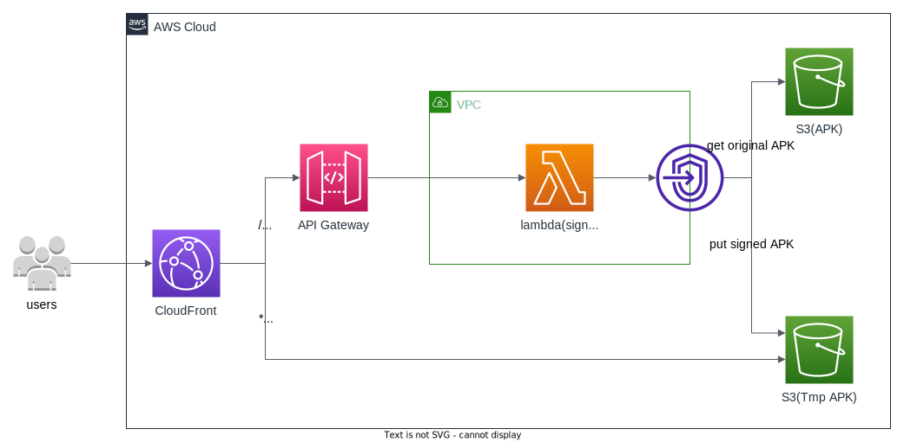

[[English](./README.md) | 中文]

# APK 动态打包

## 功能描述

本方案通过用户请求的URL中提供的参数信息，通过调用Lambda将相应的渠道信息动态写入到APK中，将打包后的APK包通过CloudFront进行分发实现APK的动态打包功能。

## 架构图



本方案主要完成以下操作：

1. CloudFront将请求转发到API Gateway，API Gateway调用Lambda打包函数
2. 打包函数先判断在存放打包APK的S3中是否已经有相应的APK包，在有APK包的情况下，返回相应的包下载链接地址
3. 在相应的APK包没有的情况下，通过在存储原始APK包的位置找到需要打包的母包，使用URL的渠道参数进行打包，并上传到存放打包APK的S3中，返回相应的包下载链接地址
4. CloudFront对打包APK进行加速分发

## 部署

部署时间：约10分钟

### 部署概述

使用以下步骤在Amazon Web Service上部署此解决方案。

* 在您的Amazon Web Service帐户中启动CloudFormation模板。
* 查看模板参数，并在必要时进行调整。

### 部署步骤

1. 登录到Amazon Web Services管理控制台，选择按钮以启动模板。您还可以选择直接[下载模板]()进行部署。
    * [一键部署]()
2. 默认情况下，该模板将在您登录控制台后默认的区域启动，即美国东部（弗吉尼亚北部）区域。需要在与存储原始APK的S3在同一个区域，请在控制台导航栏中的区域下拉列表中选择。
3. 输入存储原始母包的S3存储桶的位置，APPkey参数为是否对URL开启签名验证。
4. 选择*下一步*。
5. 在*配置堆栈选项*页面上，您可以为堆栈中的资源指定标签（键值对）并设置其他选项，然后选择*下一步*。
6. 在*审核*页面，查看并确认设置。确保选中确认模板将创建Amazon Identity and Access Management（IAM）资源的复选框。选择*下一步*。
7. 选择*创建堆栈*以部署堆栈。

您可以在Amazon CloudFormation控制台的*状态*列中查看堆栈的状态。正常情况下，大约10分钟内可以看到状态为*CREATE_COMPLETE*。
您还可以选择*输出*标签页查看APK动态打包地址。

## API定义

### 动态打包

请求方式: GET

| 参数 | 是否必需 | 说明 |
| - | -| -|
|key|是|需要动态打包的APK包在S3存储桶中的位置|
|channel|否|打包的渠道名称，不提供的情况下直接下载母包|
|sign|否|在模板参数APPkey不为空的情况下必须提供，签名为md5(key+channel+APPkey)|

示例：
CloudFront的域名为 d1234567890r.cloudfront.net，它的CName是 cloudfront.example.com.

```linux
# 模板参数APPkey为空
curl -I 'https://cloudfront.example.com/?key=ets.apk&channel=aws'
# 模板参数APPkey不为空
curl -I 'https://cloudfront.example.com/?key=aws.apk&channel=aws&sign=e10adc3949ba59abbe56e057f20f883'
```

响应: 302状态码及相应的下载地址

示例：

```HTTP
HTTP/1.1 302 Found
Content-Length: 0
Connection: keep-alive
Date: Tue, 08 Nov 2022 16:41:05 GMT
location: /aws_aws.apk
Apigw-Requestid: bSn4whXZSQ0EJqg=
X-Cache: Miss from cloudfront
```

## 费用

以APK为50M大小为例，Lambda打包需要处理约2600ms，在已打包情况下，Lambda需求处理约450ms.

Lambda配置内存为2048MB，临时存储大小为2048MB.

截至2022年11月，在美国东部（弗吉尼亚北部）区域（us-east-1），以下载10万次，APK需要Lambda动态打包以1:999为例。每月费用约为$426.69.

|  Service  | Dimensions | Cost/Month |
|  ----  | ----  | ----  |  
| Amazon Lambda | 10万次请求<br>2048MB内存<br>2048MB临时存储<br>ARM64架构 | $1.23 |
| Amazon API Gateway | 10万次请求<br>HTTP API | $0.10 |
| Amazon S3 | 标准存储<br>5050MB存储<br>100000次GET请求<br>100次PUT请求 | $0.16 |
| Amazon CloudFront | 5000GB传出流量<br>20万次请求 | $425.20 |
| Total |  | $426.69 |

## 卸载

您可执行如下命令卸载此应用

```bash
aws cloudformation delete-stack --stack-name apk-distribution
```

## 其他

* 签名方式：当前仅支持采用 Android V2 签名方式的 APK 进行动态打包，V2签名使用 WALLE 开源多渠道打包方案。
* 支持大小：建议不超过1GB的APK进行动态打包，在第一次访问生成动态包时，1GB的APK包大概需要27秒。
