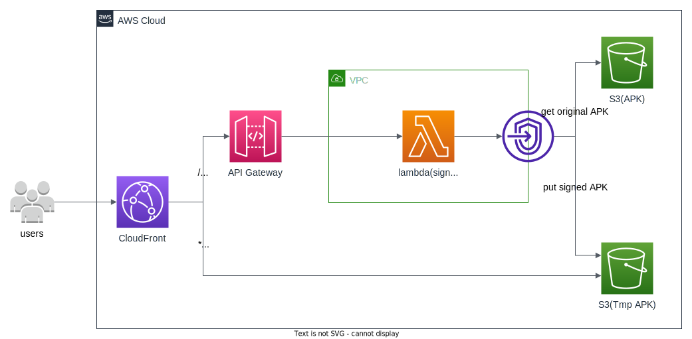

[English | [中文](./README-cn.md)]

# APK dynamic packaging

## Overview

This solution uses the parameter information provided in the URL requested by the user, and dynamically writes the corresponding channel information into the APK by invoking Lambda, and distributes the packaged APK package through CloudFront.

## Architecture Diagram



The CloudFormation template provides the following components and workflows

1. CloudFront forwards the request to API Gateway, and API Gateway invokes the Lambda packaging function.
2. The packaging function first determines whether there is a corresponding APK in S3 where the packaged APK is stored, and if there is an APK package, returns the corresponding URL to download.
3. If there is no corresponding APK package, find the package that needs to be packaged in the location where the original APK is stored, package it using the channel parameter of the URL, upload it to S3 where the packaged APK is stored, and return the corresponding URL to download.
4. CloudFront accelerates distribution of packaged APKs.

## Deployment

Time to deploy: Approximately 10 minutes

### Deployment overview

Use the following steps to deploy this solution on Amazon Web Service.

* Launch the CloudFormation template in your Amazon Web Service account.
* Review template parameters and adjust if necessary.

### Deployment steps

1. Sign in to the Amazon Web Services Management Console and select the button to launch the CloudFormation template. You can also [download the template]() as a starting point for your own implementation.
    * [Deploy]()
2. The template launches in the US East (N. Virginia) Region by default. It needs to be in the same region of S3 where the original APK is stored, use the Region selector in the console navigation bar.
3. Enter the name of the S3 bucket where the original APK is stored. The APPkey parameter is whether to enable signature verification for the request.
4. Select *Next*.
5. On the *Configure stack options* page, you can specify tags (key-value pairs) for resources in your stack and set additional options, and then choose *Next*.
6. On the *Review* page, review and confirm the settings. Check the boxes acknowledging that the template will create Amazon Web Services Identity and Access Management (IAM) resources and any additional capabilities required.
7. Choose *Create* to deploy the stack.

You can view the status of the stack in the CloudFormation Console in the Status column. You should receive a CREATE_COMPLETE status in approximately 10 minutes.

To see details for the stack resources, choose the *Outputs* tab.

## API Definition

### dynamic packaging

#### Request

Method: GET

| Parameter | Required | Description |
| - | -| -|
|key|Yes |Key of the APK that needs to be dynamically packaged in the S3 bucket|
|channel|No|The name of the channel, if not provided, download the original APK directly|
|sign|No|Must be provided if the template parameter APPkey is not empty, the signature is md5(key+channel+APPkey)|

For example:
CloudFront domain name is d1234567890r.cloudfront.net, CName is cloudfront.example.com.

```linux
# Template parameter APPkey is empty
curl -I 'https://cloudfront.example.com/?key=ets.apk&channel=aws'

# Template parameter APPkey is not empty
curl -I 'https://cloudfront.example.com/?key=aws.apk&channel=aws&sign=e10adc3949ba59abbe56e057f20f883'
````

#### Response

HTTP 302 and corresponding redirect URL

For example：

```HTTP
HTTP/1.1 302 Found
Content-Length: 0
Connection: keep-alive
Date: Tue, 08 Nov 2022 16:41:05 GMT
location: /aws_aws.apk
Apigw-Requestid: bSn4whXZSQ0EJqg=
X-Cache: Miss from cloudfront
```

## Cost

Taking the APK size of 50M as an example, Lambda packaging needs to process about 2600ms, and in the case of already packaged, Lambda needs to process about 450ms.

The Lambda configuration memory is 2048MB and the temporary storage size is 2048MB.

As of November 2022, in the US East (N. Virginia) region (us-east-1), with 100,000 downloads, the APK needs Lambda dynamic packaging. Take 1:999 as an example. The monthly cost is approximately $426.69.

| Service | Dimensions | Cost/Month |
| ---- | ---- | ---- |
| Amazon Lambda | 100,000 requests<br>2048MB memory<br>2048MB ephemeral storage<br>ARM64 architecture | $1.23 |
| Amazon API Gateway | 100,000 requests <br>HTTP API | $0.10 |
| Amazon S3 | Standard Storage<br>5050MB Storage<br>100000 GET Requests<br>100 PUT Requests | $0.16 |
| Amazon CloudFront | 5000GB outgoing traffic <br>200k requests | $425.20 |
| Total | | $426.69 |

## Uninstall

To delete the application that you created, use the AWS CLI. Assuming you used your project name for the stack name, you can run the following:

```bash
aws cloudformation delete-stack --stack-name apk-distribution
```

## Other

* Signature method: Currently, only APK that use the Android V2 signature method are supported for dynamic packaging. V2 signature uses the WALLE open source multi-channel packaging scheme.
* Supported size: It is recommended that APK not exceeding 1GB be dynamically packaged. When generating a dynamic package for the first time, it takes about 27 seconds for a 1GB APK package.
