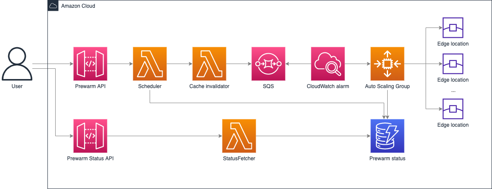

[[English](./README.md) | 中文]

# 预热

## 功能描述

本方案会在指定的PoP节点上预热指定资源。例如：在美东的节点上预热一千个图片。
当资源预热后，它会缓存到CloudFront，因此用户可以通过更低延迟访问同样资源，从而提升性能和用户体验。
本方案可以通过CloudFormation进行一键部署，部署后会生成两个REST API，一个用于出发预热操作，另一个用于查看预热状态。

## 架构图



本方案主要完成以下操作：

1. API Handler Lambda用来接收来自API Gateway的请求；对URL去重，写入一个csv文件，以request id命名上传到S3上；并按照传入的shutdown事件创建一个Eventbridge定时器；并按照参数要求启动ASG里面的EC2机器；把请求体存入DynamoDB的Request表中。
2. DynamoDB的Request表开启了DynamoDB stream，Request表的stream会触发Get Size Lambda和Task Lambda。
3. Get Size Lambda 会从S3中下载以request id命名的csv文件，轮询URL列表，执行curl命令，得到每个文件的大小并汇总文件大小，存入Request表中的total_size字段，单位是byte, 并把出问题的URL和成功的URL写回S3。
4. Task Lambda会从DynamoDB stream中得到所有pop点和Cloudfront domain的信息，从S3中下载以request id 命名的csv文件，得到URL列表。轮询pop通过dig得到每个pop的IP列表，存入Request-Pop表中，然后轮训URL，根据参数确定是否需要删除cloudfront的缓存，并把每个URL和pop点匹配作为一个任务，发送到prewarm_task这个queue中去。 
5. ASG中的EC2机器会从prewarm_task这个queue中取得任务，执行curl命令进行文件下载，并且把下载结果存入Request-Task表中，包括文件的大小和下载的成功与否。其中EC2机器使用的是标准的Amazon Linux 2023的AMI，在启动的时候会去S3上下载agent代码并进行预热。
6. Request-Task表开启了DynamoDB stream，这个stream会触发Aggregation Lambda，Aggregation Lambda会批量统计下载任务的文件大小，汇总之后更新Request表中的downloaded_size字段，得到累计下载大小。
7. 定时器在预定的时间触发Shutdown Lambda，Shutdown Lambda 会直接停掉（terminate）掉ASG中的所有EC2机器，终端正在进行的预热。同时也会删掉prewarm_task这个queue里面所有的message，不管有没有完成。


## 部署

部署时间：约15分钟

### 部署概述

使用以下步骤在Amazon Web Service上部署此解决方案。

* 在您的Amazon Web Service帐户中启动CloudFormation模板。
* 查看模板参数，并在必要时进行调整。

### 部署步骤

1. 登录到Amazon Web Services管理控制台，选择按钮以启动模板。您还可以选择直接[下载模板](https://aws-gcr-solutions.s3.amazonaws.com/Aws-cloudfront-extensions/latest/custom-domain/PrewarmStack.template.json) / [下载模板-使用已有vpc模版](https://aws-gcr-solutions.s3.amazonaws.com/Aws-cloudfront-extensions/latest/custom-domain/PrewarmStack.template.json)进行部署。

      [](https://console.aws.amazon.com/cloudformation/home?region=us-east-1#/stacks/new?stackName=prewarm&templateURL=https://aws-gcr-solutions.s3.amazonaws.com/Aws-cloudfront-extensions/latest/custom-domain/PrewarmStack.template.json)
      [](https://console.aws.amazon.com/cloudformation/home?region=us-east-1#/stacks/new?stackName=prewarm&templateURL=https://aws-gcr-solutions.s3.amazonaws.com/Aws-cloudfront-extensions/latest/custom-domain/PrewarmStack.template.json)


2. 默认情况下，该模板将在您登录控制台后默认的区域启动，即美国东部（弗吉尼亚北部）区域。若需在指定的区域中启动该解决方案，请在控制台导航栏中的区域下拉列表中选择。

3. 在参数部分，查看模板的参数，并根据需要进行修改。 
4. 对于选择直接部署的默认模版参数如下：

      | 参数      | 默认值       | 说明                                 |
      |---------|-----------|------------------------------------|
      | envName | prod      | 选择的部署预热环境。                         |
5. 对于选择使用现有vpc模版部署的参数如下：

      | 参数      | 默认值  | 说明                      |
      |---------|------|-------------------------|
      | envName | prod | 选择的部署预热环境。              |
      | vpc     | 无，必填 | 选择需要部署在的vpc             |
      | subnet  | 无，必填 | 选择需要部署所在vpc的公有子网        |
      | sg      | 无，必填 | 选择需要使用的安全组              |
      | key     | 无，必填 | 选择安全密钥keypair           |
      | vpce    | 无，选填 | 选择当需要部署为私有API时的endpoint |
6. 选择**下一步**。 
7. 在**配置堆栈选项**页面上，您可以为堆栈中的资源指定标签（键值对）并设置其他选项，然后选择**下一步**。 
8. 在**审核**页面，查看并确认设置。确保选中确认模板将创建Amazon Identity and Access Management（IAM）资源的复选框。选择**下一步**。 
9. 选择**创建堆栈**以部署堆栈。

您可以在Amazon CloudFormation控制台的*状态*列中查看堆栈的状态。正常情况下，大约15分钟内可以看到状态为*CREATE_COMPLETE*。
您还可以选择*输出*标签页查看堆栈资源的详细信息。

## API定义

## prewarm 
### 请求预热
- HTTP方法: `POST`
- 请求参数

| **名称**      | **类型** | **是否必传** | **描述**                                                                                                                                                                                             |
|-------------|--------|----------|----------------------------------------------------------------------------------------------------------------------------------------------------------------------------------------------------|
| url_list    | *列表*   | 是        | 需要预热的url列表                                                                                                                                                                                         |
| cf_domain   | *字符串*  | 是        | 以[cloudfront.net](http://cloudfront.net/)结尾的CloudFront域名。如果未设置，它将根据url列表中的CNAME查找cf_domain                                                                                                         |
| timeout     | *数字*   | 是        | 表示预热时间限制 超时会自动停止预热进程                                                                                                                                                                               |
| target_type | *字符串*  | 是        | 预热目标类型。您可以指定3种类型的值，可传值包括："pop"，"country"，"region"。<br>"pop"：根据节点预热<br>"country"：根据国家预热<br>"region"：根据区域预热。如果选择了某个值pop country region中的某一个 下面对应的pops countries regions需要填写对应需要预热的值，不填系统默认选择可预热节点预热. |
| pops        | *列表*   | 否        | 预热的pop列表。详情如下:                                                                                                                                                                                     |
| countries   | *列表*   | 否        | 预热国家列表。详情如下:                                                                                                                                                                                       |
| regions     | *列表*   | 否        | 预热区域列表。详情如下:                                                                                                                                                                                       |
| instance_count         | *数字*   | 是        | 预热的instance数量                                                                                                                                                                                      |
| need_invalidate         | *布尔值*  | 否        | 预热时是否需要清除缓存后预热，默认false                                                                                                                                                                             |

- 依据不同的target_type，需设置不同的值
    * 当 target_type 为 "pop"时，pops字段需要传pop id列表，表示在列表中指定的边缘节点进行预热(配合开启Origin Shield效果更好，详情见[链接](https://docs.aws.amazon.com/AmazonCloudFront/latest/DeveloperGuide/origin-shield.html#enable-origin-shield))，例如["ATL56-C1", "DFW55-C3"]，如果传空[] 会由系统默认指定pop点预热
    * 当 target_type 为 "region"时，regions字段需要传以下值列表范围中的值，表示在特定区域进行预热(配合开启Origin Shield效果更好，详情见[链接](https://docs.aws.amazon.com/AmazonCloudFront/latest/DeveloperGuide/origin-shield.html#enable-origin-shield))，例如["apac", "au"]，如果传空[] 会由系统默认指定如下全部区域的某些pop点预热，可用区域为：
          * apac： Asia-Pacific
          * au： Australia
          * ca： Canada
          * sa： South Africa
          * eu： Europe
          * jp： Japan
          * us： United States
          * cn： China(确保您已在中国北京或宁夏区域部署了预热方案)
    * 当 target_type 为 "country"时，countries字段需要传以下值列表范围中的值，表示在特定国家进行预热(配合开启Origin Shield效果更好，详情见[链接](https://docs.aws.amazon.com/AmazonCloudFront/latest/DeveloperGuide/origin-shield.html#enable-origin-shield))或者国家代码列表，例如["india", "new_zealand"]，如果传空[] 会由系统默认指定如下全部国家的某些pop点预热，可用国家为：
          * india： India
          * japan： Japan
          * new_zealand： New Zealand
          * australia：Australia
          * malaysia： Malaysia
          * china： China(确保您已在中国北京或宁夏区域部署了预热方案)
          * indonesia：Indonesia
          * philippines：Philippines
          * singapore：Singapore
          * thailand： Thailand
          * vietnam：Vietnam
          * south_korea： South Korea

- 请求示例
``` json
    {
        "url_list": [
          "https://www.example.com/index.html",
          "https://www.example.com/css/bootstrap-icons.css"
        ],
        "cf_domain": "www.example.com",
        "target_type":"pop",
        "countries": [
        ],
        "regions": [
        ],
        "pops": [
            "ATL56-C1",
            "SIN2-C1",
            "DFW55-C3"
        ],
        "timeout": 5,
        "header": [
        ],
        "instance_count": 1,
        "need_invalidate": false
    }
```
### 响应
- 响应参数

| **名称**    | **类型** | **描述**                                                            |
|-----------|--------|-------------------------------------------------------------------|
| status | *字符串*  | 预热请求状态 Success或者Failed                                            |
| error_message | *字符串*  | 错误信息                                                              |
| request_id | *字符串*  | 预热请求id，您可通过调用获取预热进度 API获取预热请求的最新状态 ，变更instance数量 API 调整预热的instance |
| error_urls | *列表*   | 预热请求有问题的url列表                                                     |
| timestamp | *字符串*  | 预热请求时间                                                          |
| timeout_at | *字符串*  | 超时时间                                                              |


- 响应示例

``` json
{
    "status": "Success",
    "error_message": "",
    "error_urls": [],
    "request_id": "e059b77b-e427-4489-a50b-4d8c652f114c",
    "timestamp": "2024-04-16 03:12:21.046535",
    "timeout_at": "2024-04-16 03:17:21.046535"
}
```


## prewarm
### 请求预热进度查询
- HTTP方法: `GET`
- 请求参数

| **名称** | **类型** | **描述**                                   |
|--------|--------|------------------------------------------|
| req_id | *字符串*  |  预热请求id，标识预热请求的id，需要在query string中指定 |
- 请求示例

``` json
{
  "req_id": "4f780687-9774-48cd-bd7d-db836abf45af"
}
```

### 响应
- 响应参数

| **名称**                 | **类型** | **描述**                                                    |
|------------------------|--------|-----------------------------------------------------------|
| status                 | *字符串*  | 预热状态，FINISHED表示完成，IN_PROGRESS表示进行中，TIMEOUT表示超时，FAILED表示失败 |
| total_count            | *数字*   | 请求预热url的总数                                                |
| download_count         | *数字*   | 已经预热url的总数                                                |
| percentage_complete    | *数字*   | 预热完成的url的百分比                                              |
| in_progress_task_count | *数字*   | 正在预热中的url的数量                                              |
| available_task_count   | *数字*   | 还未预热的url数量                                                |
| download_size          | *数字*   | 已预热文件大小                                                   |
| total_size             | *数字*   | 总预热文件大小                                                   |
| created_at             | *字符串*  | 创建时间                                                      |
| last_update_time       | *字符串*  | 最后更新时间                                                    |
| timestamp              | *字符串*  | 请求时间                                                      |
| request_id             | *字符串*  | 预热请求id                                                    |

- 响应示例
``` json
{
    "request_id": "684153cc-efab-4a53-9409-357fddc2e2bd",
    "download_size": 137368,
    "total_size": 206052,
    "percentage_complete": 66,
    "available_task_count": 0,
    "in_progress_task_count": 0,
    "download_count": 6,
    "total_count": 6,
    "created_at": "2024-04-16 03:10:21.405303",
    "last_update_time": "2024-04-16 03:11:53.531414",
    "timestamp": "2024-04-16 03:15:09.499889",
    "status": "FINISHED"
}
```
## summary
### 请求预热报告
- HTTP方法: `GET`
- 请求参数

| **名称** | **类型** | **描述**                                   |
|--------|--------|------------------------------------------|
| req_id | *字符串*  |  预热请求id，标识预热请求的id，需要在query string中指定 |
- 请求示例

``` json
{
  "req_id": "4f780687-9774-48cd-bd7d-db836abf45af"
}
```

### 响应
- 响应参数

| **名称**                  | **类型** | **描述**                                                    |
|-------------------------|--------|-----------------------------------------------------------|
| status                  | *字符串*  | 预热状态，FINISHED表示完成，IN_PROGRESS表示进行中，TIMEOUT表示超时，FAILED表示失败 |
| failure_pops            | *列表*   | 失败的pop列表                                                  |
| failure_urls            | *列表*   | 失败的url列表                                                  |
| failure_pop_urls_report | *字符串*  | 报告地址                                                      |
| created_at              | *字符串*  | 创建时间                                                      |
| last_update_time        | *字符串*  | 最后更新时间                                                    |
| timestamp               | *字符串*  | 请求时间                                                      |
| request_id              | *字符串*  | 预热请求id                                                    |

- 响应示例
``` json
{
    "request_id": "684153cc-efab-4a53-9409-357fddc2e2bd",
    "failure_pops": [],
    "failure_urls": [
        ""
    ],
    "failure_pop_urls_report": "http://reporturl",
    "timestamp": "2024-04-16 03:12:54.605891",
    "created_at": "2024-04-16 03:10:21.405303",
    "last_update_time": "2024-04-16 03:11:53.531414",
    "status": "FINISHED"
}
```
## instances
### 请求变更instance数量
- HTTP方法: `POST`
- 请求参数

| **名称**          | **类型** | **描述**                              |
|-----------------|--------|-------------------------------------|
| req_id          | *字符串*  | 预热请求id，标识预热请求的id，需要在query string中指定 |
| DesiredCapacity | *数字*   | instance变更为的数量                      |
| force_stop      | *布尔值*  | 是否强制停止预热进程                          |
- 请求示例

``` json
{
    "req_id": "684153cc-efab-4a53-9409-357fddc2e2bd",
    "DesiredCapacity": 1
    // "force_stop": false
}
```

### 响应
- 响应参数

| **名称**    | **类型** | **描述**                        |
|-----------|--------|-------------------------------|
| status    | *字符串*  | 实例变更状态，success表示完成，failed表示失败 |
| timestamp | *字符串*  | 请求时间                          |
| message   | *字符串*  | 消息                            |

- 响应示例
``` json
{
    "status": "success",
    "timestamp": "2024-04-16 03:54:40.366685",
    "message": "Auto Scaling Group prewarm_asg_prod updated to Desired Capacity: 1"
}
```

## instances
### 请求instance数量查询
- HTTP方法: `GET`

### 响应
- 响应参数

| **名称**          | **类型** | **描述**                      |
|-----------------|--------|-----------------------------|
| status          | *字符串*  | 查询状态，success表示完成，FAILED表示失败 |
| desiredcapacity | *数字*   | 实例数                         |
| timestamp       | *字符串*  | 请求时间                        |
| message         | *字符串*  | 消息                          |

- 响应示例
``` json
{
    "status": "success",
    "timestamp": "2024-04-16 03:56:39.210951",
    "message": "query success",
    "desiredcapacity": 1
}
```


## 费用
截至2022年5月，在美国东部（弗吉尼亚北部）区域（us-east-1），预热4次，每次预热50个资源，每个资源大小为1G，成本约为每月$11.78。

|  Service  | Dimensions | Cost/Month | 
|  ----  | ----  | ----  |  
| Amazon EC2 | 使用m5dn.xlarge Spot实例<br>150GB EBS | $10.59 |
| Amazon Lambda | 28次请求<br>256MB内存<br>ARM64架构 | $0.01 |
| Amazon API Gateway | 24次请求<br>REST API | $0.0001 |
| Amazon Simple Queue Service | 标准队列<br>1GB出站数据传输 | $0.02 |
| Amazon DynamoDB | 1GB数据存储<br>每月2000次写操作<br>每月200次读操作 | $0.25 |
| Amazon CloudWatch | 1个指标和警报 | $0.90 |
| Total |  | $11.78 |

## 卸载

您可执行如下命令卸载此应用

```bash
aws cloudformation delete-stack --stack-name prewarm
```

