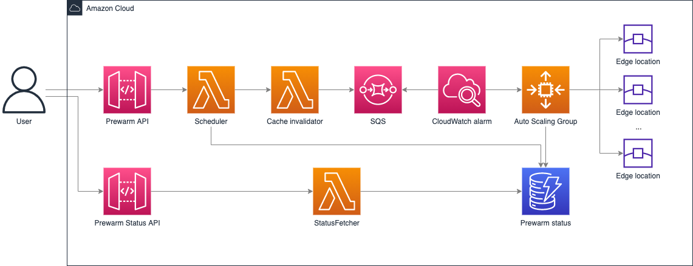

[English | [中文](./README-cn.md)]

# Prewarm

## Overview

Pre-warm or prefetching is warming the CloudFront cache for the purpose of speeding up content delivery. It is especially useful in terms of delivering large files. Another benefit is origin offload, by pre-warming, the same requests will hit the CloudFront cache, so the origin server gets less requests and consequently it's less likely that the origin server will fall over or become slow.

You can click the CloudFormation link in Deployment section to automatically deploy prewarm solution. After deployment, it will create two REST API, one for triggering prewarm, the other one for getting prewarm status.

## Architecture Diagram



The CloudFormation template provides the following components and workflows

1. Scheduler inserts initiate pre-warm status into the DynamoDB table and invokes cache invalidator
2. Cache invalidator invalidates CloudFront caches for all the urls and send messages with reqId, pop and url, etc. into SQS
3. CloudWatch alarm monitors the messages in the queue and notifies the auto scaling group to scale out when messages are sent into the queue
4. Auto scaling group contains EC2 spot instances. Each instance sends the request to the edge locations and updates the pre-warm status into DynamoDB table after receiving the messages from the queue 
5. StatusFetcher gets the status from the DynamoDB table


## Deployment

Time to deploy: Approximately 15 minutes

### Deployment overview

Use the following steps to deploy this solution on Amazon Web Services.

* Launch the CloudFormation template into your Amazon Web Services account.
* Review the template parameters, and adjust them if necessary.

### Deployment steps

1. Sign in to the Amazon Web Services Management Console and select the button to launch the CloudFormation template. You can also [download the template](https://aws-cloudfront-extensions-cff.s3.amazonaws.com/asset/prewarm/latest/PrewarmStack.template.json) as a starting point for your own implementation.
    * [Deploy](https://console.aws.amazon.com/cloudformation/home?region=us-east-1#/stacks/new?stackName=Prewarm&templateURL=https://aws-cloudfront-extensions-cff.s3.amazonaws.com/asset/prewarm/latest/PrewarmStack.template.json)
2. The template launches in the US East (N. Virginia) Region by default. To launch the solution in a different Amazon Web Services Region, use the Region selector in the console navigation bar.
3. Choose *Next*.
4. On the *Configure stack options* page, you can specify tags (key-value pairs) for resources in your stack and set additional options, and then choose *Next*.
5. On the *Review* page, review and confirm the settings. Check the boxes acknowledging that the template will create Amazon Web Services Identity and Access Management (IAM) resources and any additional capabilities required.
6. Choose *Create* to deploy the stack.

You can view the status of the stack in the CloudFormation Console in the Status column. You should receive a CREATE_COMPLETE status in approximately 15 minutes.

To see details for the stack resources, choose the *Outputs* tab.

## API Definition

### Prewarm

#### Request
Method: POST
Parameters
url_list: The list of urls for prewarm.
cf_domain: CloudFront domain name which ends with [cloudfront.net](http://cloudfront.net/). If not set, it will find cf_domain according to CNAME in the url list.
target_type: The region type for prewarm. You can specify 3 types of value. The region field should change according to this field.
    * pop：pre-warm in PoP，the value of region field is a list of PoP
    * country：pre-warm in country，the value of region field is a list of country
    * region：pre-warm in region，the value of region field is a list of region
region: The region for prewarm. This field should change according to the target_type field.
    * target_type = "pop": accept a PoP list, pre-warm in the PoP location in the list，eg:["ATL56-C1", "DFW55-C3"]
    * target_type = "region": accept "all" or a region list, pre-warm in all regions or a specific region，eg:"all"|["apac", "au"], the available regions are：
      * apac： Asia-Pacific
      * au： Australia
      * ca： Canada
      * sa： South Africa
      * eu： Europe
      * jp： Japan
      * us： United States
      * cn： China(Chinese mainland prewarm can only be used by deploying this solution in Chinese mainland regions, otherwise it will always fail.)
    * target_type = "country": accept "all" or a country list: pre-warm in all countries or a specific country，eg:"all"|["india", "new_zealand"], the available countries are：
      * india： India
      * japan： Japan
      * new_zealand： New Zealand
      * australia：Australia
      * malaysia： Malaysia
      * china： China(Currently, Hong Kong is supported，Chinese mainland prewarm can only be used by deploying this solution in Chinese mainland regions)
      * indonesia：Indonesia
      * philippines：Philippines
      * singapore：Singapore
      * thailand： Thailand
      * vietnam：Vietnam
      * south_korea： South Korea


For example:
CloudFront domain is d1234567890r.cloudfront.net，CName is www.example.com.

```
{
    "url_list": [
        "https://www.example.com/index.html",
        "https://www.example.com/images/demo.png"
    ],
    "target_type":"pop"｜"region"｜"country",
    "cf_domain": "d1234567890r.cloudfront.net",
    "region": "all"|["ATL56-C1", "DFW55-C3"]|["apac","au","ca","sa","eu","jp","us"]|["china","india","japan","new_zealand","australia","malaysia","indonesia","philippines","singapore","thailand","vietnam","south_korea"] // "all" to prewarm all established pop node
}
```

#### Response

Parameters
requestID: the request id, you can use it in PrewarmStatus API to get the pre-warm status.

For example:

```
{
  "requestID": "4f780687-9774-48cd-bd7d-db836abf45af"
}
```

### PrewarmStatus

#### Request
Method: GET
Parameters
requestID: the request id generated after a pre-warm is scheduled, it is in the query string.

```
{
  "requestID": "4f780687-9774-48cd-bd7d-db836abf45af"
}
```

#### Response
status: the overall pre-warm status
total: total url count to pre-warm
completed: the count of urls which are pre-warmed
inProgress: the count of urls which are being pre-warmed
failedUrl: the list of urls which are failed to pre-warm

```
{
    "status": "COMPLETED" | "IN_PROGRESS" | "TIMEOUT" | "FAILED",
    "total": 20,
    "completed": 17,
    "inProgress": 3,
    "failedUrl": ["https://www.example.com/images/demo.png"]
}
```


## Cost
As of May 2022, pre-warm 50 urls 4 times, each url has 1GB resource, the estimated cost of using this solution is $11.78 per month in the US East (N. Virginia) Region (excludes free tier).

|  Service  | Dimensions | Cost/Month | 
|  ----  | ----  | ----  |  
| Amazon EC2 | m5dn.xlarge Spot instance<br>150GB EBS | $10.59 |
| Amazon Lambda | 28 requests<br>256MB memory<br>ARM64 | $0.01 |
| Amazon API Gateway | 24 requests<br>REST API | $0.0001 |
| Amazon Simple Queue Service | Standard queue<br>1GB outbound data transfer | $0.02 |
| Amazon DynamoDB | 1GB storage<br>2000 write requests per month<br>200 read requests per month | $0.25 |
| Amazon CloudWatch | 1 CloudWatch metric and alarm | $0.90 |
| Total |  | $11.78 |

## Uninstall

To delete the application that you created, use the AWS CLI. Assuming you used your project name for the stack name, you can run the following:

```bash
aws cloudformation delete-stack --stack-name prewarm
```

