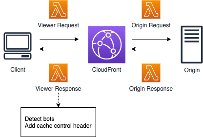

# Bot Detection

## Description

This solution detects bots according to User Agent and add cache control header to make the bots request to CloudFront cache instead of the origin. Since the bots hit the cache, it can reduce the workload of the origin website


## Architecture Diagram



CloudFront event type for this Lambda@Edge: viewer response


## Use Cases

To make the bots hit the cache instead of the origin server to reduce origin workload


## Deployment

You can deploy it in SAR(Serverless Application Repository) with one click or use SAM CLI as well

### Use SAR

- Go to https://serverlessrepo.aws.amazon.com/applications
- Check the check box "Show apps that create custom IAM roles or resource policies" and search "aws-cloudfront-extensions" or "bot-detection"
- Find the Lambda and deploy it to your AWS account

### Use SAM CLI

The Serverless Application Model Command Line Interface (SAM CLI) is an extension of the AWS CLI that adds functionality for building and testing Lambda applications. It uses Docker to run your functions in an Amazon Linux environment that matches Lambda. It can also emulate your application's build environment and API.

To use the SAM CLI, you need the following tools.

* SAM CLI - [Install the SAM CLI](https://docs.aws.amazon.com/serverless-application-model/latest/developerguide/serverless-sam-cli-install.html)
* [Python 3 installed](https://www.python.org/downloads/)
* Docker - [Install Docker community edition](https://hub.docker.com/search/?type=edition&offering=community)

To build and deploy your application for the first time, run the following in your shell:

```bash
sam build --use-container
sam deploy --guided
```
