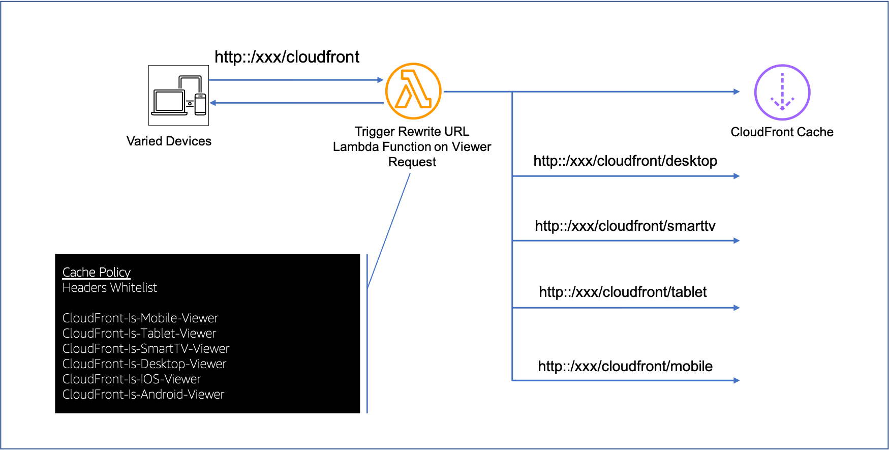

# Serving Content Based on Device


The Lambda@Edge is designed to serve content based on device type, for example, mobile device will be forwarded to access content for mobile device, desktop device will be forwarded to access specific content.


## Description

The solution will serve content by users' device tpye, here's how it works:

1. You must configure your distribution to cache based on the CloudFront-Is-*-Viewer headers. For more information, see the following documentation:
     - http://docs.aws.amazon.com/console/cloudfront/cache-on-selected-headers
     - http://docs.aws.amazon.com/console/cloudfront/cache-on-device-type

2. Lambda@Edge will rewrite URL on viewer request.

3. CloudFront adds the CloudFront-Is-*-Viewer headers after the viewer request event.


## Architecture Diagram


Lambda@Edge - serving-based-on-device is triggered on viewer request.


## Use Cases

The users can get the content more effcient by their device type with better experience, for example, mobile device could load low resolution video instead of origional high resolution in much faster manner due to smaller size of video file.

This Lambda@Edge could be further customized, such as serving different backend by specific device.


## Project Structure

This project contains source code and supporting files for a serverless application that you can deploy with the SAM CLI. It includes the following files and folders.

- serving-based-on-device - Code for the application's Lambda function, which forward requets to specific content that's under certain folder. 
- events - Invocation events that you can use to invoke the function.
- serving-based-on-device/tests - Unit tests for the application code. 
- template.yaml - A template that defines the application's AWS resources.


## Deployment

The Serverless Application Model Command Line Interface (SAM CLI) is an extension of the AWS CLI that adds functionality for building and testing Lambda applications. It uses Docker to run your functions in an Amazon Linux environment that matches Lambda. It can also emulate your application's build environment and API.

To use the SAM CLI, you need the following tools.

* SAM CLI - [Install the SAM CLI](https://docs.aws.amazon.com/serverless-application-model/latest/developerguide/serverless-sam-cli-install.html)
* Node.js - [Install Node.js 10](https://nodejs.org/en/), including the NPM package management tool.
* Docker - [Install Docker community edition](https://hub.docker.com/search/?type=edition&offering=community)

To build and deploy your application for the first time, run the following in your shell:

```bash
sam build
sam deploy --guided
```

The first command will build the source of your application. The second command will package and deploy your application to AWS, with a series of prompts:

* **Stack Name**: The name of the stack to deploy to CloudFormation. This should be unique to your account and region, and a good starting point would be something matching your project name.
* **AWS Region**: The AWS region you want to deploy your app to.
* **Desktop Path Parameter**: The content folder for desktop device.
* **Mobile Path Parameter**: The content folder for mobile device.
* **Tablet Path Parameter**: The content folder for tablet device.
* **Smart TV Path Parameter**: The content folder for smart TV device.
* **Confirm changes before deploy**: If set to yes, any change sets will be shown to you before execution for manual review. If set to no, the AWS SAM CLI will automatically deploy application changes.
* **Allow SAM CLI IAM role creation**: Many AWS SAM templates, including this example, create AWS IAM roles required for the AWS Lambda function(s) included to access AWS services. By default, these are scoped down to minimum required permissions. To deploy an AWS CloudFormation stack which creates or modified IAM roles, the `CAPABILITY_IAM` value for `capabilities` must be provided. If permission isn't provided through this prompt, to deploy this example you must explicitly pass `--capabilities CAPABILITY_IAM` to the `sam deploy` command.
* **Save arguments to samconfig.toml**: If set to yes, your choices will be saved to a configuration file inside the project, so that in the future you can just re-run `sam deploy` without parameters to deploy changes to your application.

You can find your API Gateway Endpoint URL in the output values displayed after deployment.

## Use the SAM CLI to build and test locally

Build your application with the `sam build` command.

```bash
serving-based-on-device$ sam build
```

The SAM CLI installs dependencies defined in `serving-based-on-device/package.json`, creates a deployment package, and saves it in the `.aws-sam/build` folder.

Test a single function by invoking it directly with a test event. An event is a JSON document that represents the input that the function receives from the event source. Test events are included in the `events` folder in this project.

Run functions locally and invoke them with the `sam local invoke` command.

```bash
serving-based-on-device$ sam local invoke SimpleLambdaEdgeFunction --event events/event.json
```


## Add a resource to your application
The application template uses AWS Serverless Application Model (AWS SAM) to define application resources. AWS SAM is an extension of AWS CloudFormation with a simpler syntax for configuring common serverless application resources such as functions, triggers, and APIs. For resources not included in [the SAM specification](https://github.com/awslabs/serverless-application-model/blob/master/versions/2016-10-31.md), you can use standard [AWS CloudFormation](https://docs.aws.amazon.com/AWSCloudFormation/latest/UserGuide/aws-template-resource-type-ref.html) resource types.

## Fetch, tail, and filter Lambda function logs

To simplify troubleshooting, SAM CLI has a command called `sam logs`. `sam logs` lets you fetch logs generated by your deployed Lambda function from the command line. In addition to printing the logs on the terminal, this command has several nifty features to help you quickly find the bug.

`NOTE`: This command works for all AWS Lambda functions; not just the ones you deploy using SAM.

```bash
serving-based-on-device$ sam logs -n HelloWorldFunction --stack-name serving-based-on-device --tail
```

You can find more information and examples about filtering Lambda function logs in the [SAM CLI Documentation](https://docs.aws.amazon.com/serverless-application-model/latest/developerguide/serverless-sam-cli-logging.html).

## Unit tests

Tests are defined in the `serving-based-on-device/tests` folder in this project. Use NPM to install the [Mocha test framework](https://mochajs.org/) and run unit tests.

```bash
serving-based-on-device$ cd serving-based-on-device
serving-based-on-device$ npm install
serving-based-on-device$ npm run test
```

## Cleanup

To delete the sample application that you created, use the AWS CLI. Assuming you used your project name for the stack name, you can run the following:

```bash
aws cloudformation delete-stack --stack-name serving-based-on-device
```

## Resources

See the [AWS SAM developer guide](https://docs.aws.amazon.com/serverless-application-model/latest/developerguide/what-is-sam.html) for an introduction to SAM specification, the SAM CLI, and serverless application concepts.

Next, you can use AWS Serverless Application Repository to deploy ready to use Apps that go beyond hello world samples and learn how authors developed their applications: [AWS Serverless Application Repository main page](https://aws.amazon.com/serverless/serverlessrepo/)
