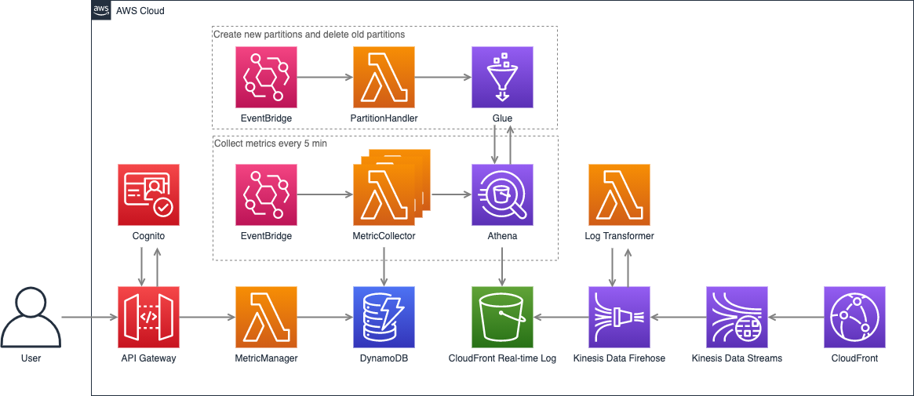

# Real-time Log Transformer 

## Description

This Lambda will get the CloudFront metric data from Dynamodb table, it can be deployed with API Gateway to create a rest API to get CloudFront metric data

## Architecture Diagram



The solution will collect real-time logs by Kinesis Data Stream and store it in S3 bucket. EventBridge will trigger MetricCollector every 5 min to collect the metric data by Athena and put it into DynamoDB table. The user can invoke the API Gateway to get the metric data in DynamoDB table. The API Gateway is authorized by Cognito and the user needs to provide a valid access token to invoke it

## Deployment

You can deploy it in SAR(Serverless Application Repository) with a few clicks or use SAM CLI as well

### Use SAR

- Go to https://serverlessrepo.aws.amazon.com/applications
- Check the check box "Show apps that create custom IAM roles or resource policies" and search "metric-manager"
- Find the Lambda and deploy it to your AWS account


### Use SAM CLI

The Serverless Application Model Command Line Interface (SAM CLI) is an extension of the AWS CLI that adds functionality for building and testing Lambda applications. It uses Docker to run your functions in an Amazon Linux environment that matches Lambda. It can also emulate your application's build environment and API.

To use the SAM CLI, you need the following tools.

* SAM CLI - [Install the SAM CLI](https://docs.aws.amazon.com/serverless-application-model/latest/developerguide/serverless-sam-cli-install.html)
* [Python 3 installed](https://www.python.org/downloads/)
* Docker - [Install Docker community edition](https://hub.docker.com/search/?type=edition&offering=community)

To build and deploy your application for the first time, run the following in your shell:

```bash
sam build --use-container
sam deploy --guided
```

## Cleanup

To delete the application that you created, use the AWS CLI. Assuming you used your project name for the stack name, you can run the following:

```bash
aws cloudformation delete-stack --stack-name metric-manager
```

## API Response Example

Here's an example of the response

```
{
    Response: {
        Data: [
            {
                CdnData: [
                    {
                        Metric: "request",
                        DetailData: [
                            {
                                Time: "2021-10-21 09:55:00",
                                Value: "347"
                            },
                            {
                                Time: "2021-10-21 10:00:00",
                                Value: "87"
                            }
                        ]
                    },
                    {
                        Metric: "requestOrigin",
                        DetailData: [
                            {
                                Time: "2021-10-21 09:55:00",
                                Value: "9"
                            },
                            {
                                Time: "2021-10-21 10:00:00",
                                Value: "9"
                            }
                        ]
                    },
                    {
                        Metric: "statusCode",
                        DetailData: [
                            {
                                Time: "2021-10-21 09:55:00",
                                Value: [
                                    {
                                        StatusCode: "403",
                                        Count: "60"
                                    },
                                    {
                                        StatusCode: "200",
                                        Count: "286"
                                    },
                                    {
                                        StatusCode: "499",
                                        Count: "1"
                                    }
                                ]
                            },
                            {
                                Time: "2021-10-21 10:00:00",
                                Value: [
                                    {
                                        StatusCode: "403",
                                        Count: "14"
                                    },
                                    {
                                        StatusCode: "200",
                                        Count: "73"
                                    }
                                ]
                            }
                        ]
                    },
                    {
                        Metric: "statusCodeOrigin",
                        DetailData: [
                            {
                                Time: "2021-10-21 09:55:00",
                                Value: [
                                    {
                                        StatusCode: "200",
                                        Count: "9"
                                    }
                                ]
                            },
                            {
                                Time: "2021-10-21 10:00:00",
                                Value: [
                                    {
                                        StatusCode: "200",
                                        Count: "9"
                                    }
                                ]
                            }
                        ]
                    },
                    {
                        Metric: "chr",
                        DetailData: [
                            {
                                Time: "2021-10-21 09:55:00",
                                Value: "96.85"
                            },
                            {
                                Time: "2021-10-21 10:00:00",
                                Value: "87.67"
                            }
                        ]
                    },
                    {
                        Metric: "chrBandWith",
                        DetailData: [
                            {
                                Time: "2021-10-21 09:55:00",
                                Value: "97.04"
                            },
                            {
                                Time: "2021-10-21 10:00:00",
                                Value: "88.50"
                            }
                        ]
                    },
                    {
                        Metric: "bandwidth",
                        DetailData: [
                            {
                                Time: "2021-10-21 09:55:00",
                                Value: "2121168"
                            },
                            {
                                Time: "2021-10-21 10:00:00",
                                Value: "523335"
                            }
                        ]
                    },
                    {
                        Metric: "bandwidthOrigin",
                        DetailData: [
                            {
                                Time: "2021-10-21 09:55:00",
                                Value: "93558"
                            },
                            {
                                Time: "2021-10-21 10:00:00",
                                Value: "69546"
                            }
                        ]
                    },
                    {
                        Metric: "downloadSpeed",
                        DetailData: [
                            {
                                Time: "2021-10-21 09:55:00",
                                Value: {
                                    CA: {
                                        OVHSAS: {
                                            750K: "0.22",
                                            250K: "0.56",
                                            4M: "0",
                                            3M: "0",
                                            2M: "0",
                                            1M: "0",
                                            500K: "0.22",
                                            Other: "0"
                                        },
                                        DIGITALOCEAN-ASN: {
                                            750K: "0",
                                            250K: "0.62",
                                            4M: "0",
                                            3M: "0",
                                            2M: "0",
                                            1M: "0",
                                            500K: "0.38",
                                            Other: "0"
                                        }
                                    },
                                    EG: {
                                        CITYNET: {
                                            750K: "0",
                                            250K: "1",
                                            4M: "0",
                                            3M: "0",
                                            2M: "0",
                                            1M: "0",
                                            500K: "0",
                                            Other: "0"
                                        },
                                        AVASTSoftwares.r.o.: {
                                            750K: "0",
                                            250K: "1",
                                            4M: "0",
                                            3M: "0",
                                            2M: "0",
                                            1M: "0",
                                            500K: "0",
                                            Other: "0"
                                        }
                                    }
                                }
                            },
                            {
                                Time: "2021-10-21 10:00:00",
                                Value: {
                                    US: {
                                        SHOCK-1: {
                                            750K: "0",
                                            250K: "1",
                                            4M: "0",
                                            3M: "0",
                                            2M: "0",
                                            1M: "0",
                                            500K: "0",
                                            Other: "0"
                                        },
                                        SERVER-MANIA: {
                                            750K: "0.25",
                                            250K: "0.5",
                                            4M: "0",
                                            3M: "0",
                                            2M: "0",
                                            1M: "0",
                                            500K: "0.25",
                                            Other: "0"
                                        },
                                        TIER-NET: {
                                            750K: "0",
                                            250K: "0.8",
                                            4M: "0",
                                            3M: "0",
                                            2M: "0",
                                            1M: "0",
                                            500K: "0.2",
                                            Other: "0"
                                        }
                                    },
                                    NL: {
                                        DIGITALOCEAN-ASN: {
                                            750K: "0",
                                            250K: "1",
                                            4M: "0",
                                            3M: "0",
                                            2M: "0",
                                            1M: "0",
                                            500K: "0",
                                            Other: "0"
                                        }
                                    }
                                }
                            }
                        ]
                    },
                    {
                        Metric: "downloadSpeedOrigin",
                        DetailData: [
                            {
                                Time: "2021-10-21 09:55:00",
                                Value: {
                                    SE: {
                                        GleSYSAB: {
                                            750K: "0",
                                            250K: "1",
                                            4M: "0",
                                            3M: "0",
                                            2M: "0",
                                            1M: "0",
                                            500K: "0",
                                            Other: "0"
                                        }
                                    }
                                }
                            },
                            {
                                Time: "2021-10-21 10:00:00",
                                Value: {
                                    PT: {
                                        Infocomunicacoes,
                                        S.A.: {
                                            750K: "0",
                                            250K: "1",
                                            4M: "0",
                                            3M: "0",
                                            2M: "0",
                                            1M: "0",
                                            500K: "0",
                                            Other: "0"
                                        }
                                    }
                                }
                            }
                        ]
                    }
                ]
            }
        ],
        RequestId: "7d029e72-bab2-4859-bad5-e16d05bb16a3",
        Interval: "5min"
    }
}
```
