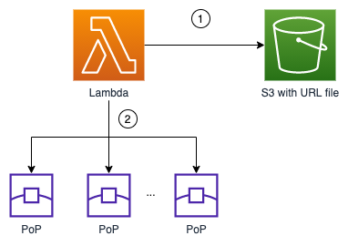
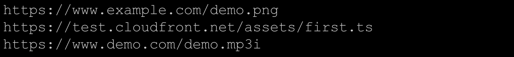
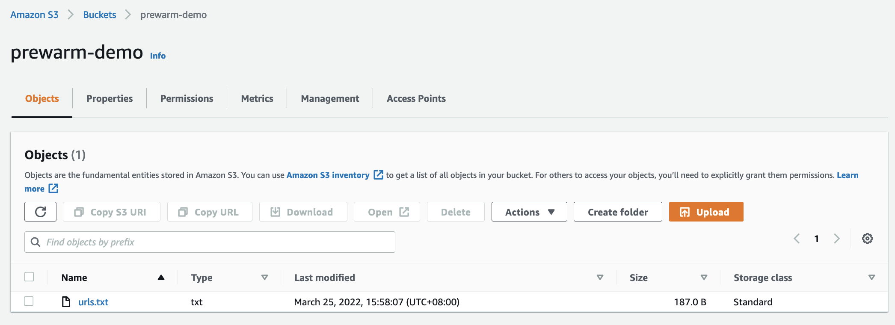
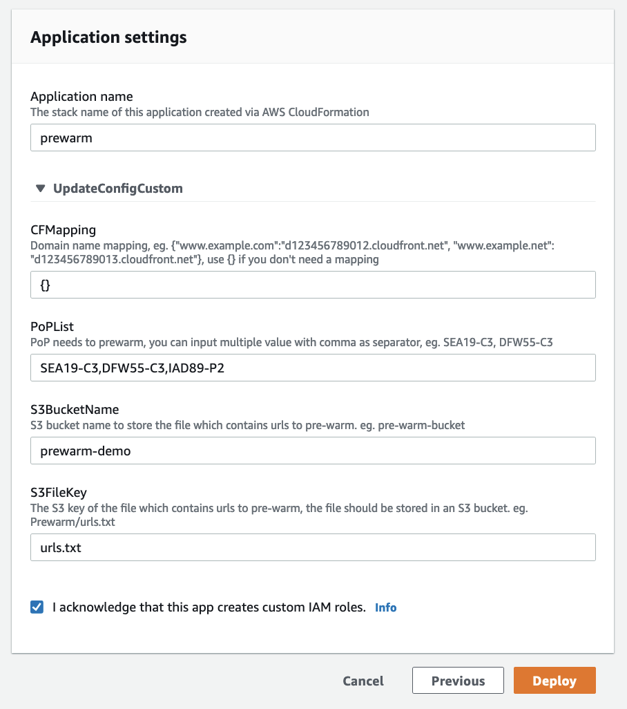
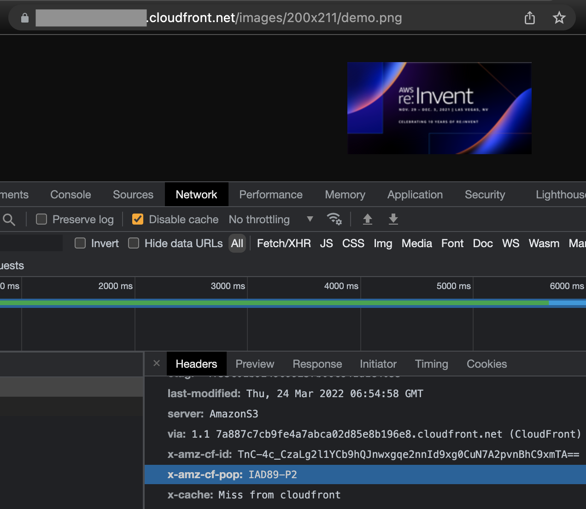
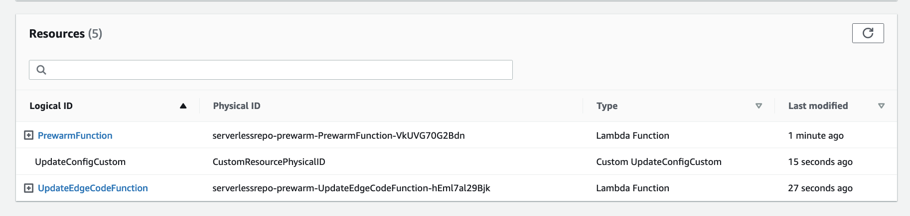
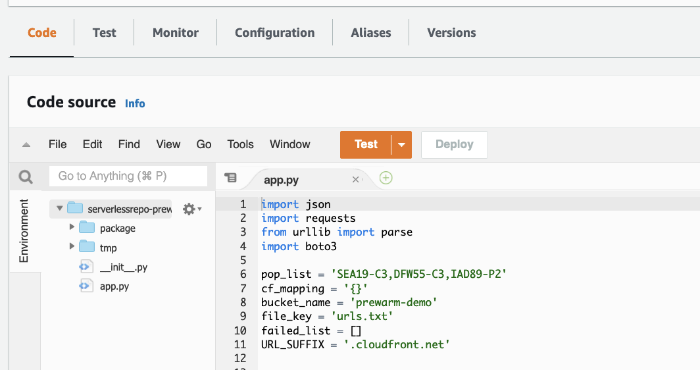
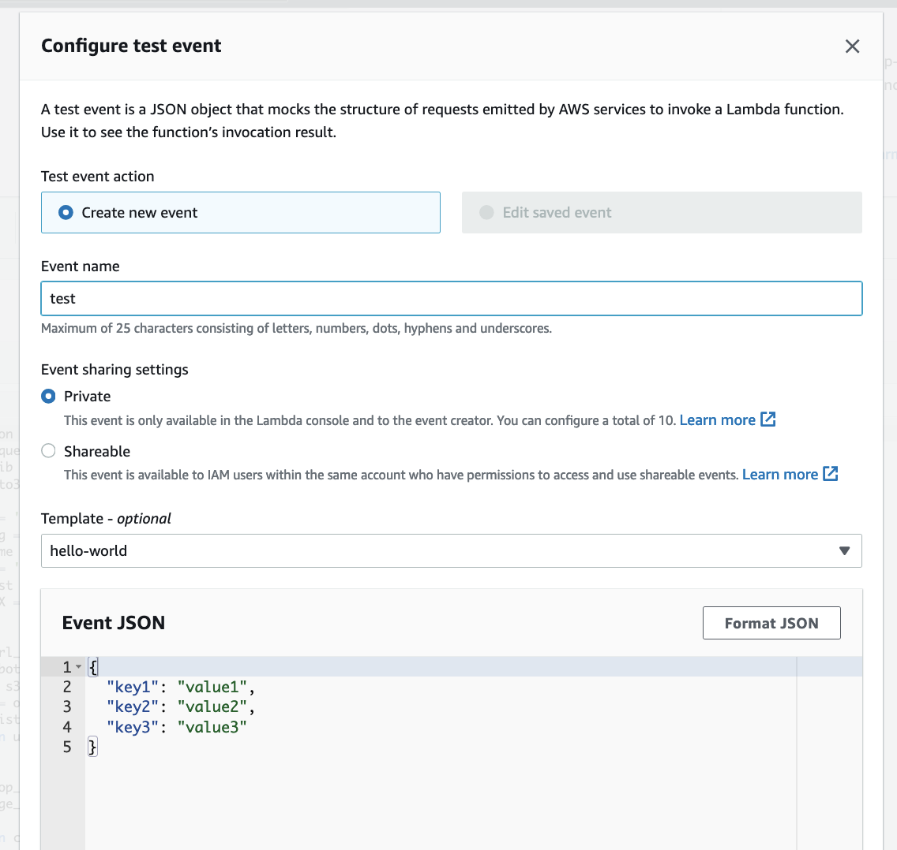
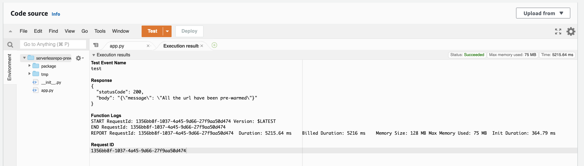

[[English](./README.md) | 中文]

# 预热

## 功能描述

本方案会在指定的PoP节点上预热指定资源。例如：在美东的节点上预热一千个图片。
当资源预热后，它会缓存到CloudFront，因此用户可以通过更低延迟访问同样资源，从而提升性能和用户体验。

## 架构图



1. 在S3桶中存储需要预热的URL
2. Lambda函数读取S3桶中的URL，并在您指定的边缘节点上预热

## 使用说明

请执行如下步骤

1. 登录您的AWS账号，并进入[S3控制台](https://s3.console.aws.amazon.com/s3/home)
2. 创建一个S3桶 (若您已有S3桶，可跳过此步骤)
3. 将要预热的URL保存到一个txt文件中，并将其上传到刚才的S3桶中

    文件内容示例（各个URL需以换行符分割）

    上传URL文件到S3桶


4. 进入[CloudFront Extensions](https://awslabs.github.io/aws-cloudfront-extensions/zh/deployment/)，找到Pre-warm并点击其右侧的Launch Stack按钮

5. 点击Deploy按钮
6. 输入参数 (如果您的网站有CName，您需要添加CName和CloudFront域名的映射关系，例如 {\"www.example.com\":\"d123456789012.cloudfront.net\",\"www.demo.com\":\"d12dbadtwi013.cloudfront.net\"}.)

  
   
   下表是参数具体定义：

  | 参数 | 描述 |
  |  ----  | ----  | 
  | PARA_POP | 进行预热的节点，若您需要在多个节点预热，各节点名称需要用逗号分隔，例如： 'ATL56-C1,DFW55-C3,SEA19-C3'。在访问一个网页时，您可通过x-amz-cf-pop标头获取当前响应的PoP节点名称，请参考下面截图 |
  | PARA_MAPPING | 如果您的网站有CName，您需要添加CName和CloudFront域名的映射关系。例如：某CloudFront分配的域名是 d123456789012.cloudfront.net，他的CName是www.example.com，您需要在这个参数里添加此行JSON {\"www.example.com\":\"d123456789012.cloudfront.net\"}。</p>如果您的网站直接使用的是CloudFront域名，如xxx.cloudfront.net， 您只需要在这里填入{} |
  | PARA_S3BUCKET  | S3桶的名称。 您需要指定一个S3桶用于存放包含要预热URL的文件，例如：pre-warm-bucket |
  | PARA_S3KEY | 包含URL的文件名。您需要创建一个文件，其中包含了所有要预热的URL，各个URL以换行符分隔，即每个URL在一行。此文件需要上传到PARA_S3BUCKET参数指定的S3桶中 |

  
   PARA_POP：当访问资源时，您可通过x-amz-cf-pop标头获取PoP节点名称
  
  

7. 勾选 "I acknowledge ..." 复选框，点击Deploy按钮
8. 等待直到部署完成，您将会看到如下资源
  
9. 在Resources表格中点击PrewarmFunction
10. 点击Test按钮

11. 因为这是您第一次点击Test按钮，因为您会看到类似下图显示的对话框。输入event name，其他项使用默认值

12. 点击Save按钮
13. 再次点击Test按钮，即开始预热S3桶中指定的URL，当预热结束后，您将会在控制台中看到预热结果



## 卸载

您可执行如下命令卸载此应用

```bash
aws cloudformation delete-stack --stack-name prewarm
```

