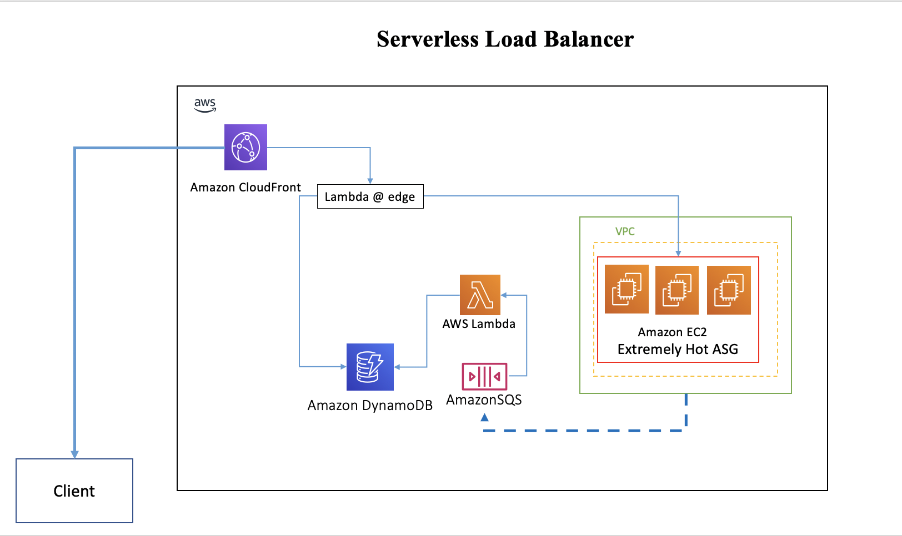

# Serverless Load Balancer

The serverless load balance solution will load balance for your origin via Lambda@Edge which is deployed on CloudFront origin request

This project contains source code and supporting files for a serverless application that you can deploy with the SAM CLI. It includes the following files and folders:

- functions - Code for the application's Lambda functions to check the value of, buy, or sell shares of a stock.
- event - Event json for lambda function.  that defines the application's AWS resources.
- template.yaml - A template that defines the application's AWS resources.

This application creates a mock stock trading workflow which runs on a pre-defined schedule (note that the schedule is disabled by default to avoid incurring charges). It demonstrates the power of Step Functions to orchestrate Lambda functions and other AWS resources to form complex and robust workflows, coupled with event-driven development using Amazon EventBridge.

The application uses several AWS resources, including DynamoDB, Lambda functions and an SQS trigger. These resources are defined in the `template.yaml` file in this project. You can update the template to add AWS resources through the same deployment process that updates your application code.

If you prefer to use an integrated development environment (IDE) to build and test the Lambda functions within your application, you can use the AWS Toolkit. The AWS Toolkit is an open source plug-in for popular IDEs that uses the SAM CLI to build and deploy serverless applications on AWS. The AWS Toolkit also adds a simplified step-through debugging experience for Lambda function code. See the following links to get started:

* [CLion](https://docs.aws.amazon.com/toolkit-for-jetbrains/latest/userguide/welcome.html)
* [GoLand](https://docs.aws.amazon.com/toolkit-for-jetbrains/latest/userguide/welcome.html)
* [IntelliJ](https://docs.aws.amazon.com/toolkit-for-jetbrains/latest/userguide/welcome.html)
* [WebStorm](https://docs.aws.amazon.com/toolkit-for-jetbrains/latest/userguide/welcome.html)
* [Rider](https://docs.aws.amazon.com/toolkit-for-jetbrains/latest/userguide/welcome.html)
* [PhpStorm](https://docs.aws.amazon.com/toolkit-for-jetbrains/latest/userguide/welcome.html)
* [PyCharm](https://docs.aws.amazon.com/toolkit-for-jetbrains/latest/userguide/welcome.html)
* [RubyMine](https://docs.aws.amazon.com/toolkit-for-jetbrains/latest/userguide/welcome.html)
* [DataGrip](https://docs.aws.amazon.com/toolkit-for-jetbrains/latest/userguide/welcome.html)
* [VS Code](https://docs.aws.amazon.com/toolkit-for-vscode/latest/userguide/welcome.html)
* [Visual Studio](https://docs.aws.amazon.com/toolkit-for-visual-studio/latest/user-guide/welcome.html)

The AWS Toolkit for VS Code includes full support for state machine visualization, enabling you to visualize your state machine in real time as you build. The AWS Toolkit for VS Code includes a language server for Amazon States Language, which lints your state machine definition to highlight common errors, provides auto-complete support, and code snippets for each state, enabling you to build state machines faster.

## Prerequisite

## Architecture Diagram

This is application architecture



## Requirement

The Serverless Application Model Command Line Interface (SAM CLI) is an extension of the AWS CLI that adds functionality for building and testing Lambda applications. It uses Docker to run your functions in an Amazon Linux environment that matches Lambda. It can also emulate your application's build environment and API.

To use the SAM CLI, you need the following tools.

* SAM CLI - [Install the SAM CLI](https://docs.aws.amazon.com/serverless-application-model/latest/developerguide/serverless-sam-cli-install.html)
* Docker - [Install Docker community edition](https://hub.docker.com/search/?type=edition&offering=community)

## Use the SAM CLI to build locally

Build your application with the `sam build` command.

```bash
serverless-load-balancer]$ sam build
```

Build your application with container  `sam build --use-container` command.

```bash
serverless-load-balancer]$ sam build --use-container
```

The SAM CLI creates a deployment package, and saves it in the `.aws-sam/build` folder.

Test a single function by invoking it directly with a test event. An event is a JSON document that represents the input that the function receives from the event source. Test events are included in the `event` folder in this project.

Run functions locally and invoke them with the `sam local invoke` command.

```bash
serverless-load-balancer]$ sam local invoke "LambdaEdgeBalancerFunction" --event events/cf_request_event.json
serverless-load-balancer]$ sam local invoke "ServerLoadReportFunction" --event events/load_report_sqs_event.json
```
## Deployment

**Deploy solution**
```bash
sam deploy --guided
```
The first command will build the source of your application. The second command will package and deploy your application to AWS, with a series of prompts:

* **Stack Name**: The name of the stack to deploy to CloudFormation. This should be unique to your account and region, and a good starting point would be something matching your project name.
* **AWS Region**: The AWS region you want to deploy your app to.
* **Parameter EnvType [test]**: The EnvType test/prod.
* **Confirm changes before deploy**: If set to yes, any change sets will be shown to you before execution for manual review. If set to no, the AWS SAM CLI will automatically deploy application changes.
* **Allow SAM CLI IAM role creation**: Many AWS SAM templates, including this example, create AWS IAM roles required for the AWS Lambda function(s) included to access AWS services. By default, these are scoped down to minimum required permissions. To deploy an AWS CloudFormation stack which creates or modified IAM roles, the `CAPABILITY_IAM` value for `capabilities` must be provided. If permission isn't provided through this prompt, to deploy this example you must explicitly pass `--capabilities CAPABILITY_IAM` to the `sam deploy` command.
* **Save arguments to samconfig.toml**: If set to yes, your choices will be saved to a configuration file inside the project, so that in the future you can just re-run `sam deploy` without parameters to deploy changes to your application.
* **SAM configuration environment [default]**: SAM environment

* **Deploy this changeset? [y/N]:**: y


**Wait for create complete output**

`Successfully created/updated stack - serverless-load-balancer in us-east-1`

**Update SSM parameter**
Replace asg_table value with DDB table name ( and load_balancer_metric value if you needed ) in cloudformation output then update ssm parameter via cli as follow:

` aws ssm put-parameter --name "target_param" --type "String" --value '{"asg_table":"serverless-load-balancer-LoadTable-14BI0OO67EZ9H","asg_name":"target_asg_name","load_balancer_metric":"network_out"}' --overwrite `

**Report target server load to the MQ**

`tools/server_load_sqs.sh` is the sample of server load report to sqs script,replace the q_url with SQS URL in cloudformation output then run the script

`tools/server-load-report.service` is a sample of systemd on amazon linux manage server load report script automatic execute when server start

## Cleanup

To delete the sample application that you created, use the AWS CLI. Assuming you used your project name for the stack name, you can run the following:

```bash
aws cloudformation delete-stack --stack-name Stack Name
```

## Resources

See the [AWS SAM developer guide](https://docs.aws.amazon.com/serverless-application-model/latest/developerguide/what-is-sam.html) for an introduction to SAM specification, the SAM CLI, and serverless application concepts.

Next, you can use AWS Serverless Application Repository to deploy ready to use Apps that go beyond hello world samples and learn how authors developed their applications: [AWS Serverless Application Repository main page](https://aws.amazon.com/serverless/serverlessrepo/)