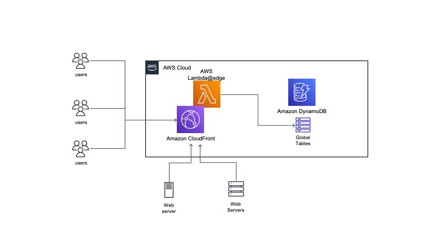

# Limit Request Rate by Lambda@Edge function

The lowest rate limit for AWS WAF's Rate Rule is 100 query/5min. However, some customer service URLs invoke a large amount of backend database resources and paid third-party API. Therefore, these types of customers hope to be able to use lower rate rules to protect certain critical URLs.

## Architecture Diagram



## Description

- architecture based on  DynamoDB and Lambda@edge service
- With Lambda@Edge, a Lambda function is invoked on every request to determine whether it complies with the specified rules. If it does, the request is counted; otherwise, access is blocked.
- Clients may potentially access any CloudFront Point of Presence (POP), so it's necessary to maintain a copy of access data at multiple physical locations and ensure synchronization. Here, Amazon DynamoDB tables are used, allowing for global data read and write operations in milliseconds, ensuring data consistency for Lambda@Edge at various POP points.
- DynamoDB maintains two global tables for data storage: [1]Lambda Edge to access, storing access data, [2]storing banned IP information, updating WAF Rules to block illegal  IPs.


## Deployment

To deploy the stack, you can either use UI or AWS CLI

### UI
Go to [CloudFront Extensions Workshop](https://awslabs.github.io/aws-cloudfront-extensions/#cloudfront-function), find the CloudFront Function and click **Deploy** button.


### AWS CLI

```bash
aws cloudformation deploy --template-file limit-request-rate.yaml --stack-name limit-request-rate 
```


## Cleanup

To delete the sample application that you created, use the AWS CLI. Assuming you used your project name for the stack name, you can run the following:

```bash
aws cloudformation delete-stack --stack-name limit-request-rate --parameter-overrides cfDistId=<distribution id> rateLimit=<total query rate per minute> urlList=<special URL list, seperate by comma> urlRateLimit=<special URL query rate per minute>
```

### Note:
Because disassociating a Lambda function from CloudFront Distribution need to some time. if the stack deletion fails, you can  delete Lambda function's verion:1 manually, and you should wait for 30 minutes before trying again.

