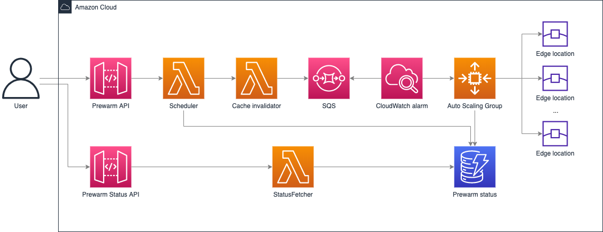

[[English](./README.md) | 中文]

# 预热

## 功能描述

本方案会在指定的PoP节点上预热指定资源。例如：在美东的节点上预热一千个图片。
当资源预热后，它会缓存到CloudFront，因此用户可以通过更低延迟访问同样资源，从而提升性能和用户体验。
本方案可以通过CloudFormation进行一键部署，部署后会生成两个REST API，一个用于出发预热操作，另一个用于查看预热状态。

## 架构图



本方案主要完成以下操作：

1. Scheduler向DynamoDB表中插入预热初始状态并且触发cache invalidator
2. Cache invalidator 清除待预热的所有URL在CloudFront中的缓存并且向SQS中发送带有reqId, pop和url等信息的消息。
3. CloudWatch警报监控着消息队列中的消息。当队列中有消息时，CloudWatch会通知Auto scaling group进行弹性伸缩。
4. Auto scaling group 包含了EC2 spot实例. 当消息队列中收到消息后，每个EC2 spot实例向指定的CloudFront边缘节点发送请求并且更新DynamoDB表中的预热状态。 
5. StatusFetcher从DynamoDB表中获取预热状态，并通过REST API返回给用户。


## 部署

部署时间：约15分钟

### 部署概述

使用以下步骤在Amazon Web Service上部署此解决方案。

* 在您的Amazon Web Service帐户中启动CloudFormation模板。
* 查看模板参数，并在必要时进行调整。

### 部署步骤

1. 登录到Amazon Web Services管理控制台，选择按钮以启动模板。您还可以选择直接[下载模板](https://aws-cloudfront-extensions-cff.s3.amazonaws.com/asset/prewarm/latest/PrewarmStack.template.json)进行部署。
    * [一键部署](https://console.aws.amazon.com/cloudformation/home?region=us-east-1#/stacks/new?stackName=Prewarm&templateURL=https://aws-cloudfront-extensions-cff.s3.amazonaws.com/asset/prewarm/latest/PrewarmStack.template.json)
2. 默认情况下，该模板将在您登录控制台后默认的区域启动，即美国东部（弗吉尼亚北部）区域。若需在指定的区域中启动该解决方案，请在控制台导航栏中的区域下拉列表中选择。
3. 选择*下一步*。
4. 在*配置堆栈选项*页面上，您可以为堆栈中的资源指定标签（键值对）并设置其他选项，然后选择*下一步*。
5. 在*审核*页面，查看并确认设置。确保选中确认模板将创建Amazon Identity and Access Management（IAM）资源的复选框。选择*下一步*。
6. 选择*创建堆栈*以部署堆栈。

您可以在Amazon CloudFormation控制台的*状态*列中查看堆栈的状态。正常情况下，大约15分钟内可以看到状态为*CREATE_COMPLETE*。
您还可以选择*输出*标签页查看堆栈资源的详细信息。

## API定义

### Prewarm

请求方式: POST
请求参数
url_list: 需要预热的url
cf_domain: CloudFront域名，以cloudfront.net结尾
region: 需要预热的区域，提供三个选项

  * all: 预热所有区域的节点。
  * pop id列表: 只预热此列表中的节点。
  * 区域代码：只预热指定区域的节点。例如us为只预热美国的节点，eu为只预热欧洲节点。各区域映射关系如下
    * apac: Asia-Pacific
    * au: Australia
    * ca: Canada
    * sa: South Africa
    * eu: Europe
    * jp: Japan
    * us: United States

示例：
CloudFront的域名为 d1234567890r.cloudfront.net，它的CName是 www.example.com.

```
{
    "url_list": [
        "https://www.example.com/index.html",
        "https://www.example.com/images/demo.png"
    ],
    "cf_domain": "d1234567890r.cloudfront.net",
    "region": ["ATL56-C1", "DFW55-C3"]|"all"|"apac"|"au"|"ca"|"sa"|"eu"|"jp"|"us" // "all" to prewarm all pop node
}
```

响应参数
requestID: 预热请求id，您可通过调用PrewarmStatus API获取预热请求的最新状态。

示例：

```
{
  "requestID": "4f780687-9774-48cd-bd7d-db836abf45af"
}
```

### PrewarmStatus

请求方式: GET
请求参数
requestID: 预热请求id，标识预热请求的id，需要在query string中指定。

```
{
  "requestID": "4f780687-9774-48cd-bd7d-db836abf45af"
}
```

响应参数
status: 预热状态，COMPLETED表示完成，IN_PROGRESS表示进行中。
total: 预热url的总数。
completed: 预热完成的url的数量。
inProgress: 正在预热中的url的数量。

```
{
    "status": "COMPLETED" | "IN_PROGRESS" | "TIMEOUT" | "FAILED",
    "total": 20,
    "completed": 17,
    "inProgress": 3,
    "failedUrl": ["https://www.example.com/images/demo.png"]
}
```


## 费用
截至2022年5月，在美国东部（弗吉尼亚北部）区域（us-east-1），预热4次，每次预热50个资源，每个资源大小为1G，成本约为每月$11.78。

|  Service  | Dimensions | Cost/Month | 
|  ----  | ----  | ----  |  
| Amazon EC2 | 使用m5dn.xlarge Spot实例<br>150GB EBS | $10.59 |
| Amazon Lambda | 28次请求<br>256MB内存<br>ARM64架构 | $0.01 |
| Amazon API Gateway | 24次请求<br>REST API | $0.0001 |
| Amazon Simple Queue Service | 标准队列<br>1GB出站数据传输 | $0.02 |
| Amazon DynamoDB | 1GB数据存储<br>每月2000次写操作<br>每月200次读操作 | $0.25 |
| Amazon CloudWatch | 1个指标和警报 | $0.90 |
| Total |  | $11.78 |

## 卸载

您可执行如下命令卸载此应用

```bash
aws cloudformation delete-stack --stack-name prewarm
```

