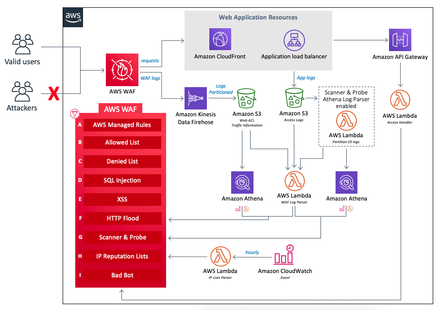

# Cloudfront with Automated WAF 

## Description
The solution use CDK to automatically deploy a set of AWS WAF rules design to filter common web-based attacks.Users can select from preconfigured protective features that define the rules included in an AWS WAF web access control list (web ACL). After the solution deploys, AWS WAF begins inspecting web requests to the user’s existing Amazon CloudFront distributions or Application Load Balancers, and blocks them when applicable.

This solution will provision a S3 bucket as origin for demo purpose.

## Architecture


## AWS WAF Rules

AWS Managed Rules (A): This set of AWS managed core rules provides protection against exploitation of a wide range of common application vulnerabilities or other unwanted traffic.

Manual IP lists (B and C): This component creates two specific AWS WAF rules that allow you to manually insert IP addresses that you want to block or allow.

SQL Injection (D) and XSS (E): The solution configures two native AWS WAF rules that are designed to protect against common SQL injection or cross-site scripting (XSS) patterns in the URI, query string, or body of a request.

HTTP flood (F): This component protects against attacks that consist of a large number of requests from a particular IP address, such as a web-layer DDoS attack or a brute-force login attempt.

Scanners and Probes (G): This component parses application access logs searching for suspicious behavior, such as an abnormal amount of errors generated by an origin. It then blocks those suspicious source IP addresses for a customer-defined period of time.

IP Reputation Lists (H): This component is the IP Lists Parser AWS Lambda function which checks third-party IP reputation lists hourly for new ranges to block.

Bad Bots (I): This component automatically sets up a honeypot, which is a security mechanism intended to lure and deflect an attempted attack.


## Quick Start

```
# Require to install AWS CDK

$ cd templates/aws-cloudfromt-waf
$ cdk deploy --parameters staticSiteBucketName=<Your unique S3 bucket name> 

```

> Use `aws s3api head-bucket --bucket <Your unique S3 bucket name>` to check whether this bucket is unique globally

